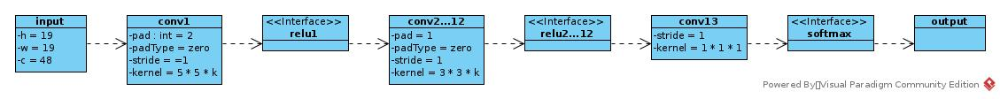
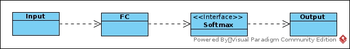
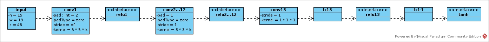
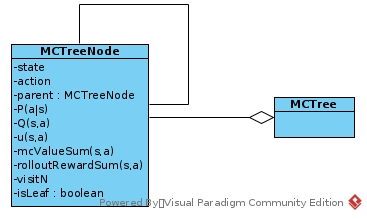
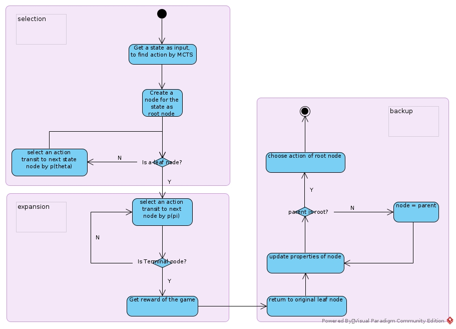

# AlphaGo Implement
∑ τ α π δ γ ∏ Δ Λ μ ∈ ∀ β λ ∞ η θ ∝ σ

## Pre-trained Network
There are three neuron networks trained by SL for online MCTS: 
* Pσ: A policy network to provide initial P(a|s) for MCTS nodes
* Pπ: A policy network to decide MCTS expansion
* Vθ: A value network to provide initial V(s) for node selection in MCTS search phase
### Pσ
#### Dataset
Training data was extracted from human player's game records, including players of multi-level. 

The input of the network combined many human selected features by game rules. Some preprocessing such as augment executed on input data.
At last the input has been formatted into 19 * 19 * 48 (W * H * C) tensor.
Refer to original paper.

The output is a distribution of π(a|s) for certain s. 

The loss of the network is softmax cross entropy.
#### Architecture

### Pπ
This NN has same dataset as that of Pσ. 
The input format has not described in detail in the paper. The architecture is shown in following figure.

This network has much less accuracy than that of Pσ. The simpler architecture makes the network runs much faster and introduces more exploration.

Seemed this network has been updated after SL training.

### Vθ
It is a regression problem

The dataset of this network is from simulation.
* Select int U randomly from [1, 450]
* Start a game
* Run U steps with action decided by Pσ. 
* Select action of SU randomly, reach SU+1
* Continue the game till Terminal state, with action decided by Pπ, and get reward z. Seemed the game has reward = 0 for each internal state and just relay back the terminal reward back to all states in the path without discounting.
* Store pair (SU+1, r) into dataset

Then the dataset works as replay buffer, and the network has been trained as a regression problem with LMSE.
## MCTS
### Structure

* state: current state
* action: action executed by parent node that leads to current state  
* parent: parent node that transit to current state by action a. I don't know Go rules, while seemed pre-procession of raw state guarantees that one node has only unique parent.
* P(a|s): prior probability that initialized by output of Pσ
* Q(s,a): Q. Estimated in tree search, not a NN output
* u(s,a): a factor to control search strategy, mainly to balance exploit and exploration
* mcValueSum(s,a): named Wv(s,a) in paper. A factor to estimate Q.
* rolloutRewardSum(s,a): named Wr(s,a) in paper. A factor to estimate Q.
* visitN: there were Nv and Nr in paper. This is because that tree search before leaf node is executed in parallel (by different games), and expansion of leaf node is executed asynchronously with leaf node tree search (as other game is expanding the same node at the same time and multi-simulation of single leaf are executed at the same time). In fact, the value of the these Ns is the same after backup step.
* isLeaf: If the node has been expanded

The overall search process:

### Selection
In selection phrase, action is select by:

* at(s) = argmaxa(Q(s,a) + u(s,a))
* Q is initialized with parent Q value and then updated in backup phrase
* u(s,a) = cpuct * P(a|s) * parent.visitN1/2 / (1 + visitN): cpuct is a constant, P(a|s) is output of Pσ
### Expansion
In expansion phase, the action is select by a(s) = argmaxaPπ(s)

In terminal state, the game get a reward defined by reward function. 
At most times, the reward function is (number of Mu won/lost) or (win/lost = 1/0)

The reward name z
### Backup
Name the leaf node as nL, Calculate Vθ(nL.state).

If nL.visitN > Threshold, nL.isLeaf = false. Enumerate all legal actions of nL and create nodes for them as children of nL with 
* nchild.isLeaf = true.
* nchild.P(a|s) = Pσ(a|s)
* nchild.mcValueSum = 0
* nchild.rolloutRewardNum = 0
* nchild.visitN = 0
* nchild.parent = nL

Start from leaf node till root node of this search task, for each node n:
* n.visitN += 1
* n.mcValueSum += Vθ(nL.state)
* n.rolloutRewardSum += z
* n.Q = ((1 - λ) * n.mcValueSum + λ * n.rolloutRewardSum) / n.visitN 
* n.u = cpuct * n.P * n.parent.visitN1/2 / n.visitN
* n = n.parent
### Output
Select the action from children of root node with

output action = argmaxanchild.visitN

Why most visited action are chosen?
* The more the action has been visited, more stable and accurate the MC estimation of Q is
* If the candidate is a good choice, the large probability of being chosen reinforced the good decision, u works rather like an exploration factor.
* If the candidate is not a good choice but is the current most visited action, it will take more episodes to decrease the Q and u; that confirms us that the choice is not a good choice with more belief to avoid fluctuation.  
## NN Reinforcement Learning
Pσ is trained after SL training. 

Pσ is trained by self-play simulation with pool of policies that trained in previous training iterations.

Pσ is trained by REINFORCEMENT algorithm
## Reference
* [_Mastering the game of Go with deep neural networks and tree search_](https://storage.googleapis.com/deepmind-media/alphago/AlphaGoNaturePaper.pdf) and its references
* _Reinforcement Learning: An Introduction_ ch13.3
* [MuGo Repository](https://github.com/brilee/MuGo.git)
* [JoshieGo Repository](https://github.com/brilee/MuGo.git)