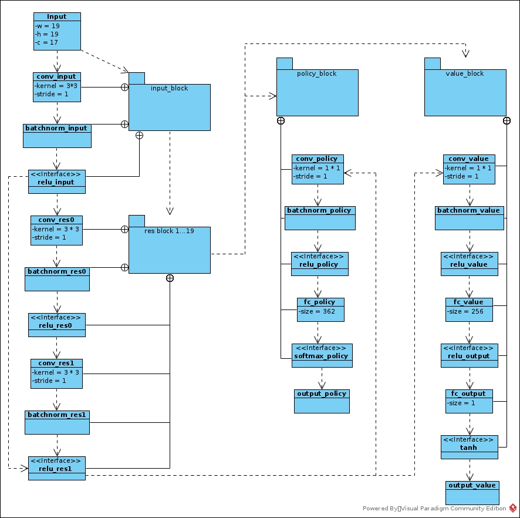

# AlphaGo Zero Implement
## Ideas
* The policy and value (network) have not been pre-trained by SL. The input of algorithm is raw board-state images, no manipulated features. So the learning process has no human knowledge involved.
* The MCST has no rollout process, it works rather like TD(1) than MC
* The MCST works as an assistant of neuron network. The NN makes use of MCST for balance of exploration and exploitation and to get the statistics of reusable tree nodes as evaluation of current policy.
* The MCTS is evaluating the policy when it is updating Q of tree node; the MCTS is also updating the policy when it is updating N of tree node. Then NN has been updated to match the MCTS estimation.  
* The input of NN involves the latest history states, it works as attention mechanism enforce the NN to focus on environment of current state. I think it also works as RNN to some degree.
* NN represents the current training policy is playing with the same NN with parameters trained in last iteration. _*Is there any component policy chosen strategy?*_
## Network Structure

## Play

## Reinforcement Learning
* The network is trained by self-play
* The player is the same network trained previously to get better and stable parameters.
* The input of the network are sampled uniformly from _samples_ generated in section _Play_
* The loss function: l = (z - v)2 - πTlogp + c||θ||