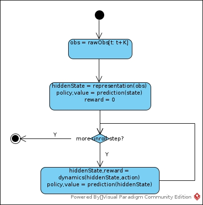

# MuZero
## Ideas
* Learn a model(MDP) and corresponding value/policy networks. It is an end-to-end algorithm.
* A representing network has been learned to encode raw observations.  
* Model of transition and reward is learned based on representation network output.  
* The model learned is not for original observation decoding. It is to make value/policy network a better one.
* Representation is based on a sequence of observation. It is for both Attention and Recurrent states.
* It uniformed learning on illegal actions and terminal actions.
* It is prospecting in real-world-environment problem learning and partially observation problem learning.
## Training
### Data Collection

#### Details
∑ τ α π δ γ ∏ Δ Λ μ ∈ ∀ β λ ∞ η θ ∝ σ

##### pUTC
In expanded children selection, the rule is:

ak = argmax[Q(s,a) + P(s,a) * ((∑bN(s,b))1/2 / (1 + N(s,a))) * (c1 + log((∑bN(s,b) + c2 + 1) / c2))]
* Both Q and P weight. Either one of them seemed prospecting, the action deserves more trials.
* Q is an unknown scalar, while 0 <= P <= 1, so P has to be adjusted to match the range of Q to impact its effect.
* If N(s,a) is relatively small, it deserves more exploration.
* It is in fact the c1 that dominates the scale of P part.
* log((∑bN(s,b) + c2 + 1) / c2) = log(∑bN(s,b) / c2 + 1 + 1 / c2) > 0. The larger ∑bN(s,b) is, the more times that S has been visited, the more believable P is. 
##### Dirichlet Noise
* Sum of P is still 1 after adding the noise
* It has no favor to any particular choice
##### TD(lambda)
In Q update in backup phase, the Q is a TD(λ) summary:

Gk = ∑τ=[0:l-1-k]γτrk+1+τ + γl-kvl

QSum(sk-1,ak) += Gk

N(sk-1,ak) += 1

Q(sk-1,ak) := QSum(sk-1,ak) / N(sk-1,ak)
##### Temperature
The estimation of π is based on N1/T instead of pure N. 

Pa = N(a)1/T / ∑bN(b)1/T

The larger T is, the less greedy and less deterministic π is
### Network Training
There are three networks:
* Representation: Observation --> State
* Dynamics: (Previous States, Previous Action, State, Action)  --> (Reward, NextState)
* Value/Policy: State --> (Policy, Value)

The State generated by either Representation network or Dynamics network is not used to input compression. 
It is not used decode State back into Observation. It is used to extract features that weight in Value/Policy prediction.
So we do not care about loss between raw Observation and State. Then the loss function is:

lt(θ) = ∑k=[0:K]Lr(ut+k, rtk) + Lv(zt+k, vtk) + Lp(πt+k, ptk) + Regl2: K = unroll steps
#### Target
1. Select a sample t. K = unroll steps
2. [obst:t+K, actiont:t+K, ut:t+K] has been stored in replay buffer in *Data Collection* phase.
3. Get zt = ∑i=t:t+K-1uiγi + vt+K. vt+KγK is looked up from transition and reward table that calculated in *Data Collection* phase
4. ut has been collected in *Data Collection* Phase
5. πt := ratio of visit count collected in *Data Collection* Phase
#### Output

### Reanalysis
MuZero Reanalyze revisits its past time-steps and re-executes its search using the latest model parameters.
That is, select samples (Obst, Rewardt, Actiont) and its rollout steps (Obst+i, Rewardt+i, Actiont+i: i=0...K) from replay buffer,
then re-calculate their network outputs and re-estimate their corresponding target values. 
For target values:
* Reward (u) remains untouched as there is no real re-play in real environment.
* Value (z) has been re-calculated where truncated vt+K has been replaced by network with current parameters
* Policy (π) has been re-calculated by same algorithm that executed in *Data Collection*, but with updated networks. 
  And each input of time step t (Obst+i) has been calculated end-to-end independently. That is, sequence of obst+i
  --> statet+i --> MCTS searcht+i --> target policy outputt+i.
  
It is obvious an off-policy training as:
1. Value(s) has been calculated by updated network
2. The rollout steps have not been generated by current policy, they are in episodes that had been conducted by networks that are different from current ones.
If the part of an episode start with Obst happened with instruction of current network(θ), 
the Obst+1, Obst+2 ... may be far away from that extracted from replay buffer. 
That introduced extra loss as:   
    * The algorithm trains dynamic network indirectly by policy/value loss
    * The algorithm considers prediction of both one step and multi-step
    
But guess that it still deserves as:
1. It is data efficient
2. There is a hidden policy called rollout policy. It may be good to rollout-policy training. 
3. Rollout policy is of less importance. Rollout often helps whatever the policy is.
4. It is to avoid overfitting.
### Difference to RNN
It is not complicated Recurrent state-space model (RSSM).
It is simpler than LSTM/GRU.
It is just a simple recurrent process. 
## Reference
* [Dirichlet noise](https://stats.stackexchange.com/questions/322831/purpose-of-dirichlet-noise-in-the-alphazero-paper)
* [Julian Schrittwieser](https://www.youtube.com/watch?v=L0A86LmH7Yw)
* [MuZero Rollout](https://www.youtube.com/watch?v=dFzFGn87wGM)
* [MuZero-Pytorch](https://github.com/koulanurag/muzero-pytorch.git)
* [Introduction by Sutton](https://www.andrew.cmu.edu/course/10-703/textbook/BartoSutton.pdf)
* [UPenn CIS 522 Guest Lecture | April 2020](https://www.seas.upenn.edu/~cis522/slides/CIS522_Lecture12T.pdf)