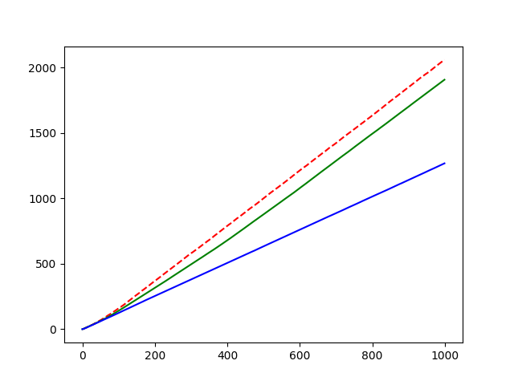
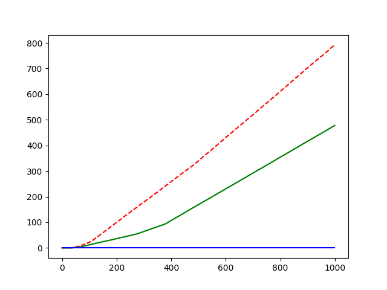
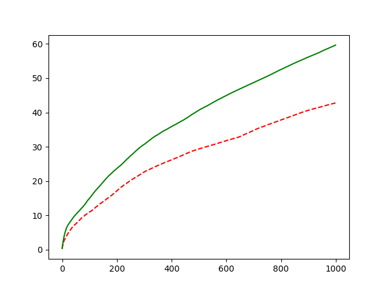

#Chapter02
## 2.1
* Suppose a bandit with 10 arms. 
The true value of arms generated by (0,1) normal distribution.
* Suppose true values of arms are V = {v<sub>0</sub>, v<sub>1</sub>, ..., v<sub>9</sub>}
* Suppose among all 10 true values, there are M values that are positive are
PV = {pv<sub>0</sub>, pv<sub>1</sub>, ..., pv<sub>M</sub>}
* Suppose the max value of V = V<sub>max</sub>

For the greedy algorithm with ε = 0, the agent would trap in a local optimized value. 
The value the agent selected as final choice would be a random choice of *PV*.

For algorithms with ε > 0, the agent would find the global optimized value,
that is the V<sub>max</sub>. 

The improvement would be E(V<sub>max</sub>) - E(PV). I don't know how to solve it.

The experiment result shown below:
```c++
#arm = 10. generated by standard normal distribution.
reward = (true value) + (standard normal distribution noise)
#sample = 1000
#epoch = 8

red line: ε = 0.1
gree line: ε = 0.01
blue line: ε = 0
```





## 2.2
Refer to [greedy model code](./codes/ch2/ch2modelgreedy.cpp)
## 2.3
Q<sub>k+1</sub> = Q<sub>k</sub> + α<sub>k+1</sub> * (R<sub>k</sub> - Q<sub>k</sub>)
    
= α<sub>k+1</sub> * R<sub>k</sub> + (1 - α<sub>k+1</sub>) * Q<sub>k</sub>

= α<sub>k+1</sub> * R<sub>k</sub> + (1 - α<sub>k+1</sub>) * (α<sub>k</sub> * R<sub>k-1</sub> + (1 - α<sub>k</sub>) * Q<sub>k-1</sub>)

= α<sub>k+1</sub> * R<sub>k</sub> + α<sub>k</sub>  * (1 - α<sub>k+1</sub>) * R<sub>k-1</sub> + ... + (1 - α<sub>k+1</sub>) * (1 - α<sub>k</sub>) * (1- α<sub>k-1</sub>) ... (1 - α<sub>2</sub>) * α<sub>1</sub> * R<sub>1</sub>
## 2.4
Refer to [2.4 code](./codes/ch2/q4.cpp)

The result:


## 2.5
In the case described in question, the Q<sub>initial</sub> >> (true value).

At the very beginning, whichever the arm was tried by the agent, the Q<sub>k</sub> would be decreased to fit the true value.
So each arm has the same chance to be tried. So the curve starts with low hit possibility.

After a round of trial, the best arm had been identified and tried, so an explicit upward observed.
While the more the potential arm was chosen, the more Q<sub>k</sub> was decreased. So the curve went downward dramatically.

At the same time, the relative bad choices got the chance to be chosen. 
After rounds of trial, the effect of initial value disappeared, and the best choice was recognized. 
So the curve went upward slowly.

Inject prior knowledge of the game into initial values may impact relatively large effect on learning.
## 2.6
Suppose possibility of action1 was chosen = p. 
The reward got was:
```c++
p * (0.1 + 0.9) + (1 - p) * (0.2 + 0.8) = 1.
```
Seemed no specific tragedy makes difference.

If the cases are known between action taken, agent could learn it as two independent games.