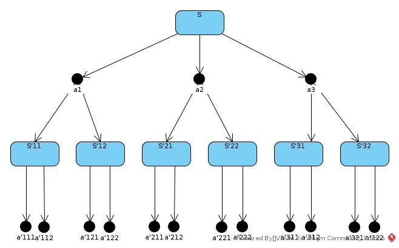
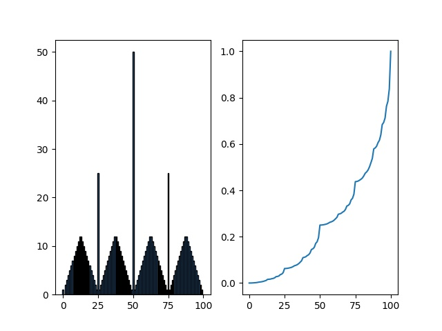
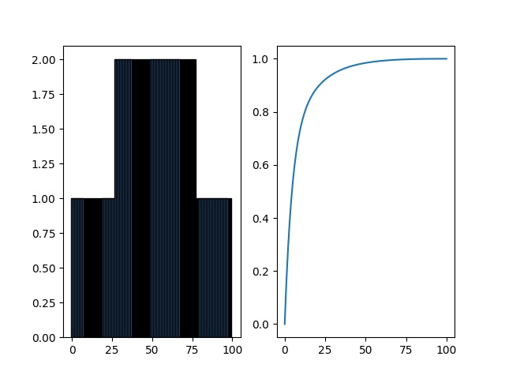

#Chapter04

## 4.1
q<sub>π</sub>(s,a) = ∑<sub>s'</sub>p(s'|s,a) * [r + γ * v<sub>π</sub>(s')]

p(s'|s,a) = 1, r = -1, γ = 1

q<sub>π</sub>(11, down) = -1 + v(T)

q<sub>π</sub>(7, down) = -1 + v(11)
## 4.2
|S|1|2|3|
|---|---|---|---|
|4|5|6|7|
|8|9|10|11|
|12|13|14|T|
|X|15|X|X|

v(s) = ∑<sub>a</sub>π(a|s) ∑<sub>s'</sub>p(s'|s,a)[r + γ * v<sub>π</sub>(s')]

π(a|s) = 1/4, p(s'|s,a) = 1, r = -1, γ = 1

v(15) = 1/4 * [(-1 + v(12)) + (-1 + v(13)) + (-1 + v(14)) + (-1 + v(15))]

= -1 + [v(12) + v(13) + v(14) + v(15)] / 4

v(13) = -1 + [v(9) + v(12) + v(14) + v(15)] / 4

Solve equations:

v(13) = -20, v(15) = -20

## 4.3
q<sub>π</sub>(s,a) = E<sub>π</sub>[R + γG' | s,a]

= E<sub>π</sub>[R + γv(s') | s,a]

= E<sub>π</sub>[R + γ∑<sub>a'</sub>π(a'|s') * q<sub>π</sub>(s',a') | s,a]

= ∑<sub>s'</sub>p(s'|s,a) * [R + γ∑<sub>a'</sub>π(a'|s') * q<sub>π</sub>(s',a')]
## 4.4
* Set threshold for steps updated per state/per evaluation, no update when threshold reached
* Set threshold for state value, no update when threshold reached
* Set γ < 1
* Check policy to detect negative infinite loop
## 4.5
[codes](./codes/ch4/orig4_5.cpp)
## 4.6
```
1.  Initiation
Initialize Q(s,a) ∀{s,a | s∈S,a∈A}; initialize π(s) ∀s∈S
2. Policy Evaluation
  Repeat
    ∆ <- 0
    for each (s,a) ∈ SxA:
      q <- Q(s,a)
      Q(s,a) <- ∑(s')p(s'|s,a) * [R + γ∑(a')π(a'|s') * q[π](s',a')]
      ∆ <- max(∆, |Q(s,a) - q|)
  until ∆ < θ
3. Policy Improvement
   policy-stable <- true
   For each s ∈ S:
     a <- π(s)
     π(s) <- argmax(a)Q(s,a)
     if a != π(s):
        then policy-stable = false
   if policy-stable:
     then stop
   else:
     goto 2
```     
## 4.7
### Step1
Initialize π(s) = ϵ * u(s) + (1 - ϵ) * A / |A|, u(s) = original π(s) in figure 4.3
### Step2
V(s) = ϵ * ∑<sub>s'</sub>p(s'|s,a)[r + γ * V<sub>u</sub>(s')] + (1 - ϵ) / |A| * ∑<sub>a</sub>∑<sub>s'</sub>p(s'|s,a) * [r + γ * V(s')]
### Step3
u(s) = argmax<sub>a</sub>∑<sub>s'</sub>p(s'|s,a) * [r + γv(s')]
## 4.8
Seemed that the original implementation breaks tie by order. 
That is, the algorithm is looking for most rewarded, and the fastest solution at the same time.

So in s = 50, action = 50 get the best value as it has chance to win in 1 step with possibility = PH.
Similarly, in s = 25, action = 25 get the best value. While as the 25 % 2 == 1, there is no similar spike in s = 12/13.

Then for s = 51, the best choice is to bet 1. 
In winning case, the player get positive reward; in lost case, the player reach s = 50, a good state.
For s = 52, 53, ..., the V(s) is looking for balance between going back to s = 50 with negative reward and going forward to relative better states.

[ref1](https://github.com/dennybritz/reinforcement-learning/issues/172)

[ref2](https://ai.stackexchange.com/questions/12469/the-problem-with-the-gamblers-problem-in-rl)
## 4.9
[codes](./codes/ch4/gambler.cpp)

Figure for ph = 0.25



Figure for ph = 0.55

## 4.10
q(s,a) = ∑<sub>s'</sub>p(s'|s,a) * [r + γmax<sub>a'</sub>q(s',a')]