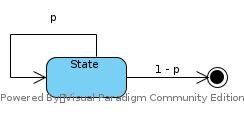

#Chapter05
## Notes
* Q or V? Why? How to remove model?
* Advantages of MC
* Bias and Bound and How to deal with it
    1. No bootstrap
* First-visit and Every-visit
* Exploring policy: how to meet the requirements
* MCES = Monte Carlo Exploring Starts
* DP converge? Converge to optimal?

### 5.1
* MC is used to learn v(s).
* Both first-visit and every-visit algorithm converge to unbiased expectation 
and standard deviation of error fall as (1 / n<sup>1/2</sup>)
* Estimation of state value is independent of that of other states. Which means:
    1. No bootstrap
    2. Just experiences, no Bellman equation.
    3. Can focus on certain states, ignoring others
* Advantages of MC:
    1. Learn from actual experience
    2. Learn from simulation
    3. Only states concerned to be estimated
### 5.2
* Given V(s) learned, the policy is to be determined by argmax<sub>a</sub>∑<sub>a</sub>p(s'|s,a)(r + v(s')), still the model p(s'|s,a) to be given.
So, Q(s,a) is more directly choice for policy learning
* To learn Q(s,a), we'd better learn each action of a state to choose the best one for policy improvement.
While as MC could estimate Q(s,a) without considering Q(s,a'), esp in case of deterministic π, we need exploration.
  1. Exploration start is useful, but sometimes not practical
  2. Alternatives to assuring all state-action pairs are encountered
### 5.3    
MCES: 
* Start from random (s,a) pair
* Run episode from start pair to terminal state
* Record each (s,a) and corresponding reward for each step
* After each episode, update G for each (s,a); update Q for each (s,a); update π(s) for each step.
* By backward order
### 5.4
* To remove exploring start assumption: on-policy and off-policy learning.
* ϵ-greedy policy on-policy MC control learning achieves the best policy among all ϵ-soft policies.
### 5.5
* The on-policy approach is actually a compromise -- it learns action values not for the optimal policy, but for a near-optimal policy that still explores.
* π is target policy, b is behavior policy, both policies are considered fixed and given
* Assumption of coverage
* Almost all off-policy methods utilize importance sampling.
* Importance sampling: a general technique for estimating expected values under one distribution given samples from another

|visit|Item|Ordinary| Weighted | Comments |
|---|---|---|---|---|
|first-visit|biased|N: It is similar to E(V(pai))/Constant|Y: It also includes factor of Theta|Bias of weighted converge to 0|
|first-visit|Variance| Extreme: as there is no constraint on b|Bounded: as max(Theta) <= 1|Variance of weighted converge to 0 providing bounded returns|
|every-visit|biased|Y|Y|Bias falls to 0 in both cases|
### 5.7
The behavior policy b can be anything, but in order to assure convergence of π to the optimal policy, an
infinite number of returns must be obtained for each pair of state and action. This can be
assured by choosing b to be epsilon-soft.
## Exercises
### 5.1
The last two rows represent 20 and 21 of player's cards, which holds high possibility of winning of player.
When sum < 20, the policy tells the player to hit. 
Then, when sum is small, player holds high possibility of losing game;
when sum is large, player holds high possibility of bust. 

The player and the dealer hold the same possibility of getting sum = {20, 21}.
At left corner, the dealer holds Ace, which contributes high possibility of dealer winning for two reasons:
* Dealer can reach 20/21 by fewer steps. As more steps means larger sum and higher possibility of bust, fewer steps mean more possibility of 20/21.
* It reduces possibility of the case that the player holds Ace.

Similar reasons as listed above
### 5.2
No. Because the sum is allowed to be increased merely, no chance to be meet a state more than once in one episode
### 5.3

### 5.4
Q<sub>n</sub>(S, A) = ∑<sub>i=(1...n)</sub>G<sub>i</sub> / n

= (∑<sub>i=(1...n - 1)</sub>G<sub>i</sub> + G<sub>n</sub>(S,A))/ n

= (Q<sub>n-1</sub> * (n - 1) + G<sub>n</sub>(S,A)) / n

= Q<sub>n-1</sub> + (G<sub>n</sub>(S,A) - Q<sub>n-1</sub>) / n
### 5.5


G<sub>t</sub> = t ∀t
#### First-visit
State reached first at time t = 1, G<sub>1</sub> = 1, v(s) = 1
#### Every-visit
State arrived 9 times with t = {1, 2, ..., 9}

v(s) = ∑<sub>t</sub>G<sub>t</sub> / T : t = {1, 2, ..., 9}, T = 9

= (1 + 2 + ... + 9) / 9 = 5
### 5.6
The probability of subsequent trajectory is:

Pr{S<sub>t+1</sub>, A<sub>t+1</sub>,S<sub>t+2</sub>, A<sub>t+2</sub>,...,S<sub>T</sub>|S<sub>t+1</sub>,A<sub>t:T-1</sub>}

= p(S<sub>t+1</sub>|S<sub>t</sub>,A<sub>t</sub>) * ∏<sub>k=t+1:T-1</sub>π(A<sub>k</sub>|S<sub>k</sub>)p(S<sub>k+1</sub>|S<sub>k</sub>,A<sub>k</sub>)

ρ<sub>t</sub> = ∏<sub>k=t+1:T-1</sub>π(A<sub>k</sub>|S<sub>k</sub>)p(S<sub>k+1</sub>|S<sub>k</sub>,A<sub>k</sub>) / ∏<sub>k=t+1:T-1</sub>b(A<sub>k</sub>|S<sub>k</sub>)p(S<sub>k+1</sub>|S<sub>k</sub>,A<sub>k</sub>)

= ∏<sub>k=t+1:T-1</sub>π(A<sub>k</sub>|S<sub>k</sub>) / ∏<sub>k=t+1:T-1</sub>b(A<sub>k</sub>|S<sub>k</sub>)

Q(s,a) = ∑<sub>t</sub>ρ<sub>t</sub>G<sub>t</sub> / ∑<sub>t</sub>ρ<sub>t</sub>
### 5.7
The bias of weighted average is explicit as the bias is also introduced by that of ρ.
And, at the very beginning, ρ is also very biased. 
### 5.8
Assume g<sub>k</sub> represent return for a trajectory with length = k from start point. 
g<sub>k</sub> = ρ<sub>k</sub> * Return<sub>k</sub> 

For example, an episode with T = 2 includes a trajectory with length = 1 and trajectory with length = 2.

As Reward = 1 at the end of episode and γ = 1, an episode with (T + 1) steps would include T visit to S, each with return = 1.
That is, for each episode with length = (T + 1), the V(s) is updated by (g<sub>1</sub> + g<sub>2</sub> + ... + g<sub>T</sub>) / T

Assume p<sub>k</sub> = probability of an episode last for k

For all episode, 

Sum = p<sub>1</sub> * g<sub>1</sub> + p<sub>2</sub> * (g<sub>1</sub> + g<sub>2</sub>) + ...+ p<sub>T</sub> * ∑<sub>k=(1:T)</sub>g<sub>k</sub>

= ∑<sub>k=(1:T)</sub>p<sub>k</sub>g<sub>1</sub> + ∑<sub>k=(2:T)</sub>p<sub>k</sub>g<sub>2</sub> + ... + g<sub>T</sub>

= ∑<sub>i=(1:T)</sub>g<sub>i</sub>∑<sub>k=(i:T)</sub>p<sub>k</sub>

To take average:

Average = ∑<sub>i=(1:T)</sub>g<sub>i</sub> * (1/i) ∑<sub>k=(i:T)</sub>p<sub>k</sub>

g<sub>i</sub> = 2<sup>i</sup>

p<sub>k</sub> = 0.9<sup>k</sup>

Average = ∑<sub>i=(1:T)</sub>(1/i) * 2<sup>i</sup> * 0.9<sup>i</sup> ∑<sub>k=(0:T-i)</sub>0.9<sup>k</sup> > ∑<sub>i=(1:T)</sub>(1/i) * 1.8<sup>i</sup> * Constant = INF

Then E(X<sup>2</sup>) > Average<sup>2</sup> = INF

There would be still INF variance for every-visit

### 5.9
#### Modify figure in 5.6
```
Loop forever (for each episode):
  b <- any policy with coverage of π
  Generate episode following b: S0, A0, R1, ..., S(T-1),A(T-1),R(T)
  G <- 0
  W <- 1
  Loop for each step of espisode, t = T-1, T-2, ..., 0 while (w != 0)
    G <- γG + R(t+1)
    If (S(t),A(t)) has not been touched in this episode:
      C(S(t),A(t)) += W
      Q(S(t),A(t)) += W/C * [G - Q(S(t),A(t))]
    W *= π(A|S)/b(A|S)
```
#### Modify figure in 5.1
```
Initialize:
  N(S) = 0, for all S
Loop forever (for each episode):
  Generate episode following b: S0, A0, R1, ..., S(T-1),A(T-1),R(T)
  G <- 0
  visit(s) <- -1, for all s
  g(t) <- 0, for all g
  //They are to find first visit step in backward traverse
  Loop for each step of espisode, t = T-1, T-2, ..., 0 while (w != 0)
    G <- γG + R(t+1)
    g(t) = G
    visit(s) = t
  Loop for each visit:
    if (visit(s) >= 0):
      N(s) += 1
      V(s) += [g(visit(s)) - V(s)] / N(s)
```
### 5.10
V<sub>n</sub> = ∑<sub>n-1</sub>(k)W<sub>k</sub>G<sub>k</sub> / ∑<sub>n-1</sub>(k)W<sub>k</sub>

V<sub>n+1</sub> = ∑<sub>n</sub>(k)W<sub>k</sub>G<sub>k</sub> / ∑<sub>n</sub>(k)W<sub>k</sub>

= (∑<sub>n-1</sub>(k)W<sub>k</sub>G<sub>k</sub> + W<sub>n</sub>G<sub>n</sub>) / ∑<sub>n</sub>(k)W<sub>k</sub>

= (V<sub>n</sub> * ∑<sub>n-1</sub>(k)W<sub>k</sub> + V<sub>n</sub>W<sub>n</sub> + W<sub>n</sub>G<sub>n</sub> - V<sub>n</sub>W<sub>n</sub>) / ∑<sub>n</sub>(k)W<sub>k</sub>

= (V<sub>n</sub> * ∑<sub>n</sub>(k)W<sub>k</sub> + W<sub>n</sub>(G<sub>n</sub> - V<sub>n</sub>)) / ∑<sub>n</sub>(k)W<sub>k</sub>

= V<sub>n</sub> + W<sub>n</sub>(G<sub>n</sub> - V<sub>n</sub>) / ∑<sub>n</sub>(k)W<sub>k</sub>

= V<sub>n</sub> + W<sub>n</sub>(G<sub>n</sub> - V<sub>n</sub>) / C<sub>n</sub>
### 5.11
Because π is a greedy policy, i.e., A = π(S) is a deterministic. And the algorithm says:

"If A<sub>t</sub> != π(S<sub>t</sub> then exit inner Loop (proceed to next episode)".

So, π(A<sub>t</sub>, S<sub>t</sub>) = 1.
