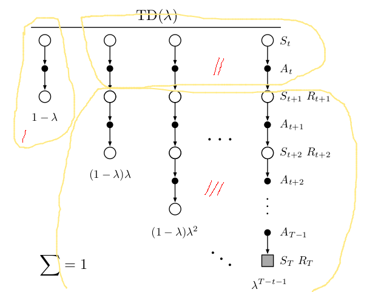

# Chapter12
∑ τ α π δ γ ∏ Δ Λ μ ∈ ∀ β λ ∞
## References
[towardsdatascience](https://towardsdatascience.com/eligibility-traces-in-reinforcement-learning-a6b458c019d6#:~:text=Eligibility%20traces%20is%20a%20way,have%20a%20better%20learning%20performance.)

[Alister Reis's blog](https://amreis.github.io/ml/reinf-learn/2017/11/02/reinforcement-learning-eligibility-traces.html)

[MIT ppt](https://www.tu-chemnitz.de/informatik/KI/scripts/ws0910/ml09_7.pdf)

[Maybe Coursera](https://www.cs.utexas.edu/~pstone/Courses/394Rfall16/resources/week6-sutton.pdf)

## Exercises
### 12.1
G<sub>t:t+n</sub> = R<sub>t+1</sub> + γR<sub>t+2</sub> + ... + γ<sup>n</sup>v(S<sub>t+n</sub>, w<sub>t+n-1</sub>)

= R<sub>t+1</sub> + γ(R<sub>t+1+1</sub> + ... + γ<sup>n-1</sup>v(S<sub>(t+1)+(n-1)</sub>, w<sub>(t+1)+(n-1)-1</sub>))

= R<sub>t+1</sub> + γG<sub>t+1:t+1+n-1</sub>

G<sub>t:t+1</sub> = R<sub>t+1</sub> + γv(S<sub>t+1</sub>, w<sub>t</sub>)

G<sub>t+1:t+1</sub> = v(S<sub>t+1</sub>, w<sub>t</sub>)

G<sub>t</sub><sup>λ</sup> = (1 - λ)∑<sub>n=(1,∞)</sub>λ<sup>n-1</sup>G<sub>t:t+n</sub>

= (1 - λ)∑<sub>n=(1,∞)</sub>λ<sup>n-1</sup>(R<sub>t+1</sub> + γG<sub>t+1:t+1+n-1</sub>)

= (1 - λ)(∑<sub>n=(1,∞)</sub>λ<sup>n-1</sup>R<sub>t+1</sub> + γλ<sup>1-1</sup>G<sub>t+1:t+1</sub> + λ∑<sub>n=(1,∞)</sub>γG<sub>t+1:t+1+n</sub>)

= R<sub>t+1</sub> + (1 - λ)γv(S<sub>t+1</sub>, w<sub>t</sub>) + γλG<sub>t+1</sub>
### 12.2
(1 - λ)λ<sup>τ</sup> = (1 - λ) / 2

λ<sup>τ</sup> = 1 /2 

τ = log<sub>λ</sub>(1/2)
### 12.3
1. w<sub>t+1</sub> = w<sub>t</sub> + α[G<sub>t</sub><sup>λ</sup> - v(S<sub>t</sub>,w<sub>t</sub>)]dv(S<sub>t</sub>,w<sub>t</sub>)

2. δ<sub>t</sub> = R<sub>t+1</sub> + γv(S<sub>t+1</sub>,w<sub>t</sub>) - v(S<sub>t</sub>,w<sub>t</sub>)

3. G<sub>t</sub><sup>λ</sup> = R<sub>t+1</sub> + (1 - λ)γv(S<sub>t+1</sub>, w<sub>t</sub>) + γλG<sub>t+1</sub>

4. G<sub>t</sub> - V(S<sub>t</sub>) = ∑<sub>k=t:T-1</sub>γ<sup>k-t</sup>δ<sub>k</sub>

G<sub>t</sub> - V(S<sub>t</sub>) = R<sub>t+1</sub> + (1 - λ)γv(S<sub>t+1</sub>, w<sub>t</sub>) + γλG<sub>t+1</sub> - V(S<sub>t</sub>)   ...(3)

= R<sub>t+1</sub> + γv(S<sub>t+1</sub>,w<sub>t</sub>) - v(S<sub>t</sub>,w<sub>t</sub>) - λγv(S<sub>t+1</sub>,w) + λγG<sub>t+1</sub><sup>λ</sup>

= δ<sub>t</sub> + λγ(G<sub>t+1</sub><sup>λ</sup> - v(S<sub>t+1</sub>,w<sub>t</sub>))    ...(2)

= δ<sub>t</sub> + λγ(δ<sub>t</sub> + λγ(G<sub>t+2</sub><sup>λ</sup> - v(S<sub>t+2</sub>,w<sub>t</sub>)))

= ∑<sub>k=t:∞</sub>(λγ)<sup>k-t</sup>δ<sub>k</sub>
### 12.4
∑ τ α π δ γ ∏ Δ Λ μ ∈ ∀ β λ ∞

TD(λ):

Δw = α∑<sub>t</sub>δ<sub>t</sub>z<sub>t</sub>

z<sub>t+1</sub> = γλz<sub>t</sub> + dV(S<sub>t</sub>,w)

z<sub>t+2</sub> = γλz<sub>t+1</sub> + dV(S<sub>t+1</sub>,w)

= γλ(γλz<sub>t</sub> + dV(S<sub>t</sub>,w)) + dV(S<sub>t+1</sub>,w)

= γλ<sup>2</sup>z<sub>t</sub> + γλz<sub>t+1</sub> + z<sub>t+2</sub>

z<sub>t+n</sub> = ∑<sub>k=0:n</sub>(γλ)<sup>n-k</sup>dV(S<sub>t+k</sub>)

Δw = α∑<sub>t</sub>δ<sub>t</sub>∑<sub>k=0:t</sub>(γλ)<sup>t-k</sup>dV(S<sub>k</sub>)

Don't know how to prove it, refer to [LyWangPx](https://github.com/LyWangPX/Reinforcement-Learning-2nd-Edition-by-Sutton-Exercise-Solutions/tree/master/Chapter%2012)
### 12.5
(1)
G<sub>t:h</sub> - G<sub>t:h-1</sub>

= δ<sub>t</sub> + V<sub>t</sub> + γ(G<sub>t+1:t+n</sub> - V<sub>t+1</sub>) - δ<sub>t</sub> - V<sub>t</sub> - γ(G<sub>t+1:t+n-1</sub> - V<sub>t+1</sub>)

= γ(G<sub>t+1:t+n</sub> - G<sub>t+1:t+n-1</sub>)

= ...

= γ<sup>n</sup>(G<sub>t+n-1:t+n</sub> - G<sub>t+n-1:t+n-1</sub>)

= γ<sup>n</sup>(R<sub>t+n</sub> + γV<sub>t+n</sub> - V<sub>t</sub>)

= γ<sup>h</sup>δ<sub>t+h</sub>

(2)
∑<sub>n=1:h-t-1</sub>λ<sup>n-1</sup>G<sub>t:t+n</sub> - λ∑<sub>n=1:h-t-2</sub>λ<sup>n-1</sup>G<sub>t:t+n</sub>

= ∑<sub>n=1:h-t-2</sub>λ<sup>n-1</sup>(G<sub>t:t+n</sub> - λ*λ<sup>n-1</sup>G<sub>t:t+n</sub>) + λ<sup>h-t-2</sup>G<sub>t:t+h-t-1<sub>

= (1 - λ)∑<sub>n=1:h-t-2</sub>λ<sup>n-1</sup>G<sub>t:t+n</sub> + λ<sup>h-t-2</sup>G<sub>t:h-1</sub>

(3)
G<sub>t:h</sub><sup>λ</sup> = (1 - λ)∑<sub>n=1:h-t-1</sub>λ<sup>n-1</sup>G<sub>t:t+n</sub> + λ<sup>h-t-1</sup>G<sub>t:h</sub>

= ∑<sub>n=1:h-t-1</sub>λ<sup>n-1</sup>G<sub>t:t+n</sub> - λ∑<sub>n=1:h-t-1</sub>λ<sup>n-1</sup>G<sub>t:t+n</sub> + λ<sup>h-t-1</sup>G<sub>t:h</sub>

= ∑<sub>n=1:h-t-1</sub>λ<sup>n-1</sup>G<sub>t:t+n</sub> - λ∑<sub>n=1:h-t-2</sub>λ<sup>n-1</sup>G<sub>t:t+n</sub> - λ<sup>h-t-1</sup>G<sub>t:h-1</sub> + λ<sup>h-t-1</sup>G<sub>t:h</sub>

= (1 - λ)∑<sub>n=1:h-t-2</sub>λ<sup>n-1</sup>G<sub>t:t+n</sub> + λ<sup>h-t-2</sup>G<sub>t:h-1</sub> + λ<sup>h-t-1</sup>γ<sup>h</sup>δ<sub>t+h</sub>

= Solve it recursively

(4) Intuitively, G<sub>t+1</sub> - G<sub>t</sub> = estimated δ decayed by γ and λ
### 12.6
```
    Loop for i in F(S,A):
        δ -= wi
        zi += 1
    ...
    Loop for i in F(S',A): δ += γwi
    w += αδz
    z = (1-α)γλz
    S = S'; A = A'
```
### 12.6


G<sub>t</sub><sup>λ<sub>s</sub></sup> = 
(1-λ<sub>t+1</sub>)G<sub>t</sub> + γ<sub>t+1</sub>λ<sub>t+1</sub>G<sub>t+1</sub><sup>λ<sub>s</sub></sup> + λ<sub>t+1</sub>R<sub>t+1</sub>

Part I: λ<sub>t+1</sub>R<sub>t+1</sub>

Part II: (1-λ<sub>t+1</sub>)G<sub>t</sub>

Part III: γ<sub>t+1</sub>λ<sub>t+1</sub>G<sub>t+1</sub><sup>λ<sub>s</sub></sup>

G<sub>t</sub><sup>λ<sub>s</sub></sup> =  R<sub>t+1</sub> + γ<sub>t+1</sub>((1-λ<sub>t+1</sub>)v(S<sub>t+1</sub>,w<sub>t</sub>) + λ<sub>t+1</sub>G<sub>t+1</sub><sup>λ<sub>s</sub></sup>)

G<sub>t:h</sub><sup>λ<sub>s</sub></sup> = R<sub>t+1</sub> + γ<sub>t+1</sub>((1-λ<sub>t+1</sub>)v(S<sub>t+1</sub>,w<sub>t</sub>) + λ<sub>t+1</sub>G<sup>λ<sub>s</sub></sup><sub>t+1:h</sub>)

G<sub>t:h</sub><sup>λ<sub>a</sub></sup> = R<sub>t+1</sub> + γ<sub>t+1</sub>((1-λ<sub>t+1</sub>)q(S<sub>t+1</sub>,A<sub>t+1</sub>,w<sub>t</sub>) + λ<sub>t+1</sub>G<sup>λ<sub>a</sub></sup><sub>t+1:h</sub>)

G<sub>t:h</sub><sup>λ<sub>s</sub></sup> = R<sub>t+1</sub> + γ<sub>t+1</sub>((1-λ<sub>t+1</sub>)v<sub>exp</sub>(S<sub>t+1</sub>) + λ<sub>t+1</sub>G<sup>λ<sub>s</sub></sup><sub>t+1:h</sub>)

