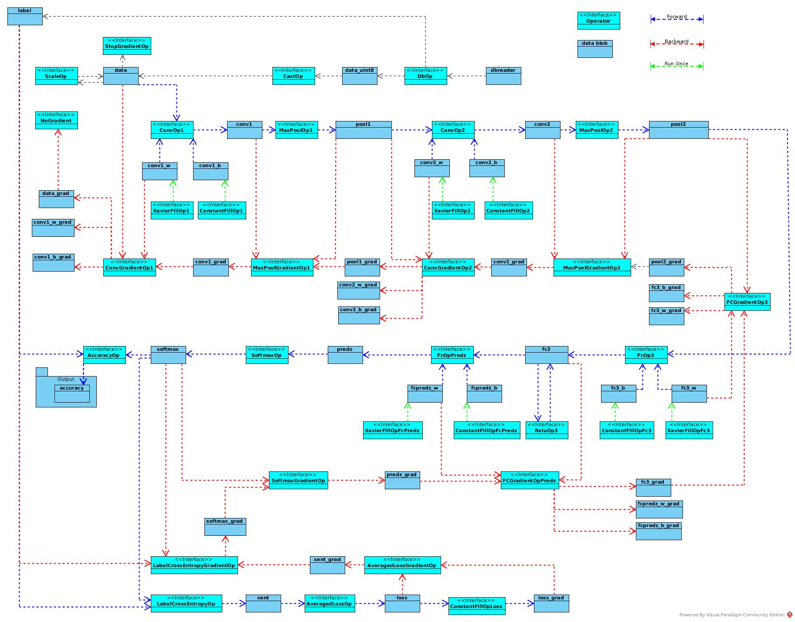
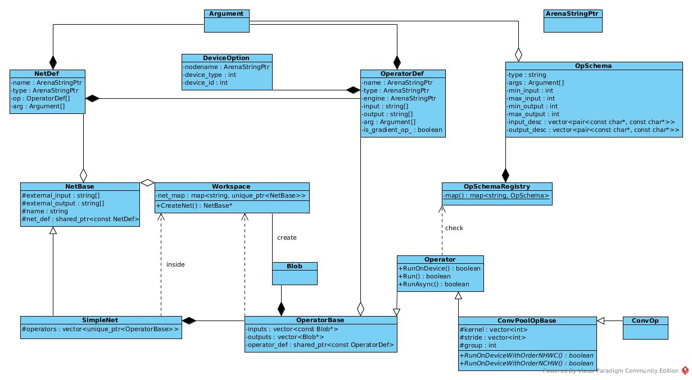
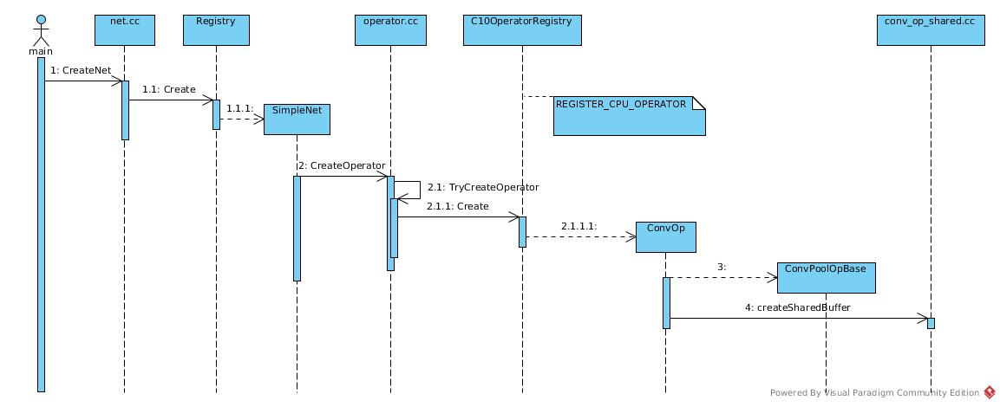
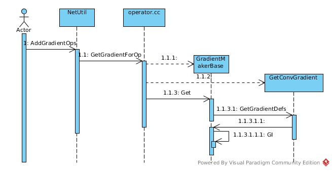
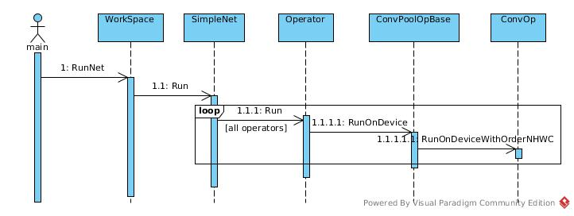
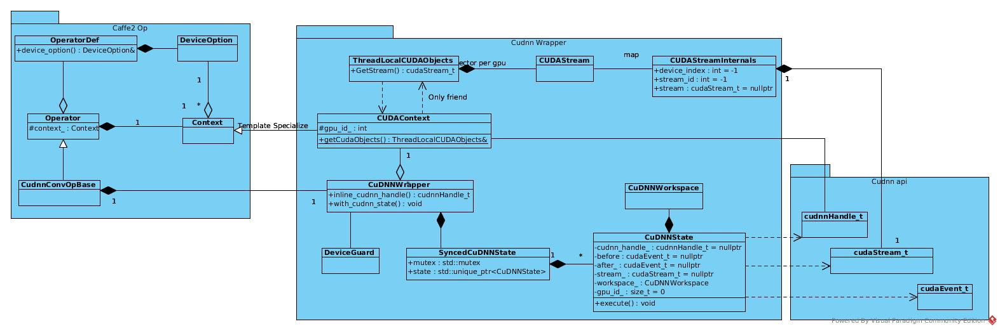
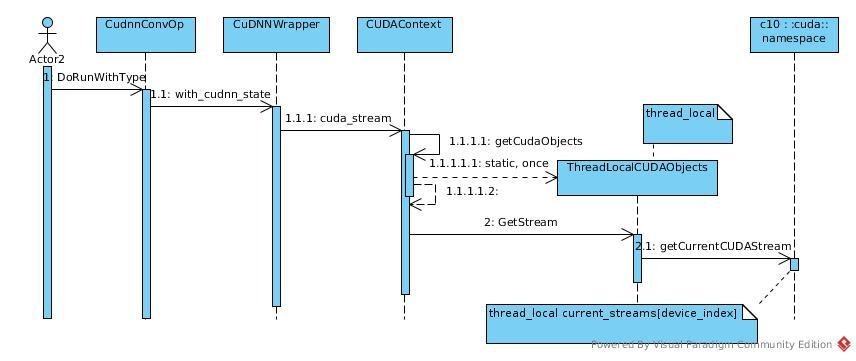
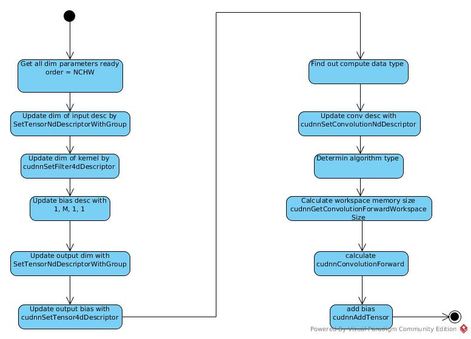
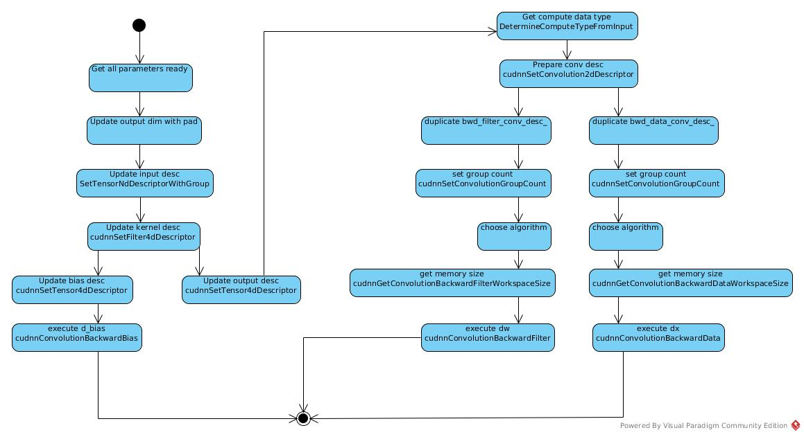

# Convolution Operation

## Initiation
### Class Diagram


*Operator* object is created based on *OperatorDef*.

In *operator.cc*:
``` c++
unique_ptr<OperatorBase> _CreateOperator(
    const OperatorDef& operator_def,
    Workspace* ws) {
```
In runtime, the schema just works as a validator:
``` c++
  auto* schema = OpSchemaRegistry::Schema(op_type);
  if (schema) {
    CAFFE_ENFORCE(
        schema->Verify(operator_def),
        "Operator def did not pass schema checking: ",
        ProtoDebugString(operator_def));
  }
```
Create through registry:
``` c++
unique_ptr<OperatorBase> TryCreateC10Operator(
    const string& key,
    const OperatorDef& operator_def,
    Workspace* ws) {
  return C10OperatorRegistry()->Create(key, operator_def, ws);
}
```
The creator is registered in conv_op.cc
``` c++
REGISTER_CPU_OPERATOR(Conv, ConvOp<float, CPUContext>);
```
So, the constructor is invoked:
``` c++
 public:
  USE_CONV_POOL_BASE_FUNCTIONS(Context);
  ConvOp(const OperatorDef& operator_def, Workspace* ws)
      : ConvPoolOpBase<Context>(operator_def, ws) {
```  
The convolution specific arguments are initiated in parent class:
``` c++
 public:
  USE_OPERATOR_CONTEXT_FUNCTIONS;
  ConvPoolOpBase(const OperatorDef& operator_def, Workspace* ws)
      : Operator<Context>(operator_def, ws),
        legacy_pad_(
            static_cast<LegacyPadding>(this->template GetSingleArgument<int>(
                "legacy_pad",
                LegacyPadding::NOTSET))),
        global_pooling_(
        		//ZF: GetSingleArgument / GetRepeatedArgument
            this->template GetSingleArgument<int>("global_pooling", 0)),
        kernel_(this->template GetRepeatedArgument<int>("kernels")),
        dilation_(this->template GetRepeatedArgument<int>("dilations")),
        stride_(this->template GetRepeatedArgument<int>("strides")),
        pads_(this->template GetRepeatedArgument<int>("pads")),
        float16_compute_(
            this->template GetSingleArgument<bool>("float16_compute", false)),
        group_(this->template GetSingleArgument<int>("group", 1)),
        order_(StringToStorageOrder(
            this->template GetSingleArgument<string>("order", "NCHW"))),
			//ZF: What's shared_buffer for?
        shared_buffer_(
            this->template GetSingleArgument<int>("shared_buffer", 0)),
        ws_(ws) {
```
The input/output are initiated in base class *OperatorBase*:

But seemed that the *OperatorDef* in specified class has only check/validation/test functions. 
``` c++
OperatorBase::OperatorBase(const OperatorDef& operator_def, Workspace* ws)
    : operator_ws_(ws),
      operator_def_(std::make_shared<OperatorDef>(operator_def)),
      device_option_(
          operator_def.has_device_option() ? operator_def.device_option()
                                           : DeviceOption()),
      event_(caffe2::make_unique<Event>(device_option_)) {
  static GlobalInitIsCalledGuard guard;
  for (const string& input_str : operator_def.input()) {
    auto* blob = ws->GetBlob(input_str);
    CAFFE_ENFORCE(
        blob != nullptr,
        "op ",
        operator_def.type(),
        ": Encountered a non-existing input blob: ",
        input_str);
    inputs_.push_back(blob);
  }

  GetOperatorLogger()(operator_def);

  for (const string& output_str : operator_def.output()) {
    outputs_.push_back(CHECK_NOTNULL(ws->CreateBlob(output_str)));
  }

  type_ = operator_def.type();
}
```  
The input/output schema and indices are registered in *conv_op.cc*
``` c++
std::function<void(OpSchema&)> ConvDocGenerator(const char* dim) {
   return [=](OpSchema& schema) {  
```
``` c++
OPERATOR_SCHEMA(Conv)
    .NumInputs(2, 3)
    .NumOutputs(1)
    .TensorInferenceFunction(ConvPoolOpBase<CPUContext>::TensorInferenceForConv)
    .CostInferenceFunction(OpSchema::CostInferenceFunctionType(
        ConvPoolOpBase<CPUContext>::CostInferenceForConv))
    .FillUsing(ConvDocGenerator(""))
    .InheritOnnxSchema();
```
              
### Sequence 

### ConvOp Class
The class create an object of certain kernel with specific environment,
including context, workspace, order, group etc.
``` c++
  ConvPoolOpBase(const OperatorDef& operator_def, Workspace* ws)
      : Operator<Context>(operator_def, ws),
        legacy_pad_(
            static_cast<LegacyPadding>(this->template GetSingleArgument<int>(
                "legacy_pad",
                LegacyPadding::NOTSET))),
        global_pooling_(
        		//ZF: GetSingleArgument / GetRepeatedArgument
            this->template GetSingleArgument<int>("global_pooling", 0)),
        kernel_(this->template GetRepeatedArgument<int>("kernels")),
        dilation_(this->template GetRepeatedArgument<int>("dilations")),
        stride_(this->template GetRepeatedArgument<int>("strides")),
        pads_(this->template GetRepeatedArgument<int>("pads")),
        float16_compute_(
            this->template GetSingleArgument<bool>("float16_compute", false)),
        group_(this->template GetSingleArgument<int>("group", 1)),
        order_(StringToStorageOrder(
            this->template GetSingleArgument<string>("order", "NCHW"))),
			//ZF: What's shared_buffer for?
        shared_buffer_(
            this->template GetSingleArgument<int>("shared_buffer", 0)),
        ws_(ws) {
        // Validation and adjustment of above arguments
        }
``` 

Caffe2 re-arched to replace concepts of layer by concepts of operator,
and the *conv_op* class seemed just have kernel dim parameters registered (maybe not initialized),
and the input/output are referred and transferred as *name(string)* parameters.

``` c++
OperatorBase::OperatorBase(const OperatorDef& operator_def, Workspace* ws)
    : operator_ws_(ws),
      operator_def_(std::make_shared<OperatorDef>(operator_def)),
      device_option_(
          operator_def.has_device_option() ? operator_def.device_option()
                                           : DeviceOption()),
      event_(caffe2::make_unique<Event>(device_option_)) {
  static GlobalInitIsCalledGuard guard;
  for (const string& input_str : operator_def.input()) {
    auto* blob = ws->GetBlob(input_str);
    CAFFE_ENFORCE(
        blob != nullptr,
        "op ",
        operator_def.type(),
        ": Encountered a non-existing input blob: ",
        input_str);
    inputs_.push_back(blob);
  }

  GetOperatorLogger()(operator_def);

  for (const string& output_str : operator_def.output()) {
    outputs_.push_back(CHECK_NOTNULL(ws->CreateBlob(output_str)));
  }

  type_ = operator_def.type();
}
```
### ConvOpDef
***TODO: Input and output***

*initModel* and *trainModel* are both view of actual graphs.
*initModel* adds generator for W and b initiation. 
``` c++
void ModelUtil::AddConvOps(const std::string &input, const std::string &output,
                    int in_size, int out_size, int stride, int padding,
		            int kernel, bool test) {
    if (!test) {
	    initModel.AddXavierFillOp({out_size, in_size, kernel, kernel}, output + "_w");
		initModel.AddConstantFillOp({out_size}, output + "_b");
	}
```
For example, the Xavier filler is an operator without input blob, 
and produces output as output_w and output_b. 

Then *trainModel* add the generated definition into data dictionary 
and generate *convopdef* with input, w, b as input.
``` c++
	trainModel.AddInput(output + "_w");
	trainModel.AddInput(output + "_b");
	trainModel.AddConvOp(input, output + "_w", output + "_b", output, stride,
		               padding, kernel);
}
```
The *initModel* runOnce to initialize all parameters and attach the pipeline of input and output
### Gradient Op
Generate *OpDef* then constructs object.
#### Create OpDef

In general, corresponding gradient operator generated by 
*GetGradientForOp* defined in *operator.cc*:
``` c++
GradientOpsMeta GetGradientForOp(
    const OperatorDef& def, const vector<GradientWrapper>& g_output) {
  std::unique_ptr<GradientMakerBase> maker(
      GradientRegistry()->Create(def.type(), def, g_output));
```
The argument of output is customer-defined, such as:
``` c++
OperatorDef* NetUtil::AddGradientOp(OperatorDef& op) {
	OperatorDef* grad = nullptr;
	std::vector<GradientWrapper> output(op.output_size());
	for (int i = 0; i < output.size(); i ++) {
		output[i].dense_ = op.output(i) + ModelUtil::GetConstName(GRADIENTSUFFIX);
	}
```
The corresponding gradient class constructor called:
``` c++
//GetGradientForOp
  GradientOpsMeta meta = maker->Get();
```
``` c++
//operator_gradient.h: GradientMakerBase
  virtual GradientOpsMeta Get() {
    VerifyOp();
    vector<OperatorDef> new_defs = GetGradientDefs();
```
The implement:
``` c++
// conv_gradient_op.cc
class GetConvGradient : public GradientMakerBase {
  using GradientMakerBase::GradientMakerBase;
  vector<OperatorDef> GetGradientDefs() override {
```
And create the *OperatorDef* by
``` c++
// proto_utils.h
OperatorDef CreateOperatorDef ()
```
Set input and output blob names in 
``` c++
        return SingleGradientDef(
            def_.type() + "Gradient",
            "",
            vector<string>{I(0), I(1), GO(0)},
            vector<string>{GI(1), GI(2), GI(0)});
```
The inputs are *X, W, Gradient_output*; outputs are *Gradient_W, Gradient_b, Gradient_X*
``` c++
  string I(const int i) {
    CAFFE_ENFORCE((i >= 0) && (i < def_.input().size()));
    return def_.input(i);
  }
  
  string GI(const int i) {
    g_input_.at(i).dense_ = GradientName(def_.input(i));
    return GradientName(def_.input(i));
  }  
  
  string GO(const int i) {
    return g_output_.at(i).dense_;
  }   
```
#### Create Op
Once the *OpDef* created and added into train model, 
the operator object is created as other operators.

The *ConvGradientOp* is a sub-class of *ConvPoolOpBase*,
it shares shapes of corresponding parameters
and the only extra input required is gradient of output in forward propagation.
## Run

### Calculation
#### RunOnDeviceWithOrderNCHW
``` c++
bool ConvOp<T, Context>::RunOnDeviceWithOrderNCHW() {
```
* T: data type
* Context: device etc.
``` c++
  const auto& X = Input(INPUT);
  const auto& filter = Input(FILTER);
  auto* Y = Output(0);
  const int N = X.dim32(0);
  const int C = X.dim32(1);
  const int G = group_;
  CAFFE_ENFORCE_EQ(X.dim(), filter.dim());
  const int M = filter.dim32(0);
```
* N: batch size
* C: input channel size
* G: group number
* M: kernel number
* X: image input, N * C * H * W
* Y: output, N * M * H' * W'
* filter: W, M * C * kernel_H * kernel_W
``` c++
  CAFFE_ENFORCE_EQ(
      C,
      filter.dim32(1) * G,
      "Convolution op: input channels does not match: # of input channels ",
      C,
      " is not equal to kernel channels * group: ",
      filter.dim32(1),
      "*",
      G);
  CAFFE_ENFORCE_EQ(
      M % G, 0, "The number of output channels is not divisible by group.");
``` 
In group case, the filter had been grouped in advance.
i.e., the channel number in filter = input channel number / group number
``` c++
  int kernel_size = 1;
  for (std::size_t i = 0; i < kernel_.size(); ++i) {
    CAFFE_ENFORCE_EQ(filter.dim32(i + 2), kernel_[i]);
    kernel_size *= kernel_[i];
  }
```
Calculate # of elements of kernel = kernel_H * kernel_W, 
that is size of filter except kernel number and channel number.
``` c++
  ConvPoolOpBase<Context>::SetOutputSize(X, Y, M);
```
Calculate output size of each dim by pad, dilation, stride, kernel size, input size.
For example:
``` c++
  static inline void ComputeSizeAndPad(
    //...
    switch (legacy_pad) {
      case LegacyPadding::NOTSET:
        //...
        *out_size = static_cast<int>(
            static_cast<float>(in_size + *pad_head + *pad_tail - dkernel) /
                stride +
            1);
        break;
      case LegacyPadding::VALID:
        //...
        *out_size = (in_size - dkernel) / stride + 1;
        break;
      case LegacyPadding::SAME: {
        // ...
        *out_size = (in_size + pad_needed - dkernel) / stride + 1;
        break;
      }

```
Back to Run function:
``` c++
  const vector<int> X_dims = GetDims(X);
  const vector<int> Y_dims = GetDims(*Y);
  const int X_HxW = X.numel() / (N * C);
  const int Y_HxW = Y->numel() / (N * M);
  const vector<int> img_shape(X.sizes().cbegin() + 1, X.sizes().cend());
  vector<int> buffer_shape(Y_dims.size() + 1);
  buffer_shape[0] = C * kernel_size;
  std::copy(Y_dims.cbegin(), Y_dims.cend(), buffer_shape.begin() + 1);
  
  // The im2col output buffer
  const int buffer_size = C * kernel_size * Y_HxW;
```
* X_dims: dims of single channel image
* Y_dims: dims of single channel output image
* X_HxW: input size for each image per channel
* Y_HxW: output size for each image per channel
* image_shape: channel, H, W
* buffer_shape: im2col output shape

[A ref image](https://raw.githubusercontent.com/fulltopic/Dp4jPractice/master/docs/images/im2col.jpg)

``` c++
  // To prove validation of these strides for group cases
  // The dimension of each kernel
  const int kernel_dim = C / G * kernel_size; // In fact, C * kernel_size / G
  const int X_stride = C * X_HxW;
  const int Y_stride = M * Y_HxW;
  const int filter_stride = filter.numel() / G;
``` 
The stride is the size of data per image per group calculated in one round of process.
``` c++
  if (InputSize() == 3) {
    const auto& bias = Input(BIAS);
    CAFFE_ENFORCE_EQ(bias.dim(), 1);
    CAFFE_ENFORCE_EQ(bias.dim32(0), M);
    bias_data = bias.template data<T>();
    ConvPoolOpBase<Context>::template SetBiasMultiplier<T>(
        Y_HxW, &bias_multiplier_);
  }
```  
In bias case, the *bias_multiplier_* is set to a matrix of one

***TODO: Im2Col implement***
``` c++
      if (G == 1) {
        math::Gemm<T, Context>(
            CblasNoTrans,
            CblasNoTrans,
            M, // M
            Y_HxW, // N
            kernel_dim, // K
            1.0f, // alpha
            filter_data, // W
            col_buffer_data, // X
            0.0f, //beta
            Y_data, // Y
            &context_);
      }
```
Y_data = 1.0 * filter_data * col_buffer_data + 0.0 * Y_data
* M: row number of *filter_data* = M = number of kernels
* N: col number of *col_buffer_data* = Y_HxW = number of elements of output image per channel
* K: col number and row number of input matrix
    = number of elements of kernel 
    = #channel * kernel_H * kernel_W
``` c++
else {
        math::GemmStridedBatched<T, Context>(
            CblasNoTrans,
            CblasNoTrans,
            G,
            M / G,
            Y_HxW,
            kernel_dim, // kernel_dim has had group counted
            1.0f,
            filter_data,
            filter_stride,
            col_buffer_data,
            buffer_size / G,
            0.0f,
            Y_data,
            Y_stride / G,
            &context_);
      }
```
* [GemmStridedBatched](https://devblogs.nvidia.com/cublas-strided-batched-matrix-multiply/)
* [Group](https://pic2.zhimg.com/80/v2-8563964e131c61172ea5ecfe7a7e85c1_hd.jpg)

In group case, treat group as batch size. 
* G: batch size for GemmStridedBatched (not batch size of DL)
* M / G: M = #row of multiplier#1
* Y_HxW: N + #col of multiplier#2
* kernel_dim: #col of multiplier#1 = #row of multiplier#2
* filter_stride: #elements of multiplier#1 per group = filter.numel() / G
    filter_numel() != M * C * H * W. In group case, the input has been adjusted as 
    filter_numel() = M * (C / G) * H * W.
    So, dividing G once is enough.
* buffer_size / G: B stride. The input divided by group
* Y_stride / G: output stride. 

So, the multiplication is 
* matrix of (M / G, C * Kernel_H * Kernel_W / G) multiplies
* matrix of (C * Kernel_H * Kernel_W / G, Output_H * Output_W)
* = matrix of (M / G, Output_H * Output_W)
``` c++
      if (bias_data != nullptr) {
        // Bias term can be carried out outside the group definition
        // to be efficient.
        math::Gemm<T, Context>(
            CblasNoTrans,
            CblasNoTrans,
            M,
            Y_HxW,
            1,
            1.0f,
            bias_data,
            bias_multiplier_.template data<T>(),
            1.0f,
            Y_data,
            &context_);
      }
```
For bias.

|matrix           |row number|col number            |
|-----------------|----------|----------------------|
|bias_data        |M         |1                     |
|bias_multiplier  |1         |output_H * output_W   |
|Y_data           |M         |output_H * output_W   |
``` c++
      X_data += X_stride;
      Y_data += Y_stride;
```
Continue to process next image
``` c++
  if (FLAGS_caffe2_force_shared_col_buffer || shared_buffer_) {
    runWithSharedBuffer<Context>(ws_, func);
  }
```
When there is no dead/live-lock, the temporary buffer of im2col result could be shared between between *conv_ops*.
``` c++
template <>
void runWithSharedBuffer<CPUContext>(
    Workspace* ws,
    std::function<void(Tensor* buffer)> f) {
  auto* mutexBlob = ws->GetBlob("__CAFFE2_SHARED_CONV_BUFFER_CPU_MUTEX__");
  CAFFE_ENFORCE(mutexBlob, "Must call createSharedBuffer() first");

  auto* mutexPtr = mutexBlob->GetMutable<std::unique_ptr<std::mutex>>();
  std::lock_guard<std::mutex> g(**mutexPtr);
  auto* buffer = BlobGetMutableTensor(
      ws->GetBlob("__CAFFE2_SHARED_CONV_BUFFER_CPU__"), CPU);
  f(buffer);
}
```   
Just get the mutex blob and lock with lock_guard to protect the critical memory.
``` c++
 else {
    func(&col_buffer_);
  }
```
Else, use per object tensor:
``` c++
// ConvOp class
  Tensor col_buffer_{Context::GetDeviceType()};
  Tensor col_buffer_shape_device_{Context::GetDeviceType()};
```
#### Run1x1ConvOnDeviceWithOrderNCHW
There is an optimization (or other consideration?) for 1x1 *conv_op*.
No im2col executed as the result is the same as original matrix.
And images processed once for all. 
``` c++
  if (G == 1) {
    math::GemmStridedBatched<T, Context>(
        CblasNoTrans,
        CblasNoTrans,
        N, // batch_size,
        M, //M kernel number, in fact, channel number * new channel number * 1 * 1
        HxW, // N  image size
        C, //K  channel size
        1.0f, //alpha
        filter, // A   kernel matrix
        0, //a_stride  always the same kernel matrix
        X, //B image
        C * HxW, // b_stride  one image
        0.0f, //beta
        Y, //C
        M * HxW, //c_stride    new channel number * image size
        &context_);
  } 
```
For group = 1 case, make N the group number of *GemmStridedBatched*,
the calculation is a single plain 2D image *conv_op* process.
``` c++
    const int batch_size = N * G;
    const int D_X = C / G;
    const int D_Y = M / G;
    const int X_stride = D_X * HxW;
    const int W_stride = D_Y * D_X;
    const int Y_stride = D_Y * HxW;
    std::vector<const T*> X_ptr(N * G);
    std::vector<const T*> W_ptr(N * G);
    std::vector<T*> Y_ptr(N * G);
    for (int i = 0; i < N; ++i) {
      for (int j = 0; j < G; ++j) {
        const int index = i * G + j;
        X_ptr[index] = X + index * X_stride;
        W_ptr[index] = filter + j * W_stride;
        Y_ptr[index] = Y + index * Y_stride;
      }
    }
``` 
* batch_size = N * G to cover all the images
* W_ptr\[index] = filter + j * W_stride: W_ptr is of size (M / G * C)
#### Im2col
``` c++
C10_EXPORT void Im2Col<float, CPUContext, StorageOrder::NCHW>(
```
##### Im2ColZeroPaddingAndNoDilationNCHW
In simple case:
``` c++
  if (pad_t == 0 && pad_l == 0 && pad_b == 0 && pad_r == 0 && dilation_h == 1 &&
      dilation_w == 1) {
    Im2ColZeroPaddingAndNoDilationNCHW<float>(
```
Calculate output sizes:
``` c++
C10_EXPORT void Im2ColZeroPaddingAndNoDilationNCHW(
    const int C,
    const int H,
    const int W,
    const int kernel_h,
    const int kernel_w,
    const int stride_h,
    const int stride_w,
    const T* img_data,
    T* col_data,
    CPUContext* context) {
  const int output_h = (H - kernel_h) / stride_h + 1;
  const int output_w = (W - kernel_w) / stride_w + 1;
  const int output_size = output_h * output_w;
  for (int c = 0; c < C; ++c) {
    for (int kh = 0; kh < kernel_h; ++kh) {
      for (int kw = 0; kw < kernel_w; ++kw) {
        const T* src = img_data + kh * W + kw;
      }
```
The output of *Im2Col* is a matrix of (channel * K_H * K_W, output_H * output_W),
Suppose we are scanning ith element of kernel, i ∈ (0, K_H * K_W),
the line i of output contains all the elements of image_data that could be mapped to ith element of kernel.

In theory, each element of image_data could be the corresponding element of ith element of kernel,
the only constraint is matrix range. 
And the constraint had been met by output_h/output_w calculation.
``` c++
        const T* src = img_data + kh * W + kw;
```        
So, the source of each line of output matrix. 
``` c++
        if (stride_w == 1) {
          CopyMatrix<T, CPUContext>(
              output_h,
              output_w,
              src,
              stride_h * W,
              col_data,
              output_w,
              context);
        } else {
           CopyMatrix<T, CPUContext>(
              output_h,
              output_w,
              src,
              stride_h * W,
              stride_w,
              col_data,
              output_w,
              1,
              context);
        }
```
Copy a matrix with src as element\[0]\[0], #row = output_h, #col = output_w
into col_data with row-first-order.
``` c++
        col_data += output_size;
```
One line of output finished.
##### Other 2D Case
``` c++
  const int output_h =
      (H + pad_t + pad_b - (dilation_h * (kernel_h - 1) + 1)) / stride_h + 1;
  const int output_w =
      (W + pad_l + pad_r - (dilation_w * (kernel_w - 1) + 1)) / stride_w + 1;
```
Standard output calculation.
``` c++
  for (int c = 0; c < C; ++c) {
    for (int kh = 0; kh < kernel_h; ++kh) {
      for (int kw = 0; kw < kernel_w; ++kw) {
```
Still travels by kernel element.
``` c++
        for (int h = 0; h < output_h; ++h) {
          const int h_pad = h * stride_h - pad_t + kh * dilation_h;        
```
Then, to fill in output element one by one.
``` c++
          if (!utils::IsAGeZeroAndALtB(h_pad, H)) {
            std::memset(col_data + h * output_w, 0, output_w * sizeof(float));
            continue;
          }
```      
If it is a pad line, that is, the line padded on the top or bottom of the matrix,
set all elements zero.
``` c++
          for (int w = 0; w < output_w; ++w) {
            const int w_pad = w * stride_w - pad_l + kw * dilation_w;
            col_data[h * output_w + w] = utils::IsAGeZeroAndALtB(w_pad, W)
                ? img_data[(c * H + h_pad) * W + w_pad]
                : 0;
          }
```
The original index of w is (w * stride_w + kw * dilation_w), so no +1,
with pad_l counted, 
the corresponding element of col_data is 0 in padding case,
or w_pad in other cases.          
## CUDA Calculation
*Caffe2* has CuDnn integrated and takes it as a unique feature for performance.

### Classes
*Caffe2* encapsulates the *cudnn* api to manage multi-thread and multi-stream.
The resources are encapsulated in CUDAContext and runtime executions are encapsulated in CuDNNWrapper.



#### Resource management
##### Stream
There are a global stream pool per gpu, and lazy-initialized:
``` c++
CUDAStream.cpp: 
CUDAStream getStreamFromPool(...) {
//...
  std::call_once(device_flags[device_index], initDeviceStreamState, device_index);
//...
}

static void initDeviceStreamState(DeviceIndex device_index) {
  // Switches to the requested device so streams are properly associated
  // with it.
  CUDAGuard device_guard{device_index};

  for (auto i = decltype(kStreamsPerPool){0}; i < kStreamsPerPool; ++i) {
    auto& lowpri_stream = low_priority_streams[device_index][i];
    auto& hipri_stream = high_priority_streams[device_index][i];

    lowpri_stream.device_index = device_index;
    hipri_stream.device_index = device_index;

      C10_CUDA_CHECK(cudaStreamCreateWithPriority(
        &lowpri_stream.stream
      , kDefaultFlags
      , kLowPriority));
      C10_CUDA_CHECK(cudaStreamCreateWithPriority(
        &hipri_stream.stream
      , kDefaultFlags
      , kHighPriority));
  }
}    
```

A thread-local stream defined per CPU thread to ensure that there is at most one stream attach to one CPU thread.
The attachment is lazy-initialized.
``` c++
CUDAStream.cpp
static thread_local CUDAStreamInternals** current_streams = nullptr;

CUDAStream getDefaultCUDAStream(DeviceIndex device_index) {
  initCUDAStreamsOnce();
  if (device_index == -1) device_index = current_device();
  check_gpu(device_index);
  return CUDAStream_fromInternals(&default_streams[device_index]);
}

static void initCUDAStreamsOnce() {
  // Inits default streams (once, globally)
  std::call_once(init_flag, initGlobalStreamState);

  if (current_streams) return;

  // Inits current streams (thread local) to default streams
  current_streams = (CUDAStreamInternals**) malloc(num_gpus * sizeof(CUDAStreamInternals*));
  for (auto i = decltype(num_gpus){0}; i < num_gpus; ++i) {
    current_streams[i] = &default_streams[i];
  }
}
```

But *Operator* does not manipulate *CUDAStream* directly. 
The access to stream is wrapped in *CuDNNWrapper* and attached to CPU thread by another thread_local object.
``` c++
ThreadLocalCUDAObjects& CUDAContext::getCudaObjects() {
  static thread_local ThreadLocalCUDAObjects cuda_objects_;
  return cuda_objects_;
}
```


From view of *Operator*, the object of *current_streams* could be stored in *ThreadLocalCUDAObject* as a merely local field.
While the stream of current thread is also referred in other cases, often in accessory audit cases.
So, *current_streams* is also a thread_local variable.  
And there is local variable of current streams defined in *ThreadLocalCUDAObjects*,
but seemed not have been used sensibly. 

Anyway, I think the design of this module is still on-going. It is not mature yet.  

##### Handle
Besides stream, cudnn handle is also mandatory resource. 
The *cudnnHandle_t* is bound to device_index = gpu_id. 
The gpu_id is stored in *CUDAContext* which initialized in *Operator* constructor.
``` c++
class Operator : public OperatorBase {
 public:
  explicit Operator(const OperatorDef& operator_def, Workspace* ws)
      : OperatorBase(operator_def, ws), context_(operator_def.device_option()) {

```
#### Execution
Two functions of wrapper are used in execution. 

First one is to get the handle. 
As mentioned above, the handle is bound to gpu_id that set to context and put into *Operator* object in construction.

That is, there are multi handles point to the same device, 
while one object is allowed to use only one handle (gpu).  
``` c++
  cudnnHandle_t inline_cudnn_handle() {
    return context_->cudnn_handle();
  }
  
  cudnnHandle_t cudnn_handle() {
    return getCudaObjects().GetCudnnHandle(gpu_id_);
  }  
``` 

The other one is the stream. 
As all streams are de-queued from the same stream pool, there may be multi CPU threads share the same stream,
the stream has been encapsulated in *CuDNNState* that provides a mutex lock to serialize actions on the same stream.
``` c++
  template <typename F>
  void with_cudnn_state(size_t state_idx, F&& f) {
    CAFFE_ENFORCE(
        state_idx < CAFFE2_COMPILE_TIME_MAX_CUDNN_STATES, "Invalid state_idx");
    auto& sync_state = cudnn_states()[context_->device_id()][state_idx];

    DeviceGuard dg(context_->device_id());

    // We need to serialize execution on the CuDNNState as we can't
    // allow multiple threads to race through the cudaEventRecord
    // calls (so a worker thread might wait on another worker thread's
    // execution)
    std::lock_guard<std::mutex> g(sync_state.mutex);
    if (!sync_state.state.get()) {
      sync_state.state.reset(new CuDNNState(context_->device_id()));
    }
    CHECK_NOTNULL(sync_state.state.get())->execute(context_->cuda_stream(), f);
  }
```
### Implement
The implementation with *cudnn* is just standard usage as following sections show 
with just some details:
* Half:  F16 = 16-bit float data type. [TRAINING WITH MIXED PRECISION](http://on-demand.gputechconf.com/gtc/2017/presentation/s7218-training-with-mixed-precision-boris-ginsburg.pdf)
* group conv: For *cudnn* with version >= 7.0.0, the *group* parameter is used twice. 
The first one is to take set *group* attribute of conv_desc, as :
``` c++
    cudnnSetConvolutionGroupCount(conv_desc_, group_);
``` 
The second one is to set input channel number of kernel desc, as:
``` c++
cudnnSetFilter4dDescriptor(
            filter_desc_,
            cudnnTypeWrapper<T_W>::type,
            GetCudnnTensorFormat(order_),
            MM,
            C / group_,
            kernel_h(),
            kernel_.size() == 1 ? 1 : kernel_w());
```
Don't know the logic why *MM* requires no special treatment. Will it be more natural to make them symmetry?
* algorithm choose:
The algorithms supported are declared at [cudnnConvolutionFwdAlgo_t](https://docs.nvidia.com/deeplearning/sdk/cudnn-developer-guide/index.html#cudnnConvolutionFwdAlgo_t): 
If not determined in advance, there is a exhausting search for fastest algorithm 
by *cudnnFindConvolutionForwardAlgorithmEx*
#### Forward Propagation
The sequence of cudnn implementation:



The link for [cudnn conv tutorial](http://www.goldsborough.me/cuda/ml/cudnn/c++/2017/10/01/14-37-23-convolutions_with_cudnn/)
#### Back Propagation
The back-propagation is implemented in similar way as


### Profile
#### Stream Thread
#### Memory Copy
## Registry in Compile Time