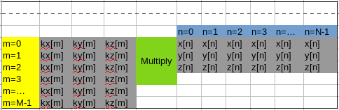
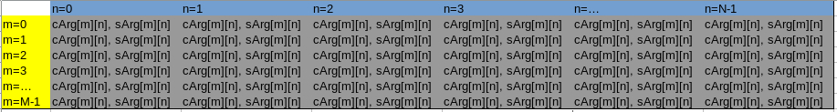
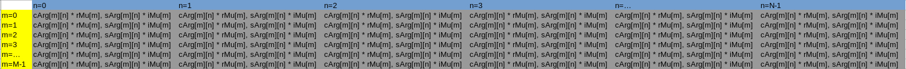
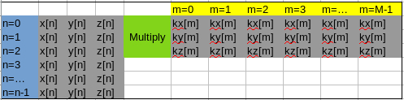
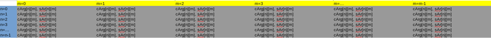
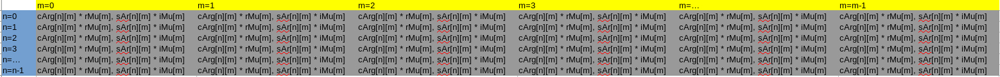
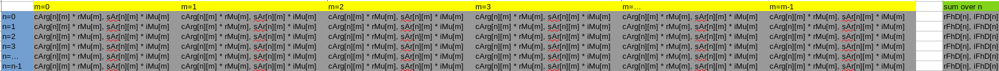

#Ch11
## Notes
* Loop fission
* Register
* Constant memory
* Memory layout
## Solutions
### 11.1
#### a
1) Read rPhi\[m], rD\[m], iPhi\[m], iD\[m]
2) Calculate rMu\[m]
3) Read rPhi\[m], rD\[m], iPhi\[m], iD\[m]
4) Compute iMu\[m]
5) n = 0
6) Read kx\[m], ky\[m], kz\[m]
7) Read x\[n], y\[n], z\[n]
8) Compute expFhd
9) Compute cArg
10) Compute sArg
11) Read rMu\[m], iMu\[m]
12) Compute rFhD\[n]
13) Read rMu\[m], iMu\[m]
14) Compute iFhD\[m]
15) n ++
16) If n < N, to 6); else to 17)
17) m ++
18) If m < M, to 1); else to 19)
19) End
#### b
According to figure 11.6(b)
1) m = 0
2) Read rPhi\[m], rD\[m], iPhi\[m], iD\[m]
3) Calculate rMu\[m]
4) Read rPhi\[m], rD\[m], iPhi\[m], iD\[m]
5) Compute iMu\[m]
6) m ++
7) If m < M, goto 2); else to 8)
8) m = 0
9) n = 0
10) Read kx\[m], ky\[m], kz\[m]
11) Read x\[n], y\[n], z\[n]
12) Compute expFhd
13) Compute cArg
14) Compute sArg
15) Read rMu\[m], iMu\[m]
16) Compute rFhD\[n]
17) Read rMu\[m], iMu\[m]
18) Compute iFhD\[m]
19) n ++
20) if n < N, goto 11); else goto 21)
21) m ++
22) if m < M, goto 9); else goto 23)
23) End
### 11.2
#### a

#### b

#### c
*cArg* depends on *kx\[m]* and *x\[n]*. 
*kx\[m]* and *x\[n]* are independent input arguments. They are ready and readonly before *cArg* computation.

*rFhD\[n]* depends on *rMu\[m]* and cArg. *rMu\[m]* is input argument, it is ready and readonly before computation.
*cArg* is calculated before *rFhD\[n]* before and after fission. And it is a temp variable that updated in each inner loop iteration.
So, all arguments for *rFhD\[n]* are ready and preserved before its consumption.

There are different operations between 2 *rFhD\[n]* update. 
But the updates of *rFhD\[n]+=* themselves are in the same sequence.

Before fission:
* m = k
* update *rFhD\[0]* with m = k arguments
* update *rFhD\[1]* with m = k arguments
* ...
* m = k + 1    
* update *rFhD\[0]* with m = k + 1 arguments
* update *rFhD\[1]* with m = k + 1 arguments
* ...

After fission:
* n = t
* update *rFhD\[t]* with m = 0 arguments
* update *rFhD\[t]* with m = 1 arguments
* update *rFhD\[t]* with m = ... arguments
* ...
* n = t + 1

In essential, *rFhD\[n] = Σmg(f(x\[n], y\[n], z\[n]), kx\[m], ky\[m], kz\[m], rMu\[m], iMu\[m])*;
where *x\[n], y\[n], z\[n], kx\[m], ky\[m], kz\[m], rMu\[m], iMu\[m]* are all independent input arguments.

### 10.3
Each thread reads one element of x, i.e. *x\[n]*. 
*x\[n]* is used in each iteration of the loop, that is, used M times. 

Each thread reads all element of *kx*. Each element of *kx* (*kx\[m]*) is used once in each iteration of loop.

So loading *kx\[n]* does not make sense as there is no reuse of this variable.
### 10.4
[ref] (https://cuda-programming.blogspot.com/2013/01/what-is-constant-memory-in-cuda.html)
* *cudaMalloc()* and *cudaMemcpy()* are for common global memory. *\_\_constant__* and *cudaMemcpyToSymbol()* are for constant memory specially.
* *constant* related symbols guarantee special properties that are not (always) true for global memory by SDK and hardware: readonly, broadcast, always cached
* If he merged the constant memory operation into *cudaMalloc()* and *cudaMemcpy()*, that is OK. 
It is possible to improve performance (refer to __ref__)
* If he merged the constant memory operation into *cudaMalloc()* and *cudaMemcpy()*, that is not align to ideology of *cuda* library 
which separate global/constant/texture memory by functions. 