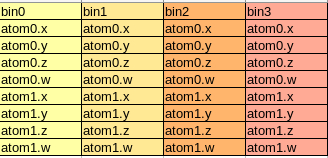

#Ch13
## Notes
* With good problem decomposition, the programmer can select and implement algorithms that achieve an
  appropriate compromise between parallelism, computational efficiency,
  and memory bandwidth consumption.
* It should also be clear from our discussion that applications that are
  good candidates for parallel computing typically involve large problem
  sizes and high modeling complexity.  
* The process of parallel programming can typically be divided into four
  steps: problem decomposition, algorithm selection, implementation in a
  language, and performance tuning.
* Gather is a desirable thread arrangement in
  CUDA devices because the threads can accumulate their results in their
  private registers. Also, multiple threads share input atom values, and can
  effectively use constant memory caching or shared memory to conserve
  global memory bandwidth.
## Solutions
### 13.1
As the following figure shows:

    

```c
#define SPACE
#define BINCAP
#define WIDTH
#define HEIGHT

#include <math.h> //For ceil
float* createBins(AtomInfo *atomInfo, int atomNum)
{
    int binWidth = ceil((double)(WIDTH / SPACE));
    int binHeight = ceil((double)(HEIGHT / SPACE));
    int binNum = binWidth * binHeight;
    int binSize = BINCAP * sizeof(AtomInfo));
    
    float* bins = (float*)malloc(binNum * binSize);
    int *binIndices = (int*)malloc(binNum * sizeof(int));
    memset(bins, 0, binNum * binSize);
    memset(binIndices, 0, binNum * sizeof(int));

    for(int i = 0; i < atomNum; i ++)
    {
        int xIndex = (int)(atomInfo[i].x / SPACE);
        int yIndex = (int)(atomInfo[i].y / SPACE);
        int binIndex = yIndex * binWidth + xIndex;
        int atomIndex = binIndices[binIndex];
        if (atomIndex < BINCAP)
        {
            binIndices[binIndex] ++;

            bins[atomIndex * 4 * binNum + binIndex] = atomInfo[i].x;
            bins[(atomIndex * 4 + 1) * binNum + binIndex] = atomInfo[i].y;
            bins[atomIndex * 4 + 2) * binNum + binIndex] = atomInfo[i].z;
            bins[atomIndex * 4 + 3) * binNum + binIndex] = atomInfo[i].w;
        }
    }

    free(binIndices);

    return bins;
} 
```
```c
struct IterStep_t
{
    int x;
    int y;
} IterStep;

IterStep* createIteSteps(float radius, int* iterNum)
{
    int gridRadius = ceil(radius);
    float radiusSq = radius * radius;
    int* tmpX = (int*) malloc(gridRadius * gridRadius * sizeof(int));
    memset(tmpX, 0, graidRadius * gradRadius * sizeof(int));
    int* tmpY = (int*) malloc(gridRadius * gridRadius * sizeof(int));
    memset(tmpY, 0, graidRadius * gradRadius * sizeof(int));
    int iteNum = 0;

    for (int i = (-1) * gridRadius; i <= gridRadius; i ++)
    {
        for (int j = (-1) * gridRadius; j <= gridRadius; j ++)
        {
            float y = max(0, abs(i) - 1);
            float x = max(0, abs(j) - 1);
            if ((x * x + y * y) < radiusSq)
            {
                tmpY[iteNum] = y;
                tmpX[iteNum] = x;
                iteNum ++;
            }                         
        }
    }

    IteStep* steps = (IteStep*)malloc(iteNum * sizeof(IterStep));
    for (int i = 0; i < iteNum; i ++)
    {
        steps[i].x = tempX[i];
        steps[i].y = tempY[i];
    }

    free(tempX);
    free(tempY);

    *iterNum = iteNum;
    return steps;
}
```
Each thread deals with one grid point.
### 13.2 and 13.1
```c
//Tiled, each neighbors have the same z
__global__
void atomKernel(float* bins, int binNum, int radius, IterStep* iteSteps, int iteNum, int binWidth)
{
    int yIndex = blockIdx.y * blockDim.y + threadIdx.y;
    int xIndex = blockidx.x * blockDim.x + threadIdx.x;
    int binIndex = yIndex * binWidth + xIndex;

    float x = xIndex * SPACE;
    float y = yIndex * SPACE;

    for (int i = 0; i < iteNum; i ++)
    {
        int nyIndex = yIndex + iteSteps[i].y;
        int nxIndex = xIndex + iteSteps[i].x;
        int nbIndex = nyIndex * binWidth + nxIndex;

        for (int j = 0; j < BINCAP; j ++)
        {
            int row = j * 4;
            int atomX = nbIndex + row;
            int atomY = atomX + binNum;
            //...
            float distance = (bins[atomX] - x) * (bins[atomX] - x)
                                + (bins[atomY] - y) * (bins[atomY] - y)
            if (distance < radius * radius)
            {
                //To be charged
            }
        }
    }
}
```
