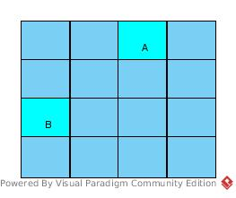

# Ch4 Solution
## 4.1
* a: 128 * 4 = 512
* b: 256 * 4 = 1024
* c: 512 * 4 = 2048 > 1536 ==> (1536 / 512) * 512 = 1536
* d: 1024 * 4 = 4096 > 1536 ==> (1536 / 1024) * 1024 = 1024

C
## 4.2
ceil(2000 / 512) * 512 = 2048
## 4.3
It is like a signal function, the turning point is included in at most one warp
## 4.4
Choose 2D as it is a 2D image.

Suppose the max number of threads per block is 1024 (I am not sure).
To use the max number, with square block, block dim is (32, 32).

Block dim = (ceil(400 / 32), ceil (900 / 32)) =  (13, 29)
## 4.5
#Idle = 13 * 29 * 1024 - 400 * 900 = 26048
## 4.6
max execution time = mT = 3.0

number of threads = nT = 8

ratio

= Σ<sub>i</sub>(mT - execution_time<sub>i</sub>) / (mT * nT)

= (1.0 + 0.7 + 0.0 + 0.2 + 0.6 + 1.1 + 0.4 + 0.1) / (3.0 * 8)

= 4.1 / 24.0

= 0.1708
## 4.7
Don't know specification of capacity x.x
## 4.8
Suppose 32 is number of threads per warp (So why 32 instead of 16?).

* It is correct that *\__syncthreads()* is not necessary as a warp is scheduled as a unit,
and *\__syncthreads()* can only guarantee synchronization within a block.
* 32 threads per block leads to under-utility of SM
* 32 threads per block may make synchronization meaningless,
which introduces more synchronization between blocks, leading to more complexity
## 4.9
32 * 32 = 1024 > 512 (threads per block).

To make use of capacity (512), the grid dim could be 32 * 16 = 512.

Then the block dim could be (1024 / 32, 1024 / 16) = (32, 64).

The block number 32 * 64 = 2048 > 8 (block per SM), while it is a valid usage.
## 4.10
### a
None.

1) For threads in same block, suppose blockIdx.y = A, blockIdx.x = B.
``` c
    In case threadIdx.y = a, threadIdx.x = b:
    blockA[a][b] = A_elements[A * BLOCK_SIZE + a][B * BLOCK_SIZE + b]
    A_elements[A * BLOCK_SIZE + a][B * BLOCK_SIZE + b] = blockA[b][a]

    In case threadIdx.y = b, threadIdx.x = a:
    blockA[b][a] = A_elements[A * BLOCK_SIZE + b][B * BLOCK_SIZE + a]
    A_elements[A * BLOCK_SIZE + b][B * BLOCK_SIZE + a] = blockA[a][b]

    To match the transpose requirement,
    A_elements[A * BLOCK_SIZE + a][B * BLOCK_SIZE + b] should be assigned the element A_elements[B * BLOCK_SIZE + b][A * BLOCK_SIZE + a]

    i.e., blockA[b][a]
    = A_elements[A * BLOCK_SIZE + b][B * BLOCK_SIZE + a]
    = A_elements[B * BLOCK_SIZE + b][A * BLOCK_SIZE + a]

    ==> A * BLOCK_SIZE + b = B * BLOCK_SIZE + b
    ==> A * BLOCK_SIZE = B * BLOCK_SIZE
    ==> BLOCK_SIZE = 0
```
BLOCK_SIZE = 0 is not in the valid range

2) Even if the kernel function works, for matrix like:



A block of threads transpose a tile of the matrix: A = B<sup>T</sup>.

But we can not guarantee that the blocks are executed concurrently, the following case is very possible:

A = B<sup>T</sup> --> B = A<sup>T</sup> = (B<sup>T</sup>)<sup>T</sup> = B != A<sub>orig</sub><sup>T</sup>

3) There should be at least a *synch* after *blockA* reading.

### b
So, to exchange 2 corresponding tiles at the same time in one block and correct the index problem mentioned above.

``` c
dim3 blockDim(BLOCK_WIDTH, BLOCK_WIDTH);
//Suppose A_width = n * 2 * BLOCK_WIDTH, A_height = m * BLOCK_WIDTH, n and m are positive int
dim3 gridDim(A_width / (blockDim.x * 2), A_height / blockDim.y;

BlockTranspose<<<gridDim, blockDim>>> (A, A_width, A_height);
__global__ void
BlockTranspose(float* A_elements, int A_width, int A_height)
{
    __shared__ float blockA[BLOCK_WIDTH][BLOCK_WIDTH];
    int row = blockIdx.y * BLOCK_WIDTH + threadIdx.y;
    int col = blockIdx.x * BLOCK_WIDTH + threadIdx.x;

    blockA[threadIdx.y][threadIdx.x] = A_elements[row * A_width + col];

    A_elements[row * A_width + col] = A_elements[col * A_width + row];
    A_elements[col * A_width + row] = blockA[threadIdx.y][threadIdx.x];
}
```
e.g.
``` c
A_height = 16, A_width = 16, BLOCK_WIDTH = 4
blockIdx.y = 0, blockIdx.x = 2
threadIdx.y = 3, threadIdx.x = 1

row = 0 * 4 + 3 = 3
col = 2 * 4 + 1 = 9

row * A_width + col = 3 * 16 + 9 = 57
col * A_width + row = 9 * 16 + 3 = 147

blockA[3][1] = A_elements[3][9] = 666
A_elements[3][9] = A_elements[9][3] = 233
A_elements[9][3] = blockA[3][1] = 666
```
This block exchange tile A and tile B and in transpose format