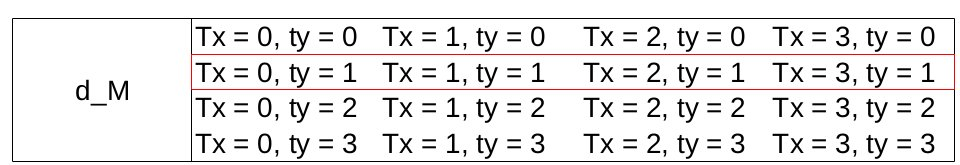
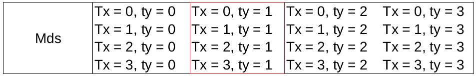
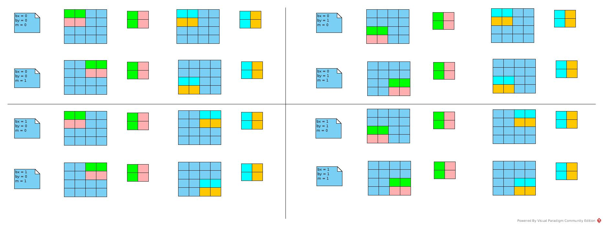

# Ch6
## Notes
### Coalesced Access
This technique takes advantage of the fact that threads in a warp execute
the same instruction at any given point in time. When all threads in a warp execute a load instruction,
the hardware detects whether they access consecutive global memory locations.
That is, the most favorable access pattern is achieved when all threads in a warp
access consecutive global memory locations.
In this case, the hardware combines, or coalesces,
all these accesses into a consolidated access to consecutive DRAM locations.
### Coalesced Load Pattern
The consolidated copy in figure 6.11 is like :



The second row is copied into second column of *Mds*



The sequence of load:



#### Implementation:
* tx decides column index of *d_M* and *d_N*:
``` c
// d_M
Mds[tx][ty] = d_M[Row * Width + m * TILE_WIDTH + tx];
// = d_M[Row][m * TILE_WIDTH + tx]
```

``` c
//d_N
int Col = bx * TILE_WIDTH + tx
Nds[tx][ty] = d_N[(m * TILE_WIDTH + ty) * Width + Col];
// = d_N[m * TILE_WIDTH + ty][Col];
// = d_N[m * TILE_WIDTH + ty][bx * TILE_WIDTH + tx];
```
* tx decides row index of *Mds*/*Nds*, ty decides column index of *Mds*/*Nds*.
*Mds* and *Nds* load transpose of original tile.
Which ensures the relative sequence of elements in original tile.
* *d_M* is loaded by row, *d_N* is loaded by column
* Each block computes (*blockIdx.x*<sub>th</sub> rows of *d_M*) * (*blockIdx.y*<sub>th</sub> columns of *d_N*)
with (number of rows) = (number of columns) = *TILE_WIDTH*
* __Don't know why *Mds* and *Nds* are indexed by *\[tx]\[ty]* instead of *\[ty]\[tx]*__
### SHM Bank Conflict
[Stackoverflow](https://stackoverflow.com/questions/4396191/gpu-shared-memory-bank-conflict)
## Solutions
### 6.1
[ref](http://www.csce.uark.edu/~mqhuang/courses/5013/f2011/lecture/HSCoDesign_Lecture_6.pdf)
#### Figure 6.2
``` c
__shared__ float partialSum[];
unsigned int t = threadIdx.x;

partial[t] += partial[t + blockDim.x];
__synchthreads();

for (unsinged int stride = 1; stride < blockDim.x; stride *= 2)
{
    __synchthreads();

   if (t % (2 * stride) == 0)
   {
    partialSum[t] += partialSum[t + stride];
   }
}
```
* blockIdx.x = half original blockIdx.x
* Extra arithmetic operation: The extra part deals with right part of partialSum.
When the blockDim.x reduced, this part could be concealed with the first loop of the original design.
So, no extra cost introduced.
* Resource limitation:
    1) No extra register introduced
    2) Element read per thread doubled, while the total number remains. No global bandwidth limitation addressed.
    3) Threads per block reduced.
    4) No extra block introduced.
    5) No extra SHM required.
#### Figure 6.4
``` c
__shared__ float partialSum[];
unsigned int t = threadIdx.x;
for (unsigned int stride = blockDim.x; stride > 0; stride >> 1) {
    __syncthreads();
    if (t < stride) {
        partialSum[t] += partialSum[t+stride];
    }
}
```

Others questions: the same to that of *Figure 6.2*
### 6.2
The modification of *Figure 6.2* removed the __>>__ operation in *for* loop.
### 6.3
Refer to [ref](https://tschmidt23.github.io/cse599i/CSE%20599%20I%20Accelerated%20Computing%20-%20Programming%20GPUs%20Lecture%208.pdf)
#### Figure 6.2
``` c
//Suppose number of blocks are calculated to remove length assert inside kernel
//define BLOCK_SIZE = number of blocks
//blockDim.x * threadDim.x * 2 = number of elements in input
__global__
void reduceAddKernel(float *input)
{
    __shared__ float partialSum[threadDim.x];
    __constant__ unsigned int blockGap = BLOCK_SIZE * blockDim.x;

    unsigned int t = threadIdx.x;
    unsigned int inputIndex = blockIdx.x * blockDim.x + threadIdx.x;
    partialSum[t] = input[inputIndex];
    partialSum[t] += input[inputIndex + blockGap];
    __synchthreads();

    for (unsigned int stride = 1; stride < blockDim.x; stride *= 2)
    {
        __synchthreads();

        if (t % stride == 0)
        {
            partialSum[2 * t] += partialSum[2 * t + stride];
        }
    }

    if (t == 0)
    {
        input[blockIdx.x * blockDim.x] = partialSum[0];
    }
}
```
#### Figure 6.4
``` c
__global__
void reduceAddKernel(float* input)
{
    __shared__ float partialSum[blockDim.x * 2];
    unsigned int t = threadIdx.x;
    partialSum[t] = input[threadIdx.x + blockIdx.x * blockDim.x];
    partialSum[t + blockDim.x] = input[threadIdx.x + (blockIdx.x + BLOCK_SIZE) * blockDim.x];

    for (unsigned int stride = blockDim.x; stride > 0; stride >> 1)
    {
        __synchthreads();
        if (t < stride)
        {
            partialSum[t] += partialSum[t + stride];
        }
    }

    //output written to first element of the block
    if (t == 0)
    {
        input[blockIdx.x * blockDim.x] = partialSum[0];
    }
}
```
### 6.4
``` c
//define INPUT_SIZE
//define INPUT_SECTION_SIZE
//define BLOCK_SIZE
//define GRID_SIZE
float reduceAdd (float* input)
{
    float *devInput;
    float *inputSection = input;
    float sum = 0.0f;

    cudaMalloc((void*) &devInput, sizeof(float) * INPUT_SECTION_SIZE);
    dim3 dimGrid(GRID_SIZE, 1, 1);
    dim3 dimBlock(BLOCK_SIZE, 1, 1);

    for (int i = 0; i < INPUT_SIZE / INPUT_SECTION_SIZE; i ++)
    {
        cudaMemcpy(devInput, input, cudaMemcpyHostToDevice);

        reduceAddKernel<<<dimGrid, dimBlock>>> (devInput);

        cudaMemcpy(input, devInput, cudaMemcpyDeviceToHost);

        for (int j = 0; j < BLOCK_SIZE; j ++)
        {
            sum += input[j * GRID_SIZE];
        }
    }

    cudaFree(devInput);
}
```
### 6.5
The figure in ##Notes
### 6.6
If the *simple matrix-matrix multiplication based on row-major layout* means
each thread to load one row and one column:

Whenever a thread loading an M element, the elements loaded by adjacent threads lay in input array with gap as *M.Width*.
It is not coalesced access.

Whenever a thread loading a N element, the elements loaded by adjacent threads are adjacent.
It is coalesced access.

__b__
### 6.7
In according to figure 6.11, both.

__c__
### 6.8
1024 / 32 = 32 warps

* Iteration 1: 16 elements remain per warp
* Iteration 2: 8 elements remain per warp
* Iteration 3: 4 elements remain per warp
* Iteration 4: 2 elements remain per warp
* Iteration 5: 1 element remains per warp

During 5th iteration, the reduction still remains inside warp.

__d__
### 6.9
1024 / 32 = 32 warps

* Iteration 1: stride = 1024, (t < 1024) --> 1024 threads are executing reduction
* Iteration 2: stride = 512, 512 / 32 = 16 warps
* Iteration 3: stride = 256, 256 / 32 = 8 warps
* Iteration 4: stride = 128, 4 warps
* Iteration 5: stride = 64, 2 warps

During 5th iteration, the reduction has not been

__a__
### 6.10
//Dim of tile unit = TILE_WIDTH x TILE_WIDTH
//blockDim.x = m
//blockDim.y = m / 2
``` c
__global__
void matrixMulKernel (float *d_M, float* d_N, float* d_P, int Width)
{
    __shared__ float Mds[TILE_WIDTH][TILE_WIDTH];
    __shared__ float Nds[TILE_WIDTH][2 * TILE_WIDTH];

    int bx = blockIdx.x;
    int by = blockIdx.y;
    int tx = threadIdx.x;
    int ty = threadIdx.y;

    int Row = by * TILE_WIDTH + ty;
    int Col = bx * TILE_WIDTH + tx;

    float p0 = 0;
    float p1 = 0;

    for (int m = 0; m < Width / TILE_WIDTH; m ++)
    {
        Mds[tx][ty] = d_M[Row * Width + m * TILE_WIDTH + tx];
        Nds[tx][ty] = d_N[(m * TILE_WIDTH + ty) * Width + Col];
        Nds[tx][ty + TILE_WIDTH] = d_N[(m * TILE_WIDTH + ty) * Width + Col + TILE_WIDTH];
        __synchthreads();

        for (int k = 0; k < TILE_WIDTH; k ++)
        {
            p0 += Mds[tx][k] * Nds[k][ty];
            p1 += = Mds[tx][k] * Nds[k][ty + TILE_WIDTH];
        }
        __synchthreads();
    }

    d_P[Row * Width + Col] = p0;
    d_P[Row * Width + Col + TILE_WIDTH] = p1;
}
```
### 6.11
#### a
blockDim.x = ELEMENT_N = 256, block number = VECTOR_N = 1024

thread number = 256 * 1024 = 262144
#### b
Don't know specification of G80.

Suppose it is 32
#### c
= ELEMENT_N = 256
#### d
Access A (= d_A) once, B (= d_B) once.

2
#### e
One write for *accumResult\[tx]* per thread = ElementN

Update = 1 + 2 + 4 + ... + (ElementN / 2) = ElementN - 1

It is *(Element * 2 - 1)* overall
#### f
* The line30, where all threads updated *d_C\[blockIdx.x]* by *accumResult\[0]*.
They wanted to read *accumResult\[0]* at the same time
* No other lines as *accumResult* are read or written by unique index of tx with data type of float.
#### g
Suppose there are 32 threads per warp.

When the working threads are decreased into one warp, the branch divergence appears.

That is, when there are 1, 2, 4, 8, 16 working threads.

The number of iteration is 5.
#### h
The last part
``` c
if (tx == 0)
{
    d_C[blockIdx.x] = accumResult[0];
}
```
The number of access decreased from blockDim.x to 1.
### 6.12
Whatever the BLOCK_SIZE is, threads in one block/warp are accessing global memory by unique and adjacent indexes.
### 6.13
#### a
##### Without unroll
There are 5 iterations of 1 warp, each iteration cost 2 warp execution time for branch divergence.

The time cost: 5(iteration) * 1(float add operation) + 5 * (idle operation)
The operation cost: (16 + 8 + 4 + 2 + 1) = 31 FLOP
##### For unroll
There are 1 iteration of 1 warp, cost 2 warp execution time for *(tid < 32)* assertion.

The time cost: 5(unrolled) * (float add operation) + 1 * (idle operation)
The operation cost: 32(threads) * 5 = 160 FLOP
#### b
This part is wrong.
``` c
if (tid < 32) { // unroll last 5 predicated steps
shared[tid] += shared[tid + 16];
shared[tid] += shared[tid + 8];
shared[tid] += shared[tid + 4];
shared[tid] += shared[tid + 2];
shared[tid] += shared[tid + 1];
}
```
In *(tid < 32)* case, the elements to be counted are shared\[0] ~ shared\[31].

Take tid = 31 for example:
``` c
shared[31] += shared[31 + 16] = shared[47];
```
The index 47 is out of valid index.