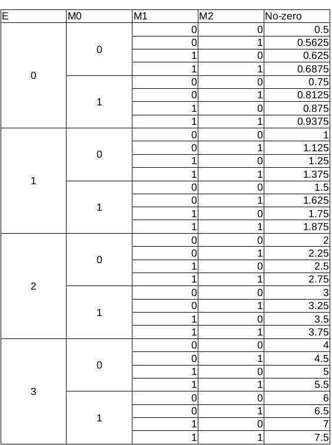
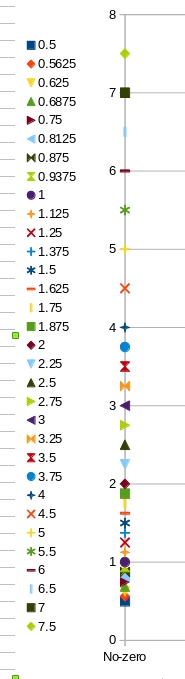
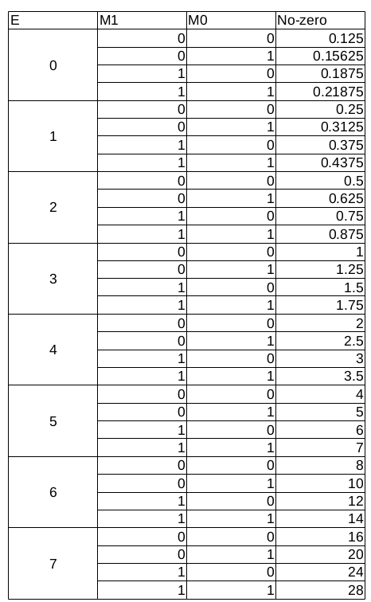
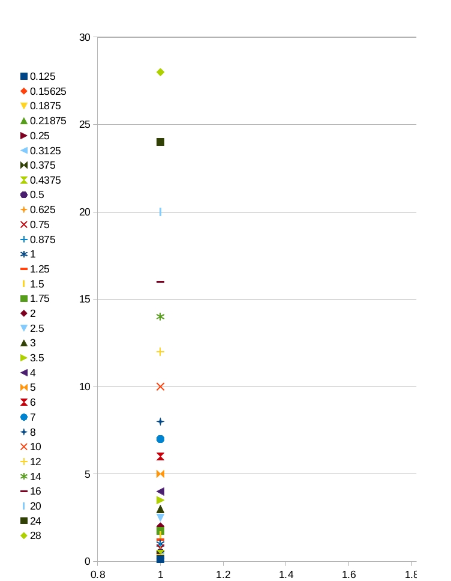

# Ch7
## Notes
* NAN representation?
* Interested readers should
  study more advanced techniques such as compensated summation algorithm, also known as Kahan’s summation algorithm, for getting an even
  more robust approach to accurate summation of floating-point values
* In general, the pivoting step should choose the equation with the largest
  absolute coefficient value among all the lead variables and swap its equation (row) with the current top equation, as well as swap the variable (col-
  umn) with the current variable.
## Solution
### 7.1



### 7.2




The number of E represents the range of representation.

In scope near __0__, it increases granularity.

In scope away __0__, it increase max number that could be represented.
### 7.3
``` c
NE = number of bits for E
NM = number of bits for M

f1 = first addition parameter
f2 = second addition parameter

e1 = E of f1
e2 = E of f2
m1 = M of f1
m2 = M of f2

sum = f1 + f2
eSum = E of sum
mSum = M of sum
```
Suppose e2 < e1.

1)
If |e1 - e2| = NM, there must be overflow as e2 would be shifted right by NM bits.

If the m2 = 1<sub>0</sub>1<sub>1</sub>...1<sub>NM</sub>, the error is (1 - 2<sup>-NM</sup>) ulp.

2)
If |e1 - e2| > NM, after shift, the m2 would be like 0<sub>0</sub>0<sub>1</sub>...0<sub>n</sub>1<sub>0</sub>1<sub>1</sub>...1<sub>NM-n</sub> < 1<sub>0</sub>1<sub>1</sub>...1<sub>NM</sub>

The round error is < (1 - 2<sup>-NM</sup>)

3)
If |e1 - e2| < NM, after shift m1, m2 left and then shift m2 right,
the tail to be rounded is
1<sub>0</sub>1<sub>1</sub>...1<sub>n</sub> < 1<sub>0</sub>1<sub>1</sub>...1<sub>NM</sub> (n < NM)

So the max is about 1 ulp
### 7.4
In the sorted array, the adjacent elements have the minimum gap, creating chance for these small elements to be added into a larger element to reduce the gap to the next element.
In figure 6.4, the elements added up in each thread are not adjacent, which enlarged the gap between two elements to be added, creating chance for the smaller one to be omitted.
### 7.5
