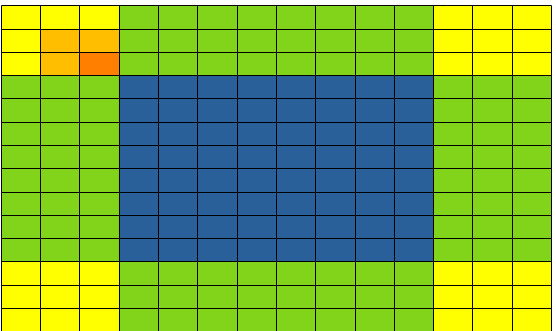
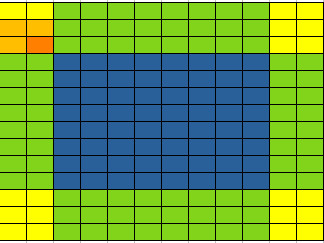
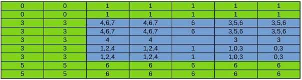

#Ch8
Σ
δ
π
∆
σ
## Notes
### Coherence
A cache coherence mechanism is needed to ensure that the contents of the
caches of the other processor cores are updated

Constant memory variables play an interesting role in using caches in
massively parallel processors. Since they are not changed during kernel
execution, there is no cache coherence issue during the execution of a kernel

How about SHM?
### Mask Size
Readers should always be careful when using smaller block and tile
sizes. They may result in significantly less reduction in memory accesses
than expected
## Solutions
### 8.1
``` c
p[0] = 0 * 3 + 0 * 4 + 1 * 5 + 2 * 4 + 3 * 3 = 22
```
### 8.2
```c
Fill in N = {0, 4, 1, 3, 2, 3, 0},
M = {2, 1, 4}

p[0] = 0 * 2 + 4 * 1 + 1 * 4 = 8
p[1] = 4 * 2 + 1 * 1 + 3 * 4 = 21
p[2] = 1 * 2 + 3 * 1 + 2 * 4 = 13
p[3] = 3 * 2 + 2 * 1 + 3 * 4 = 20
p[4] = 2 * 2 + 3 * 1 + 0 * 4 = 7
```
### 8.3
* a: identical
* b: shift right
* c: shift left
* d: edge detecting
* e: blurring
### 8.4
Suppose m = 2 * k + 1 and m <= n
#### a
2 * k
#### b
m * n
#### c
m * n - 2 * (1 + 2 + ... + k)
= m * n - 2 * k * (k + 1) / 2
= m * n - k * (k + 1)
### 8.5
Assume m = 2 * k + 1 and m <= n
#### a
(n + 2 * k)<sup>2</sup> - n<sup>2</sup>
= n<sup>2</sup> + 4 * k<sup>2</sup> + 4 * n * k - n<sup>2</sup>
= 4 * k * (k + n)
#### b
There are n * n elements. There is a (m * m) matrix dot production for each element centered matrix.

n * n * m * m
#### c
In following figure, the blue cells are image cells, other cells surrounded are halo cells.



To count the operations image cells cells.

The first line of the image cells:

The cells need halo cells in left/right edges:
 
 ((k + 1) * (k + 1)  + (k + 1) * (k + 2) + ... + (k + 1) * m) * 2
 
The cells in the middle of the first line:
 
(n - 2 * m) * (k + 1) * m

Sum up to:

((k + 1) * (k + 1)  + (k + 1) * (k + 2) + ... + (k + 1) * m) * 2 + (n - 2 * m) * (k + 1) * m

= ((k + 1) * (k + 1 + m) * (k + 1) / 2) * 2 + (k + 1) * (n - 2 * m) * m

= (k + 1) * ((k + 1 + m) * (k + 1) + (n - 2 * m) * m)

The second line
 
= (k + 2) * ((k + 1 + m) * (k + 1) + (n - 2 * m) * m)

To sum up all this type of lines:

((k + 1) + (k + 2) + ... + m) * ((k + 1 + m) * (k + 1) + (n - 2 * m) * m)

= (k + 1 + m) * (k + 1) / 2 *  ((k + 1 + m) * (k + 1) + (n - 2 * m) * m)

The other type of lines have no halo cells on cell and floor edges:

m * ((k + 1 + m) * (k + 1) + (n - 2 * m) * m) * (n - 2 * m)

To sum up all these lines:

((k + 1 + m) * (k + 1) + (n - 2 * m) * m) * \[(k + 1 + m) * (k + 1) / 2 + m * (n - 2 * m)]
 
### 8.6
Suppose m1 = 2 * k1 + 1, m2 = 2 * k2 + 1,
m1 <= n1 && m2 <= n2
#### a
(2 * k1 + n1) * (2 * k2 + n2) - n1 * n2
#### b
n1 * n2 * m1 * m2
#### c


Take it as a matrix, the up left corner is (0, 0)

n1, m1 --> Row, n2, m2 --> Column 

To count how many image cells convolution would have a certain halo cell involved
#### The corner
For yellow cells in the up left corner, the number of blues cells that would have the corner cells involved in convolution is (x + 1) * (y + 1): (x, y) is index of the cell.

sum1 = Σ<sub>i</sub>Σ<sub>j</sub>(i + 1) * (j + 1): 0 <= i < k1, 0 <= j < k2

sum1 = Σ<sub>i</sub>(i + 1) * ((k2 + 1) * k2 / 2)

sum1 = (k1 + 1) * (k2 + 1) * k1 * k2 / 4
#### The upper green part
sum2 = n2 * Σ<sub>i</sub>(k2 + 1) * (i + 1): 0 <= i < k1

sum2 = n2 * (k2 + 1) * (k1 + 1) * k1 / 2
#### The upper halo cells
sum3 = 2 * sum1 + sum2
#### The left green cells
Symmetric to sum2

sum4 = n1 * (k1 + 1) * (k2 + 1) * k2 / 2
#### All halo cells
sumHalo = (sum3 + sum4) * 2
#### Result
sum = n1 * n2 * m1 * m2 - sumHalo
### 8.7
#### a
As one tile per block, there are n / t blocks
#### b
Number of threads per block = number of output elements per block = tile size = t
#### c
Suppose m = 2 * k + 1

SHM per block is size of halo elements + internal elements = (m - 1) + t

Total number is (m - 1 + t) * n / t
#### d
##### a 
n /t
##### b
t
##### c
SHM per block: t

Total: t * n / t = n
### 8.8
``` c
//__constant__ int ImageLen = height * width;  
__global__ void convolution_2D_basic_kernel (float *N, float *M, float *P, int maskHeight, int maskWidth, int Width, int Height)
{
    int indexX = blockIdx.x * blockDim.x + threadIdx.x - maskHeight / 2;
    int indexY = blockIdx.y * blockDim.y + threadIdx.y - maskWidth / 2;
    int index = 0;

    float pValue = 0;
    for (int i = 0; i < maskHeight; i ++)
    {
        for (int j = 0; j < maskWidth; j ++)
        {
            index = (indexY + i) * width + indexX + j;
            if (index <= 0 && index < ImageLen) 
            {
                pValue += N[index] * M[i * maskWidth + j];
            }
        }
    }

    P[(indexY + maskWidth / 2) * width + indexX + maskHeight / 2] = pValue;
}
```
### 8.9
```c
//#define MASK_WIDTH 
//#define MASK_HEIGHT
__constant__ float M[MASK_HEIGHT][MASK_WIDTH];
__global__ void convolution_2D_basic_kernel(float *N, float *P, int height, int width)
{
    int indexX = blockIdx.x * blockDim.x + threadIdx.x - MASK_HEIGHT / 2;
    int indexY = blockIdx.y * blockDim.y + threadIdx.y - MASK_WIDTH / 2;
    int index = 0;

    float pValue = 0;
    for (int i = 0; i < MASK_HEIGHT; i ++)
    {
        for (int j = 0; j < MASK_WIDTH; j ++)
        {
            index = (indexY + i) * width + indexX + j;
            if (index <= 0 && index < ImageLen) 
            {
                pValue += N[index] * M[i][j];
            }
        }
    }

    P[(indexY + maskWidth / 2) * width + indexX + maskHeight / 2] = pValue;    
}
```
### 8.10

```c
//#define MASK_WIDTH 
//#define MASK_WK  (MASK_WIDTH / 2)
//#define MASK_HEIGHT
//#define MASK_HK (MASK_HEIGHT / 2)
//#define TILE_SIZE
//#define IMAGE_SIZE
//Suppose TILE_SIZE = blockDim.y = blockDim.x
__constant__ float M[MASK_HEIGHT][MASK_WIDTH];

__global__ void convolution_2D_basic_kernel(float* N, float *P, int width, int height)
{
    __shared__ float N_ds[TILE_SIZE + MASK_HEIGHT / 2][TILE_SIZE + MASK_WIDTH / 2];
    int indexY = blockIdx.y * blockDim.y + threadIdx.y;
    int indexX = blockIdx.x * blockDim.x + threadIdx.x;

    int tmpBlockId = 0;
    int tmpIndex = 0;
    //area 0
    if ((threadIdx.y + MASK_HK >= blockDim.y) && (threadIdx.x + MASK_WK) >= blockDim.x)
    {
        tmpIndex = ((blockIdx.y - 1) * blockDim.y + threadIdx.y) * width + (blockIdx.x - 1) * blockDim.x + threadIdx; 
        N_ds[threadIdx.y - blockDim.y + MASK_HK][threadIx.x - blockDim.x + MASK_WK]
            = (tmpIndex >= 0)? N[tmpIndex]: 0; 
    }
    //area 1
    if ((threadIdx.y + MASK_HK) >= blockDim.y)
    {
        tmpIndex = ((blockIdx.y - 1) * blockDim.y + threadIdx.y) * width + blockIdx.x * blockDim.x + threadIdx.x;
        N_ds[threadIdx.y - blockDim.y + MASK_HK][threadIdx.x] 
            = (tmpIndex >= 0)? N[tmpIndex]: 0;
    }
    //area 2
    if ((threadIdx.y + MASK_HK >= blockDim.y) && threadIdx < MASK_WK)
    {
        tmpIndex = ((blockIdx.y - 1) * blockDim.y + threadIdx.y) * width + (blockIdx.x + 1) * blockDim.x + threadIdx.x;
        N_ds[threadIdx.y - blockDim.y + MASK_HK][threadIdx.x + blockDim.x + MASK_WK]
            = (tmpIndex < IMAGE_SIZE)? N[tmpIndex]: 0; 
    } 
    //area 3
    if (threadIdx.x + MASK_WK >= blockDim.x)
    {
        tmpIndex = (blockIdx.y * blockDim.y + threadIdx.y) * width + (blockIdx.x - 1) * blockDim.x + threadIdx.x;
        N_ds[threadIdx.y][threadIdx.x - blockDim.x + MASK_WK] 
            = (tmpIndex >= 0)? N[tmpIndex]: 0;
    }
    //area 4
    if (threadIdx.x < MASK_WK)
    {
        tmpIndex = (blockIdx.y * blockDim.y + threadIdx.y) * width + (blockIdx + 1) * blockDim.x + threadIdx;
        N_ds[threadIdx.y][blockDim.x + MASK_WK + threadIdx.x]
            = (tmpIndex < IMAGE_SIZE)? N[tmpIndex]: 0;
    ]
    //area 5
    if ((threadIdx.y < MASK_HK) && (threadIdx.x + MASK_WK) >= blockDim.x)
    {
        tmpIndex = ((blockIdx.y + 1) * blockDim.y + threadIdx.y) * width + (blockIdx.x - 1) * blockIdx.x + threadIdx.x;
        N_ds[threadIdx.y + blockDim.y + MASK_HK][threadIdx.x - blockDim.x + MASK_WK]
            = (tmpIndex >= 0 && tmpIndex < IMAGE_SIZE)? N[tmpIndex]: 0; 
    }
    //area 6
    if (threadIdx.y < MASK_HK)
    {
        tmpIndex = ((blockIdx.y + 1) * blockDim.y + threadIdx.y) * width + blockIdx.x * blockDim.x + threadIdx.x;
        N_ds[threadIdx.y + blockDim.y + MASK_HK][threadIdx.x] 
            = (tmpIndex < IMAGE_SIZE)? N[tmpIndex]: 0;
    }
    //area 7
    if (threadIdx.y < MASK_WK && threadIdx.x < MASK_HK)
    {
        tmpIndex = ((blockIdx.y + 1) * blockDim.y + threadIdx.y) * width + (blockIdx.x + 1) * blockDim + threadIdx.x;
        N_ds[threadIdx.y + blockDim.y + MASK_Hk][threadIdx.x + blockDim.x + MASK_WK]
            = (tmpIndex < IMAGE_SIZE)? N[tmpIndex]: 0;
    }

    //inner cells
    N_ds[threadIdx.y + MASK_HK][threadIdx.x + MASK_WK]
        = N[(blockIdx.y * blockDim.y + threadIdx.y) * width + blockIdx.x * blockDim.x + threadIdx];

    __synchthreads();

    //conv
    float pValue = 0.0f;
    for (int i = 0; i < MASK_HEIGHT; i ++)
        for (int j = 0; j < MASK_WIDTH; j ++)
    {
        pValue += N_ds[threadIdx.y + i][threadIdx.x + j] * M[i][j];
    }
    
    P[(blockIdx.y * blockDim.y + threadIdx.y) * width + blockIdx.x * blockDim.x + threadIdx.x] = pValue;
}
```
