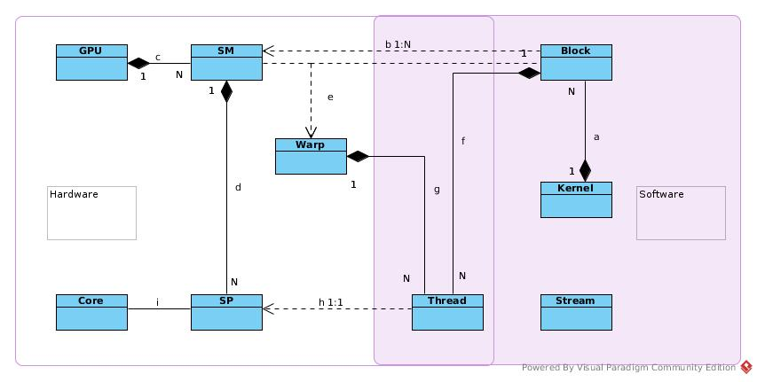
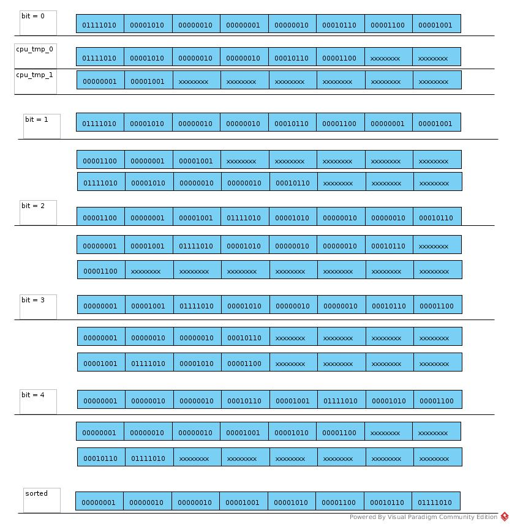
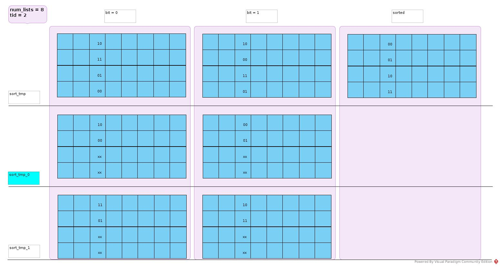
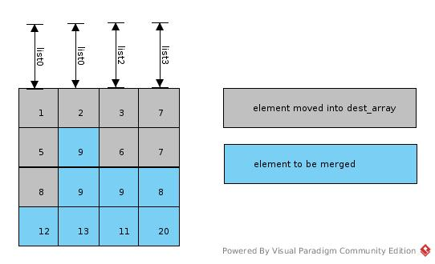
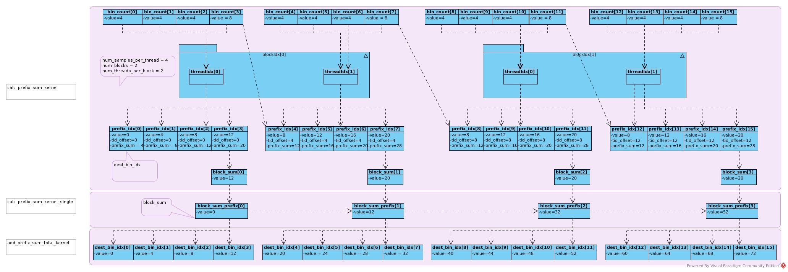

# CUDA Programming
## Threads Related
### Terminology



* a: A kernel is a unit of program that to be executed in GPU.
A kernel can requires N thread blocks, each block is combined by same number of threads.
Kernel is a software concept.
* b: Thread block is unit of SM scheduling.
    1) A block can be assigned to only one SM.
    The hardware architecture and scheduling policy decide in which SM the block would be assigned.
    Block does not migrate.
    2) Threads in the same block can communicate with each other via SHM,
    barrier or other synchronization primitives such atomic operations;
    as they reside in the same SM and have access to same cache, SHM or register file.
    3) Number of Thread per block is concept to programmer.
    Threads in the same block may not run physically in parallel when resources (computing resource or memory access) is not ready.
* c: One GPU contains N SM. It is hardware concept.
* d: One SM contains N SP. It is hardware concept.
* e: Warp is unit of hardware scheduling.
    Threads in one warp executed in parallel physically.
    One Warp = 32 threads.
* f: A block contains a lots of threads (.../512/1024/or more).
    1) A block/kernel assign tasks to threads by programming logic.
    2) The threads in one block are assigned to one SM, and managed by Warp
    3) SM/GPU schedules warp into SP according to it life cycle status.
* g: A Warp is combined by 32 threads.
    1) A Warp is SIMT
    2) Two Warps are MIMD, can do branching, loops, etc.
* h: SP is the hardware unit that actually executes thread.
    One thread per SP. SP does not control life cycle of thread.
* i: Core is alias of SP

_*_A block would be executed after occupying block completed? That is something related to STREAM_*_

### Dynamic Parameters
In general, When discussing GPU performance, in most cases, we are talking about throughput.
The throughput is often measured by Occupancy, and occupancy is measured by number of running Warps.

For certain GPU, the fixed parameters are:

* Number of SM
* Number of SP per SM
* Maximum number of blocks per SM
* Maximum number of threads per SM
* Maximum number of threads per Block

The dynamic parameters are
* Number of blocks
* Number of threads per block

Consequently:
* Total number of Threads = (Number of Thread per Block) * (Number of Block)
* Total number of Blocks = (Max Number of Block per SM) * (Number of SM)

For a certain kernel, Number of Blocks:
* It depends on max number of Block per GPU = (max number of Block per SM) * (Number of SM)
* (Number of Block per SM) <= Floor((Max number of Threads per SM) / (Number of Threads per Block))
* But it is OK to set (Number of blocks) > (Number of blocks per GPU).
    Although some of them are definitely not able to executed in parallel,
    this type of setting helps hide the potential latency.

Number of Thread per Block (When number of Block is not decided yet):
* Number of Thread per Block <= Max number of Thread per Block
* It decides Number of Block: (Total Number of Threads) / (Number of Thread per Block)
* It decides Number of Block per SM = Floor((Max number of Thread per SM) / (Number of Thread per Block)).
* When calculating Number of Warp per SM, the Number of Block never exceeds hardware capacity of SM.
* It decides Number of Warp per SM: (Block per SM) * (Number of Thread per Block) / 32
    1) if (Number of Block per SM) <= (Max number of Block per SM), (Number of Warp per SM) = (Number of Block per SM) * (Number of Thread per Block) / 32
    2) if (Number of Block per SM) > (Max Number of Block per SM), (Number of Warp per SM) = (Max number of Block per SM) * (Number of Thread per Block) / 32

## Memory
### Overview
[CUDA Memory Model](https://www.3dgep.com/cuda-memory-model/)
### Examples
#### Cardinality Sort
##### CPU Sort 1
The basic radix sort codes for CPU (Section 6.4.2)
``` c++
__host__ void cpu_sort(u32 *const data, const u32 num_elements) {
  static u32 cpu_tmp_O[NUM_ELEM];
  static u32 cpu_tmp_1[NUM_ELEM];

  for (u32 bit = 0; bit < 32; bit ++) {
    u32 base_cnt_0 = 0;
    u32 base_cnt_1 = 0;

    for (u32 i = 0; i < num_elements; i ++) {
      const u32 d = data[i];
      const u32 bit_mask = (1 << bit);

      if ( (d & bit_mask) > 0) {
        cpu_tmp_0[base_cnt_1] = d;
        base_cnt_1 ++;
      } else {
        cpu_tmp_0[base_cnt_0] = d;
        base_cnt_0 ++;
      }
    }

    for (u32 i = 0; i < base_cnt_0; i ++) {
      data[i] = cpu_tmp_0[i];
    }

    for (u32 i = 0; i < base_cnt_1; i ++) {
    data[base_cnt_0 + i] = cpu_tmp_1[i];
  }
}
```

The process is like:



##### GPU Sort 1
Section 6.4.2
###### Sort with 2 Tmp Block
``` c++
__device__ void radix_sort(u32 *const sort_tmp,
                            const u32 num_lists,
                            const u32 num_elements,
                            const u32 tid,
                            u32 *const sort_tmp_0,
                            u32 *const sort_tmp_1) {
  for (u32 bit = 0; bit < 32; bit ++) {
    u32 base_cnt_0 = 0;
    u32 base_cnt_1 = 0;

    for (u32 i = 0; i < num_elements; i += num_lists) {
      const u32 elem = sort_tmp[i + tid];
      const u32 bit_mask = (1 << bit);

      if ((elem & bit_mask) > 0) {
        sort _tmp_1[base_cnt_1 + tid] = elem;
        base_cnt_1 += num_lists;
      } else {
        sort_tmp_0[base_cnt_0 + tid] = elem;
        base_cnt_0 += num_lists;
      }
    }

    for (u32 i = 0; i < base_cnt_0; i+= num_lists) {
      sort_tmp[i + tid] = sort_tmp_0[i + tid];
    }

    for (u32 i = 0; i < base_cnt_1; i += num_lists) {
      sort_tmp[base_cnt_0 + i + tid] = sort_tmp_1[i + tid];
    }
  }

  __synchthreads();
}
```
Each thread sort a column of raw data that represented in 2D matrix:



###### Sort with 1 Tmp Block
Just replace *sort_tmp_0* with *sort_tmp* as there is no overlapping case.


###### Merge with Single Thread


*Page 127*

Imagine *src_array* as 2D matrix, num_lists = column_number; list_indexes\[list] = row_index; list = column_index.

One column had been sorted by one GPU thread.

In merge phase as shown in above figure, when i = 8:

* list = 0, list_indexes\[list] = 3, src_index = (3, 0), data = 12
* list = 1, list_indexes\[list] = 1, src_index = (1, 1), data = 9
* list = 2, list_indexes\[list] = 2, src_index = (2, 2), data = 9
* list = 3, list_indexes\[list] = 2, src_index = (2, 3), data = 8

*min_val = 8*, *min_idx* = 3, *dest_array\[8]* = 8, *list_indexes\[3]* = 3
###### Merge in Parallel

#### Merge Sort
##### select_samples_gpu_kernel
*sample_data* is an input argument.

__*Is it in SHM or Global Memory?*__

##### sort_samples_xpu
Both CPU and GPU provides library for this simple sort.

While cooperation of threads and challenge to cache covered benefits of parallel in GPU.
This task is more straightforward to be executed in CPU, and with better performance.

##### Prefix Sum Calculation


The last *bin_count* of current block thread would be added to first *prefix_idx* of the next block thread,
as this number would not be counted in sum/prefix of current block thread.

### Tips
* Register is the best candidate to storage for its access performance, with 2 limitations:
    1) It is NOT shared between threads
    2) Too many registers per thread may harm capacity of Warp
* SHM
    1) If each thread of Warp accesses a separate bank address, the certain operation of the Warp could be executed in one cycle
    2) If more than one threads access to the same bank address, they would be executed sequentially
    3) If each thread of the Warp reads the same bank address, the read of all threads could be executed in one cycle
* Quick sort is not the best for GPU as it
    1) Recursion is not supported in CUDA prior to 2.x
    2) Branches are divergence, not good for GPU
* The function invocation costs registers for stack, so merge functions into one function is a reasonable way to reduce register cost.
* Constant memory
    1) Constant memory is part of global memory.
    2) There is no special reserved constant memory block
    3) It is read-only for GPU, writable for CPU
    4) It is cached (where?)
    5) It supports broadcasting a single value to all elements within a warp. It provides L1 cache speed
    6) If a constant is really a literal value, it is better to define it as literal value using *#define*
    7) Sometimes, compiler may transfer constant var into literal var
    8) On Fermi, L1 cache and constant memory access speeds are in same level
* Coalesced access
    1) If we have a one-to-one __sequential__ and __aligned__ access to memory, the address accesses of each thread are combined together and a single memory transaction is issued.
    2) Replace *cudaMalloc* with __cudaMallocPitch__
    3) So, data often organized by columns instead of rows as that in CPU case
    4) Array of structure would be split into separate arrays: abcdabcdabcdabcd ==> aaaabbbbccccdddd. The later is better for Warp of 4 threads to execute SISD
* Index calculation is sometimes costly, some multiplications and additions and moves
* Global Memory question & answer
    1) Performance of almost sorted data is better as each bin has almost the same number of data to be sorted, that makes each thread have almost the same workload.
    2) In radix sort of each bin, the layout of data elements to be sorted is like one row per thread, that failed coalesced access.
* Constant memory, Global memory, L2 cache?