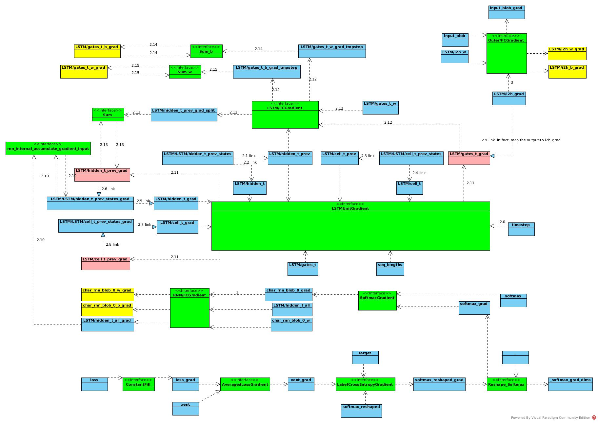

# RNN Operation
## Codes
### Overview
The *rnn.cpp* defined the 3 models, all models have both run-net and init-net
* training model, named t
* predict model, named model
* data pre processing model, named prepare

The run-net is shared by training model and predict model.

From model-net view, the architecture is like:

 
### rnn_net
The rnn net is defined as an operator in *AddLSTM* and *AddRecurrentNetworkOp*

Overview of the LSTM is like:


#### AddLSTM  
``` c++
		AddFcOps(input_blob, scope + "/i2h", vocab_size, 4 * hidden_size, 2);
```
The line of the codes deals with *(Wz * x)* in above picture. 
This part has nothing to do with recurrent operations, 
and the *FcOp* processes this part from 0 to *SeqLen* once for all.

``` c++
		*hidden_output = scope + "/hidden_t_last";
		*cell_state = scope + "/cell_t_last";
```
This part defines output of recurrent network.

``` c++
		initModel.AddXavierFillOp({4 * hidden_size, hidden_size},
				scope + "/gates_t_w");
		trainModel.AddInput(scope + "/gates_t_w");
		initModel.AddConstantFillOp({4 * hidden_size}, scope + "/gates_t_b");
		trainModel.AddInput(scope + "/gates_t_b");
```
This part initializes *Rz* (refer to above figure). 
#### AddRecurrentNetworkOp
Define simple network for step operation in recurrent network
##### Forward Pass Step Network
Create forward network and set input/output:

``` c++
		NetUtil forward(scope);
		forward.SetType("rnn");
		forward.AddInput("input_t");
		forward.AddInput("timestep");
		forward.AddInput(scope + "/hidden_t_prev");
		forward.AddInput(scope + "/cell_t_prev");
		forward.AddInput(scope + "/gates_t_w");
		forward.AddInput(scope + "/gates_t_b");
```
Calculate R * C(t - 1) and add to W * X(t - 1)
 
``` c++
		auto fc = forward.AddFcOp(scope + "/hidden_t_prev", scope + "/gates_t_w",
									scope + "/gates_t_b", scope + "/gates_t", 2);
		auto sum = forward.AddSumOp({scope + "/gates_t", "input_t"}, scope + "/gates_t");
```		
Add seq for recurrent calculation and add *LSTMUnitOp*

``` c++
		forward.AddInput(seq_lengths);
		auto lstm = forward.AddLSTMUnitOp({scope + "/hidden_t_prev", scope + "/cell_t_prev", scope + "/gates_t", seq_lengths, "timestep"},
											{scope + "/hidden_t", scope + "/cell_t"});
```

Add output of LSTM (Not Recurrent network). 

``` c++
		forward.AddOutput(scope + "/hidden_t");
		forward.AddOutput(scope + "/cell_t");
```		
##### Backward Pass Step Network
Create backward network
``` c++
		NetUtil backward("RecurrentBackwardStep");
		backward.SetType("simple");
		backward.AddGradientOp(*lstm);
```

Replace output *"LSTM/hidden_t_prev_grad"* of FcGradient by *"LSTM/hidden_t_prev_grad_split"*,
as the name *"LSTM/hidden_t_prev_grad"* conflicts with LSTMUnitGradient output.

``` c++
		auto grad = backward.AddGradientOp(*fc);
		grad->set_output(2, scope + "/hidden_t_prev_grad_split");
```
Add the FcGradient part into δy(t - 1)

```c++
		backward.AddSumOp(
				{scope + "/hidden_t_prev_grad", scope + "/hidden_t_prev_grad_split"},
					scope + "/hidden_t_prev_grad");
```		
Define input of backward network
```c++
		backward.AddInput(scope + "/gates_t");
		backward.AddInput(scope + "/hidden_t_grad");
		backward.AddInput(scope + "/cell_t_grad");
		backward.AddInput("input_t");
		backward.AddInput("timestep");
		backward.AddInput(scope + "/hidden_t_prev");
		backward.AddInput(scope + "/cell_t_prev");
		backward.AddInput(scope + "/gates_t_w");
		backward.AddInput(scope + "/gates_t_b");
		backward.AddInput(seq_lengths);
		backward.AddInput(scope + "/hidden_t");
		backward.AddInput(scope + "/cell_t");
```
##### Recurrent Network
Create Recurrent network by *RecurrentNetwork* Operation
```c++
		auto op = trainModel.AddOp("RecurrentNetwork",
					{scope + "/i2h", hidden_init, cell_init, scope + "/gates_t_w",
						scope + "/gates_t_b", seq_lengths},
					{scope + "/hidden_t_all", hidden_output, scope + "/cell_t_all",
						cell_state, scope + "/step_workspaces"}
		);
```	
***What's function of LSTM/step_workspaces?***

###### Link Operation
Setup links for recurrent operation in time T
```c++
		  net_add_arg(*op, "link_internal",
		              std::vector<std::string>{
		                  scope + "/hidden_t_prev",
						  scope + "/hidden_t",
		                  scope + "/cell_t_prev",
						  scope + "/cell_t",
						  "input_t"});
		  net_add_arg(*op, "link_external",
		              std::vector<std::string>{
		                  scope + "/" + scope + "/hidden_t_prev_states",
		                  scope + "/" + scope + "/hidden_t_prev_states",
		                  scope + "/" + scope + "/cell_t_prev_states",
		                  scope + "/" + scope + "/cell_t_prev_states",
						  scope + "/i2h"});
		  net_add_arg(*op, "link_offset", std::vector<int>{0, 1, 0, 1, 0});
```	
The link operation defined in *recurrent_network_op.h* as *RNNApplyLinkOp*
and *recurrent_network_op.cc AddApplyLinkOps*

It maps part of external data into internal data as a pointer (reference).

```c++
    const auto& t0 = this->template Input<Tensor>(0, CPU);
    const auto t = t0.template data<int32_t>()[0];
    auto& external = Input(1);

    auto* internal_out = Output(0);
    auto* external_out = Output(1);

    CAFFE_ENFORCE_GT(external.numel(), 0);
    const int64_t externalTimestepSize = external.numel() / external.size(0);
    auto* externalData = external_out->template mutable_data<T>() +
        (t + offset_) * externalTimestepSize;
    auto internalDims = external_out->sizes().vec();
    internalDims[0] = window_;

    internal_out->Resize(internalDims);
    internal_out->ShareExternalPointer(
        externalData, externalTimestepSize * window_);
```
The link operation is like: 


So, in above links, taking *cell_t* for example, at time t:
* the *c(t)* = *LSTM/cell_t_prev* points to *LSTM/LSTM/cell_t_prev_states(t)*, 
* the *c(t + 1)* = *LSTM/cell_t* points to *LSTM/LSTM/cell_t_prev_states(t + 1)*,

the *LSTM/LSTM/cell_t_prev_states(t + 1)* would be filled in after RNN step t calculation,
for calculation of step *(t + 1)*

###### Alias Operation
Then alias setup for forward network:
```c++
		  net_add_arg(
		      *op, "alias_src",
		      std::vector<std::string>{scope + "/" + scope + "/hidden_t_prev_states",
		                               scope + "/" + scope + "/hidden_t_prev_states",
		                               scope + "/" + scope + "/cell_t_prev_states",
		                               scope + "/" + scope + "/cell_t_prev_states"});
		  net_add_arg(*op, "alias_dst",
		              std::vector<std::string>{
			  	  	  	  scope + "/hidden_t_all",
						  hidden_output,
		                  scope + "/cell_t_all",
						  cell_state});
		  net_add_arg(*op, "alias_offset", std::vector<int>{1, -1, 1, -1});
``` 
Alias operation is similar to Link operation, to share part of source data into destination blob.
The difference is that 
* alias operation maps data of sequence of time steps.
* alias operation executed before recurrent operations.
``` c++
  const int32_t startDstTimestep =
      oc.offset >= 0 ? oc.offset : src->size(0) + oc.offset;
  const int32_t numDstTimesteps = src->size(0) - startDstTimestep;
``` 
###### Other Arguments
* Timestep
The argument *timestep* is also an input of each recurrent operations. 
It increase by 1 in forward pass and decrease by 1 in backward pass.
```c++
		  net_add_arg(*op, "timestep", "timestep");
```
*  recompute_blobs_on_backward
Not defined
```c++
		  net_add_arg(*op, "recompute_blobs_on_backward");
		  
  void initializeBlobsToRecomputeOnBackward(Workspace* sharedBlobsWs) {
    std::vector<std::string> v;
    const auto& blobs = this->template GetRepeatedArgument<std::string>(
        "recompute_blobs_on_backward", v);
    for (const auto& b : blobs) {
      // Note: if the blob already was created, this is a no-op.
      sharedBlobsWs->CreateBlob(b);
    }
  }		  
```
* param, param_grads, outputs_with_grads, 
*param* argument defines recurrent network parameters to be learned. 
```c++
		  net_add_arg(*op, "param", std::vector<int>{3, 4});
``` 
*outputs_with_grads* defines corresponding name in *GradientOp* as:
```c++
		  net_add_arg(*op, "param_grads",
		              std::vector<std::string>{scope + "/gates_t_w_grad",
		                                       scope + "/gates_t_b_grad"});
```		                                       
The index(3, 4) follows sequence defined in forward network inputs as:
```c++
		auto op = trainModel.AddOp("RecurrentNetwork",
					{scope + "/i2h", hidden_init, cell_init, scope + "/gates_t_w",
						scope + "/gates_t_b", seq_lengths},
					{scope + "/hidden_t_all", hidden_output, scope + "/cell_t_all",
						cell_state, scope + "/step_workspaces"}
		);
```
But in actual GradientOp parse, the indices are extracted in *constuctParams* as
```c++
    for (int i = 0; i < param.size(); ++i) {
      detail::Param p;
      // Forward inputs come after [outputs_with_grads] gradient inputs
      p.param = operator_def.input(param[i] + gradInputs_.size());
      // See GetRecurrentNetworkGradient to understand offseting here
      p.grad = operator_def.output(i + numSequences_);

      std::string grad_blob =
          param_grads.empty() ? p.grad : remappedName(param_grads[i]);
      p.cellGradient = grad_blob + "_tmpstep";
      params.push_back(p);

      std::cout << "Construct params " << p.param << ", " << p.grad << ", " << p.cellGradient << std::endl;

      renameOpInputOutput(grad_blob, p.cellGradient);
    }
```
The actual index is (*param\[i\] + gradInputs_.size()*), as the inputs/outputs of *GradientOp* are converted by *GetRecurrentNetworkGradient::GetGradientDefs*:
```c++
    auto outputs_with_grads =
        argsHelper.GetRepeatedArgument<int32_t>("outputs_with_grads");
    CAFFE_ENFORCE(outputs_with_grads.size() > 0);
    for (auto id : outputs_with_grads) {
      gradientInputs.push_back(GO(id));
    }

    // All inputs and outputs are passed back
    for (int i = 0; i < def_.input_size(); ++i) {
      gradientInputs.push_back(I(i));
    }
    for (int i = 0; i < def_.output_size(); ++i) {
      gradientInputs.push_back(O(i));
    }
```
As size of *outputs_with_grads" is 1:
```c++
		  net_add_arg(*op, "outputs_with_grads", std::vector<int>{0});
```
The actual indices are *1 + 3* and *1 + 4*, that matches inputs/outputs of *GradientOp*:
```c++
Generated gradient op 
input: "LSTM/hidden_t_all_grad"
input: "LSTM/i2h"
input: "hidden_init"
input: "cell_init"
input: "LSTM/gates_t_w"
input: "LSTM/gates_t_b"
input: "seq_lengths"
input: "LSTM/hidden_t_all"
input: "LSTM/hidden_t_last"
input: "LSTM/cell_t_all"
input: "LSTM/cell_t_last"
input: "LSTM/step_workspaces"
output: "LSTM/i2h_grad"
output: "LSTM/gates_t_w_grad"
output: "LSTM/gates_t_b_grad"
output: "hidden_init_grad"
output: "cell_init_grad"
```
In *constructParam*, the param also have been renamed as:
```c++
      p.cellGradient = grad_blob + "_tmpstep";
```
As the ultimate gradient of these parameters are accumulation of gradients in each time step.
So a temporary argument name created for each time step.

* recurrent_states, initial_recurrent_state_ids
In forward pass, *recurrent_states* is bound to *initial_recurrent_state_ids*. 
The mapping is parsed in *constructRecurrentInputs*
```c++
  std::vector<detail::RecurrentInput> constructRecurrentInputs(
      const OperatorDef& operator_def,
      Workspace* sharedWs) {
	  //Seemed GetRepeatedArgument is to copy each element of input into created blob
    const auto states =
        this->template GetRepeatedArgument<std::string>("recurrent_states");
    const auto inputs =
        this->template GetRepeatedArgument<int>("initial_recurrent_state_ids");
    CAFFE_ENFORCE_EQ(states.size(), inputs.size(), "states/inputs mismatch");
    std::vector<detail::RecurrentInput> ris;
    for (auto i = 0; i < states.size(); ++i) {
      // States need to be "global" (since they are shared between
      // forward and backward).
      sharedWs->CreateBlob(states[i]);

      detail::RecurrentInput ri;
      ri.state = states[i];
      ri.input = operator_def.input(inputs[i]);
      ris.push_back(ri);
    }
    return ris;
  }
```
The states initialization is defined in *detail::initializeRecurrentInput*. 
The annotation of function:
```c++
/**
 * Copy external input to the step net into the first item of
 * (T + 1) X batch_size X input_size tensor
 */
```
 
In backward pass, *recurrent_states* is bound with *alias_src* and *alias_offset*. 
In *constructRecurrentGradients*, it finds the corresponding gradient of RNN network inputs.
And the result is *LSTM/LSTM/hidden_t_prev_states_grad ==> LSTM/hidden_t_all_grad*

*AddGradientInputAccumulationOps* defines accumulation operation to get the gradient passed from upper layer in each time step.
After gradients of all the time steps, the output is copied back into init blob for next forward pass:
```c++
   for (int i = 0; i < recurrentInputIds_.size(); ++i) {
      // See GetRecurrentNetworkGradient to understand offseting here
      // Outputs of the gradient are inputs of the forward pass.
      // So we need to offset on all inputs that go before recurrent
      // initial ones
      auto outputIdx = i + params_.size() + numSequences_;
      // because first gradInputs_.size() inputs are from GO
      int inputId = recurrentInputIds_[i] + gradInputs_.size();
      VLOG(1) << "Resetting output " << this->debug_def().output(outputIdx)
              << " like input " << this->debug_def().input(inputId);
      Output(outputIdx)->ResizeLike(Input(inputId));
      T* output_data = Output(outputIdx)->template mutable_data<T>();
      auto pBlob = sharedWs_->GetBlob(recurrentGradients_[i].grad);
      CAFFE_ENFORCE(pBlob);
      auto* p = BlobGetMutableTensor(pBlob, Context::GetDeviceType());

      if (Input(inputId).dim() >= 2) {
        // Gradient states blob should live. And if it gets changed by the
        // backward pass, then output should be changed as well. Thus it should
        // be okay to share data here
        Output(outputIdx)->template ShareExternalPointer<T>(
            p->template mutable_data<T>());
      }
```  
###### Step Network
Define forward network and backward network for each step execution
```c++
		  net_add_arg(*op, "step_net", forward.Proto());
		  net_add_arg(*op, "backward_step_net", backward.Proto());
```
In *RecurrentNetworkOp::DoRunWithType*:
```c++
    for (auto t = 0; t < seqLen; ++t) {
      auto& currentStepWorkspace =
          (has_backward_pass ? stepWorkspaces[t] :
              stepWorkspaces[t % num_workspaces_on_fwd_only]);
      if (!currentStepWorkspace) {
        currentStepWorkspace = std::make_shared<Workspace>(sharedBlobsWs.get());
      }

      if (rnnExecutor_) {
    	 //...
      } else {
        // Use plain Caffe2 nets
        detail::UpdateTimestepBlob(currentStepWorkspace.get(), timestep_, t);
        auto* stepNet = currentStepWorkspace->GetNet(stepNetDef_.name());
        if (stepNet == nullptr) {
          stepNet = currentStepWorkspace->CreateNet(stepNetDef_);
        }
        CAFFE_ENFORCE(stepNet, "Step Net construction failure");
        // Since we have a SimpleNet, there are no races here.
        stepNet->RunAsync();
      }
    }
```    	 
Similar in *RecurrentNetworkGradientOp::DoRunWithType*    
## Architecture
### Forward Pass

### Backward Pass
Backward Propagation:



Update


## Sequence