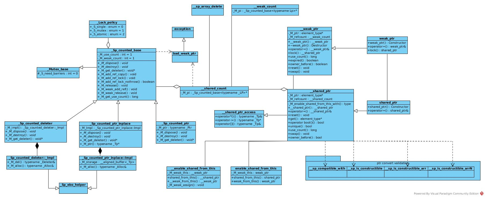
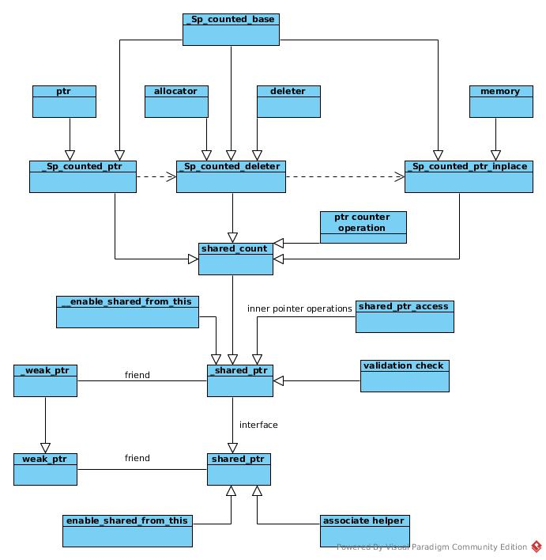

# Template and Meta in shared_ptr
## Structure
### The classes

### The Idea
The inheritance arrow in this figure is in fact a plain arrow, means "add".
It is just for convenience of my UML editor



In general, the _shared_ptr_ is combined by components of counter, pointer reference, pointer access.
These contributor work in policy pattern and implemented in meta programming to provide flexibility in compile time.
## Components
### bad_weak_ptr
It is an exception to be thrown when the ___weak_ptr_ is invalid.

* Why there is a bad weak ptr exception, no bad shared ptr exception
* This exception is thrown when ref_count = 0, why?
    The counters are initialized as 1 when a shared pointer is created.
    If the count == 0, the wrapped pointer and the ptr object should have been destructed.

### Sp_counted_base
#### Meta Classes
The __Sp_counted_base_ is the base of counter class.
It combines the counter for both shared pointer and weak pointer.
It provides sub-classes for different lock policies.
``` C++
  template<_Lock_policy _Lp = __default_lock_policy>
    class _Sp_counted_base
    : public _Mutex_base<_Lp>
```
__Sp_counted_base_ is a class template of lock policy. It provides default value for template argument Lock_policy.
The default value is the default policy value of OS.

The class inherited the _Mutex_base_ class.
``` C++
  // Empty helper class except when the template argument is _S_mutex.
  template<_Lock_policy _Lp>
    class _Mutex_base
    {
    protected:
      // The atomic policy uses fully-fenced builtins, single doesn't care.
      enum { _S_need_barriers = 0 };
    };

```
The meta class of _Mutex_base_ defined _barriers_ as false.
And a specialized template for mutex policy defined _barriers_ as true
``` C++
  template<>
    class _Mutex_base<_S_mutex>
    : public __gnu_cxx::__mutex
    {
    protected:
      // This policy is used when atomic builtins are not available.
      // The replacement atomic operations might not have the necessary
      // memory barriers.
      enum { _S_need_barriers = 1 };
    };
```
#### Concurrency in Release
The treatments that make this function thread safe
##### _GLIBCXX_SYNCHRONIZATION_HAPPENS__*
``` C++
      void
      _M_release() noexcept
      {
        // Be race-detector-friendly.  For more info see bits/c++config.
        //POSITION_1
        _GLIBCXX_SYNCHRONIZATION_HAPPENS_BEFORE(&_M_use_count);
	if (__gnu_cxx::__exchange_and_add_dispatch(&_M_use_count, -1) == 1)
	  {
	    //POSITION_2
            _GLIBCXX_SYNCHRONIZATION_HAPPENS_AFTER(&_M_use_count);
	    _M_dispose();
```
The __GLIBCXX_SYNCHRONIZATION_HAPPENS_XXX_ ensures that instructions before _POSITION_1_
would be executed before instructions in _POSITION_2_. Then
* iff _M_use_count == 0 makes thread reach _POSITION_2_
* the ___exchange_and_add_dispatch_ function is synchronized

So
* Only one thread would call __M_dispose_
* When __M_use_count_ > 0, it does not race with thread read __M_use_count_ == 0

Conclusion:
* The function ___exchange_and_add_dispatch_ alone is able to provide synchronization mentioned
* The __GLIBCXX_SYNCHRONIZATION_HAPPENS_XXX_ is just a race-detector-friendly trick

Ref:
* [bits/c++conf](https://github.com/gcc-mirror/gcc/blob/master/libstdc%2B%2B-v3/include/bits/c%2B%2Bconfig)
* [c++ 11 的shared_ptr多线程安全？](https://www.zhihu.com/question/56836057)

##### Fence
``` C++
	    if (_Mutex_base<_Lp>::_S_need_barriers)
	      {
		__atomic_thread_fence (__ATOMIC_ACQ_REL);
	      }
```
The ___atomic_thread_fence_ is introduced to ensure that the effect of __M_dispose_ is known to __M_destroy_
as the _destroy_ may also be invoked by other threads that manipulate  _weak_ptr_

Ref:
* [GNU Compiler Atomic](https://gcc.gnu.org/onlinedocs/gcc/_005f_005fatomic-Builtins.html)
* [How fence introduced](http://gcc.gnu.org/ml/libstdc++/2005-11/msg00136.html)

Questions:
* Which level of these tricks, compiler or runtime?
* Atomic memory access sequence system

##### Single Policy
The release function was optimized for single case as there is no race condition:
``` C++
  template<>
    inline void
    _Sp_counted_base<_S_single>::_M_release() noexcept
    {
      if (--_M_use_count == 0)
        {
          _M_dispose();
          if (--_M_weak_count == 0)
            _M_destroy();
        }
    }
```
#### Implement classes
##### _Sp_counted_ptr
This is the simple and default implementation without deleter and allocator assigned
This class just has the inner pointer involved.

The __M_destroy_ defined as
``` C++
      virtual void
      _M_destroy() noexcept
      { delete this; }
```
This function delete itself as:
* The newed object requires a way to be deleted
* The clean up operations, including counter manipulation and memory management, should be executed in a destructor
* The function that implemented clean up functions are virtual functions, they can not be called in a destructor
* Therefore, the clean up functions are encapsulated in _release()_
* Then _release()_ function is invoked in destructor of ___shared_count_
* As the pointer of _count_base_ is encapsulated in ___shared_count_, the pointer is inaccessible after _release_
* So, the object kills itself and it is safe

Ref:

[Calling virtual function from destructor](https://stackoverflow.com/questions/12092933/calling-virtual-function-from-destructor)

[Is it legal (and moral) for a member function to say delete this?](https://isocpp.org/wiki/faq/freestore-mgmt#delete-this)
##### _Sp_counted_deleter
This class has deleter and allocator involved.
###### std::move
There is a inner class __Impl_ defined.
This class is inherited from __Sp_ebo_helper_, and to provide the real type for deleter/allocator according to their EBO property.

This class has a constructor like this:
``` C++
      _Sp_counted_deleter(_Ptr __p, _Deleter __d, const _Alloc& __a) noexcept
      : _M_impl(__p, std::move(__d), __a) { }
```
This shows the general way of using std::move().
The _Deleter_ object is copied into the constructor.
As this object is merely for __M_impl_ object, the _Deleter_ object is moved into the __M_impl_ constructor.
And then moves into __M_impl_ object:

``` C++
      explicit _Sp_ebo_helper(_Tp&& __tp) : _Tp(std::move(__tp)) { }
```
But the _Alloc_ argument is not moved as it is not recommended to move a const object:
``` C++
      explicit _Sp_ebo_helper(const _Tp& __tp) : _Tp(__tp) { }
```
Ref:
* [右值引用与转移语义](https://www.ibm.com/developerworks/cn/aix/library/1307_lisl_c11/index.html)
* [Why can we use `std::move` on a `const` object?](https://stackoverflow.com/questions/28595117/why-can-we-use-stdmove-on-a-const-object)

###### _M_destroy()
As mentioned in __Sp_counted_ptr_, __M_destroy_ takes responsibility of killing self.
In __Sp_counted_deleter_, the function defined as:
``` C++
      virtual void
      _M_destroy() noexcept
      {
	__allocator_type __a(_M_impl._M_alloc());
	__allocated_ptr<__allocator_type> __guard_ptr{ __a, this };
	this->~_Sp_counted_deleter();
      }
```
As this version of counter ptr has customized allocator defined,
a __guard_ptr_ is generated to ensure that the customized allocator would release the memory in guard object's destructor
after destruction of __Sp_counted_deleter_ called as _this->~_Sp_counted_deleter()_

The allocator type was defined as:
``` C++
      using __allocator_type = __alloc_rebind<_Alloc, _Sp_counted_deleter>;
```
So we are using template argument __Alloc_ for __Sp_counted_deleter_'s memory manipulation.

Therefore, the argument __Alloc_ is for __Sp_counted_deleter_,
and the argument __Deleter_ is for inner pointer _ptr_

* The __M_get_deleter_ to be parsed

Ref:
* [Why is allocator::rebind necessary when we have template template parameters?](https://stackoverflow.com/questions/12362363/why-is-allocatorrebind-necessary-when-we-have-template-template-parameters)
##### _Sp_counted_ptr_inplace
This class is similar to __Sp_counted_deleter.
But instead of pointer, it holds the real memory for the pointer.

This is supposed to work as helper for _make_shared_ptr_ function
as this class is only used in ___shared_count_ when __Sp_make_shared_tag_ was set.

The memory is allocated once and wrapped in counter class once the __Sp_counted_ptr_inplace_ object created:
```C++
      class _Impl : _Sp_ebo_helper<0, _Alloc>
      {
	typedef _Sp_ebo_helper<0, _Alloc>	_A_base;

      public:
	explicit _Impl(_Alloc __a) noexcept : _A_base(__a) { }

	_Alloc& _M_alloc() noexcept { return _A_base::_S_get(*this); }

	__gnu_cxx::__aligned_buffer<_Tp> _M_storage;
      };
```
The constructor of typename __Tp_ invoked with constructor arguments forwarded:
```C++
      template<typename... _Args>
	_Sp_counted_ptr_inplace(_Alloc __a, _Args&&... __args)
	: _M_impl(__a)
	{
	  // _GLIBCXX_RESOLVE_LIB_DEFECTS
	  // 2070.  allocate_shared should use allocator_traits<A>::construct
	  allocator_traits<_Alloc>::construct(__a, _M_ptr(),
	      std::forward<_Args>(__args)...); // might throw
	}
```

The release of the inner pointer and outer object are similar to that in __Sp_counted_deleter_
### __shared_count
#### Constructor
The class ___shared_count_ holds a pointer of __Sp_counted_base_.
This pointer is initialized into different sub-classes in according to constructor arguments.

##### Default
A default constructor with nothing initialized
```c++
      constexpr __shared_count() noexcept : _M_pi(0)
      { }
```
##### __Sp_counted_ptr
When a inner pointer provided, the ___Sp_counted_ptr_ used
```c++
      template<typename _Ptr>
        explicit
	__shared_count(_Ptr __p) : _M_pi(0)
	{
	  __try
	    {
	      _M_pi = new _Sp_counted_ptr<_Ptr, _Lp>(__p);
	    }
	  __catch(...)
	    {
	      delete __p;
	      __throw_exception_again;
	    }
	}
```
##### __Sp_counted_deleter
When a deleter provided, the ___Sp_counted_deleter_ used
```c++
      template<typename _Ptr, typename _Deleter, typename _Alloc>
	__shared_count(_Ptr __p, _Deleter __d, _Alloc __a) : _M_pi(0)
	{
	  typedef _Sp_counted_deleter<_Ptr, _Deleter, _Alloc, _Lp> _Sp_cd_type;
      // ...
    }
```
Memory allocated in guard object:
```c++
	      typename _Sp_cd_type::__allocator_type __a2(__a);
	      auto __guard = std::__allocate_guarded(__a2);
	      _Sp_cd_type* __mem = __guard.get();
```
Construct the __Sp_counted_deleter_ pointer
```c++
	      ::new (__mem) _Sp_cd_type(__p, std::move(__d), std::move(__a));
	      _M_pi = __mem;
```
Set the guard as null to avoid destructor, so as no delete on ___mem_
While if anything wrong happened before this,
the guard destructor works to delete the memory allocated for __M_pi_
```c++
	      __guard = nullptr;
```
##### __Sp_counted_ptr_inplace
If __Sp_make_shared_tag_ set, make use of __Sp_counted_ptr_inplace to create pointer of typename __Tp_
``` c++
      template<typename _Tp, typename _Alloc, typename... _Args>
	__shared_count(_Sp_make_shared_tag, _Tp*, const _Alloc& __a,
		       _Args&&... __args)
	: _M_pi(0)
	{
	  typedef _Sp_counted_ptr_inplace<_Tp, _Alloc, _Lp> _Sp_cp_type;
      //...
	}
```
##### Copy constructor
For copy constructor, the __M_pi_ is shared, so that the counter and the inner pointer bound
```c++
      __shared_count(const __shared_count& __r) noexcept
      : _M_pi(__r._M_pi)
      {
	if (_M_pi != 0)
	  _M_pi->_M_add_ref_copy();
      }
```

And the counter operations are implemented in copy constructor, copy assignment and destructor
##### For unique_ptr
A version for unique ptr
```c++
      // Special case for unique_ptr<_Tp,_Del> to provide the strong guarantee.
      template<typename _Tp, typename _Del>
        explicit
	__shared_count(std::unique_ptr<_Tp, _Del>&& __r) : _M_pi(0)
	{
	  // _GLIBCXX_RESOLVE_LIB_DEFECTS
	  // 2415. Inconsistency between unique_ptr and shared_ptr
	  if (__r.get() == nullptr) //cuased by user
	    return;

      //Get inner pointer type
	  using _Ptr = typename unique_ptr<_Tp, _Del>::pointer;
	  //Meta, get deleter type
	  using _Del2 = typename conditional<is_reference<_Del>::value,
	      reference_wrapper<typename remove_reference<_Del>::type>,
	      _Del>::type;

	  //Same way as previous constructor implementation
	  using _Sp_cd_type
	    = _Sp_counted_deleter<_Ptr, _Del2, allocator<void>, _Lp>;
	  using _Alloc = allocator<_Sp_cd_type>;
	  using _Alloc_traits = allocator_traits<_Alloc>;
	  _Alloc __a;
	  _Sp_cd_type* __mem = _Alloc_traits::allocate(__a, 1);
	  //Suppose no throw as it succeeded in unique_ptr construction
	  _Alloc_traits::construct(__a, __mem, __r.release(),
				   __r.get_deleter());  // non-throwing
	  _M_pi = __mem;
	}
```
##### From __weak_count
```c++
  // Now that __weak_count is defined we can define this constructor:
  template<_Lock_policy _Lp>
    inline
    __shared_count<_Lp>::__shared_count(const __weak_count<_Lp>& __r)
    : _M_pi(__r._M_pi)
    {
      if (_M_pi != nullptr)
	_M_pi->_M_add_ref_lock();
      else
	__throw_bad_weak_ptr();
    }
```
The count base object has both ref_count and weak_count contained.
_weak_count_ manipulates merely _weak_ref_, _share_count_ manipulates merely _share_ref_.
So the counter pointer __M_pi_ could be shared between _shared_count_ and _weak_count_,
and therefore has _shared_count_, _weak_count_ and pinter bound.
#### Destructor
```c++
      ~__shared_count() noexcept
      {
	if (_M_pi != nullptr)
	  _M_pi->_M_release();
      }
```
Destructor -> release -> dispose -> delete inner pointer -> destroy -> delete counter pointer
### __shared_ptr
The ___shared_ptr_ combines shared ptr, weak ptr and unique ptr to some degree.
And it provides conversion of inner pointer.
#### Accessories
##### Compatible
___sp_compatible_with_ is based on _is_convertible_
```c++
  /// is_convertible
  template<typename _From, typename _To>
    struct is_convertible
    : public __is_convertible_helper<_From, _To>::type
    { };
```
The type of this template is _false_type_/_true_type_ asserted by ___test(int)_.
The input argument is just a dummy to distinguish all these _test()_ functions
```c++
  template<typename _From, typename _To>
    class __is_convertible_helper<_From, _To, false>
    {
    //...
    public:
      typedef decltype(__test<_From, _To>(0)) type;
    };
```
The default value is _false_type_
```c++
      template<typename, typename>
	static false_type
	__test(...);
```
An auxiliary function defined to assert if an input type is __To1_
```c++
       template<typename _To1>
	static void __test_aux(_To1);
```
The real job to assert if type __From_ could be converted into __To_
```c++
      template<typename _From1, typename _To1,
	       typename = decltype(__test_aux<_To1>(std::declval<_From1>()))>
	static true_type
	__test(int);
```
_std::declval<\_From1>()_ get type of __From1_,
then put it into specialized ___test_aux<\_To1>_
to assert if the template that expects a __To1_ type accepts type of __From1_.
If sentence _____test_aux<\_To1>(std::declval<\_From1>())_ compiled,
the _decltype_ then gets type,
then ___test(int)_ return _true_type_.
Else, the compiler turns back to default version to return _false_type_

To be noted that the types are __From*_ and __To*_ instead of plain types.

And a special _true_type_ case for array:
```c++
  template<typename _Up, size_t _Nm>
    struct __sp_compatible_with<_Up(*)[_Nm], _Up(*)[]>
    : true_type
    { };
```
##### Constructable
It is in fact pointer version of compatible:
```c++
  // otherwise, Y* shall be convertible to T*.
  template<typename _Tp, typename _Yp>
    struct __sp_is_constructible
    : is_convertible<_Yp*, _Tp*>::type
    { };
```
##### Assignable
Defined as
```c++
      // Constraint for assignment from shared_ptr and weak_ptr:
      template<typename _Yp>
	using _Assignable = _Compatible<_Yp, __shared_ptr&>;
```
As compatibility depends on implicit converter,
but the only constructor of ___shared_ptr_ receives raw pointer is defined as explicit,
the assignable __Yp_ is in fact one of ___share_ptr_, ___weak_ptr_ and _unique_ptr_.
### weak_ptr
_weak_ptr_ is similar to _WeakReference_ in _Java_.

_weak_ptr_ is a read-only access to _shared_ptr_.
That is, _weak_ptr_ depends on _shared_ptr_.
There is no way to construct a _weak_ptr_ from a raw pointer.
The root of a _weak_ptr_ is always a _shared_ptr_.
And there is no way to touch the inner pointer from a _weak_ptr_.
Whenever accessing to the inner pointer, a corresponding _shared_ptr_ generated from the _weak_ptr_.

On the one hand, user of _weak_ptr_ does not expect that the inner pointer is always valid.
Of course it provides function to assert if the inner pointer is valid.
If user want to write to inner pointer, the _weak_ptr_ would transferred into a _shared_ptr_ automatically.
And manipulation of _weak_ptr does not interference to memory management of the inner pointer in corresponding _shared_ptr_.

On the other hand,
the corresponding _shared_ptr_ can go its own way without consideration of related _weak_ptr_

_weak_ptr_ often works in cache: [When is std::weak_ptr useful?](https://stackoverflow.com/questions/12030650/when-is-stdweak-ptr-useful)

And to prevent cyclic reference of _shared_ptr_:

[shared_ptr的原理与应用](https://www.cnblogs.com/heleifz/p/shared-principle-application.html)

[Notes on std::shared_ptr and std::weak_ptr](https://eklitzke.org/notes-on-std-shared-ptr-and-std-weak-ptr)
### enable_shared_from_this
_enable_shared_from_this_ provides a method to get _shared_ptr_ from inner pointer
to avoid multiple independent _shared_ptr_ over a same inner pointer.

___enable_shared_from_this_ is the super class to provide this function, by function of _shared_from_this_.
The sub-classes implement this super class to inherit this function.

The __enable_shared_from_this_ class defines only protected constructor,
so the object of the class would only be created in sub-class's constructor by default.
```c++
    protected:
      constexpr __enable_shared_from_this() noexcept { }

      __enable_shared_from_this(const __enable_shared_from_this&) noexcept { }

      __enable_shared_from_this&
      operator=(const __enable_shared_from_this&) noexcept
      { return *this; }

      ~__enable_shared_from_this() { }
```

It holds an object of ___weak_ptr_, to avoid the case that the inner pointer holds a strong reference of itself.
```c++
      mutable __weak_ptr<_Tp, _Lp>  _M_weak_this;
```

The constructor of ___shared_ptr_ tries to create the associated object automatically:
```c++
      template<typename _Yp, typename _Deleter, typename = _SafeConv<_Yp>>
	__shared_ptr(_Yp* __p, _Deleter __d)
	: _M_ptr(__p), _M_refcount(__p, std::move(__d))
	{
	  static_assert(__is_invocable<_Deleter&, _Yp*&>::value,
	      "deleter expression d(p) is well-formed");
	  _M_enable_shared_from_this_with(__p);
	}
```

The definition of __M_enable_shared_from_this():
```c++
      template<typename _Yp, typename _Yp2 = typename remove_cv<_Yp>::type>
	typename enable_if<__has_esft_base<_Yp2>::value>::type
	_M_enable_shared_from_this_with(_Yp* __p) noexcept
	{
	  if (auto __base = __enable_shared_from_this_base(_M_refcount, __p))
	    __base->_M_weak_assign(const_cast<_Yp2*>(__p), _M_refcount);
	}
```
It gets the plain type of __Yp_ by _remove_cv_,
and decides if the type __Yp_ has ___enable_shared_from_this_ inherited.

If __Yp_ is a sub-class,
```c++
      friend const __enable_shared_from_this*
      __enable_shared_from_this_base(const __shared_count<_Lp>&,
				     const __enable_shared_from_this* __p)
      { return __p; }
```
The pointer ___p_ converts to pointer of base type ___enable_shared_from_this_,
and return this pointer to caller.
```c++
    private:
      template<typename _Tp1>
	void
	_M_weak_assign(_Tp1* __p, const __shared_count<_Lp>& __n) const noexcept
	{ _M_weak_this._M_assign(__p, __n); }
```
Then the ___weak_ptr_ binds the counter and the pointer.

Therefore, the ___weak_ptr_ is created by default in construction of the ___shared_ptr_ when the inner pointer was wrapped in very beginning.

If the type of inner pointer has no intention to implement this function, nothing happened.
``` c++
      template<typename _Yp, typename _Yp2 = typename remove_cv<_Yp>::type>
	typename enable_if<!__has_esft_base<_Yp2>::value>::type
	_M_enable_shared_from_this_with(_Yp*) noexcept
	{ }
```
### shared_ptr
#### make_shared
The function provides an easy way to create a _share_ptr_ from inner pointer type.
It is also a function wrapper of _shared_ptr_ creation to prevent exception thrown in _new_ [ref](https://www.cnblogs.com/heleifz/p/shared-principle-application.html).
Ref: [shared_ptr](https://kingsamchen.github.io/2018/03/30/demystify-shared-ptr-and-weak-ptr-in-libstdcpp/)
#### nullptr
_shared_ptr_ implements special treatment for _nullptr_.
##### without deleter
```c++
      constexpr shared_ptr(nullptr_t) noexcept : shared_ptr() { }
      constexpr shared_ptr() noexcept : __shared_ptr<_Tp>() { }
```

```c++
      constexpr __shared_ptr() noexcept
      : _M_ptr(0), _M_refcount()
      { }

      constexpr __shared_count() noexcept : _M_pi(0)
      { }
```
##### with deleter
```c++
      template<typename _Deleter>
	shared_ptr(nullptr_t __p, _Deleter __d)
        : __shared_ptr<_Tp>(__p, std::move(__d)) { }
```

```c++
      template<typename _Deleter>
	__shared_ptr(nullptr_t __p, _Deleter __d)
	: _M_ptr(0), _M_refcount(__p, std::move(__d))
	{ }
```
Don't know why there is no special treatment for ___shared_count_,
maybe the library suppose the user knows what is going on with _deleter_ assigned.
```c++      template<typename _Ptr, typename _Deleter, typename _Alloc>
      	__shared_count(_Ptr __p, _Deleter __d, _Alloc __a) : _M_pi(0)
      	{
      	  typedef _Sp_counted_deleter<_Ptr, _Deleter, _Alloc, _Lp> _Sp_cd_type;
      	  __try
      	    {
      	      typename _Sp_cd_type::__allocator_type __a2(__a);
      	      auto __guard = std::__allocate_guarded(__a2);
      	      _Sp_cd_type* __mem = __guard.get();
      	      ::new (__mem) _Sp_cd_type(__p, std::move(__d), std::move(__a));
      	      _M_pi = __mem;
      	      __guard = nullptr;
      	    }
      	  __catch(...)
      	    {
      	      __d(__p); // Call _Deleter on __p.
      	      __throw_exception_again;
      	    }
      	}
```

And validation in ___shared_ptr_access_
```c++
      element_type&
      operator*() const noexcept
      {
	__glibcxx_assert(_M_get() != nullptr);
	return *_M_get();
      }
```