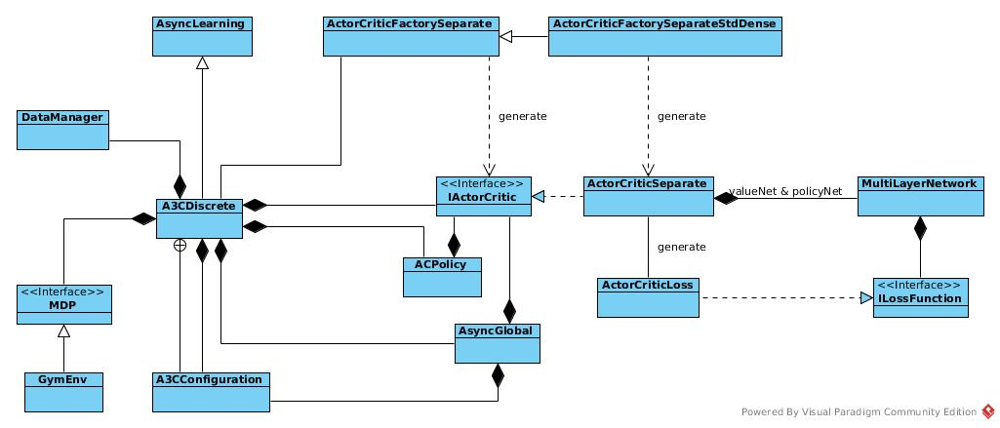
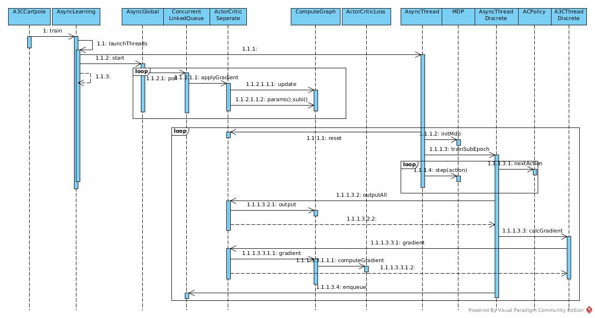

# A3C Cartepole
The figures in this link explain what A3C is doing.
[Simple Reinforcement Learning with Tensorflow Part 8: Asynchronous Actor-Critic Agents (A3C)](https://medium.com/emergent-future/simple-reinforcement-learning-with-tensorflow-part-8-asynchronous-actor-critic-agents-a3c-c88f72a5e9f2)
## Architecture



## Sequence



## Calculation

In this example, value net and policy net are two independent NN, and they are treated independently
### Global Thread

*AsyncGlobal* polls the queue and updates the network timely. Then update target network in some condition in double NN case

```
    public void run() {

        while (!isTrainingComplete() && running) {
            if (!queue.isEmpty()) {
                Pair<Gradient[], Integer> pair = queue.poll();
                T.addAndGet(pair.getSecond());
                Gradient[] gradient = pair.getFirst();
                synchronized (this) {
                    current.applyGradient(gradient, pair.getSecond());
                }
                if (a3cc.getTargetDqnUpdateFreq() != -1
                                && T.get() / a3cc.getTargetDqnUpdateFreq() > (T.get() - pair.getSecond())
                                                / a3cc.getTargetDqnUpdateFreq()) {
                    log.info("TARGET UPDATE at T = " + T.get());
                    synchronized (this) {
                        target.copy(current);
                    }
                }
            }
        }

    }
```

Workers send gradients for value net and policy net as an array and update them accordingly

```
ActorCriticSeparate.applyGradient(Gradient[] gradient, int batchSize) {
        MultiLayerConfiguration valueConf = valueNet.getLayerWiseConfigurations();
        int valueIterationCount = valueConf.getIterationCount();
        valueNet.getUpdater().update(valueNet, gradient[0], valueIterationCount, batchSize);
        valueNet.params().subi(gradient[0].gradient());
        Collection<IterationListener> valueIterationListeners = valueNet.getListeners();
        if (valueIterationListeners != null && valueIterationListeners.size() > 0) {
            for (IterationListener listener : valueIterationListeners) {
                listener.iterationDone(valueNet, valueIterationCount);
            }
        }
        valueConf.setIterationCount(valueIterationCount + 1);

        MultiLayerConfiguration policyConf = policyNet.getLayerWiseConfigurations();
        int policyIterationCount = policyConf.getIterationCount();
        policyNet.getUpdater().update(policyNet, gradient[1], policyIterationCount, batchSize);
        policyNet.params().subi(gradient[1].gradient());
        Collection<IterationListener> policyIterationListeners = policyNet.getListeners();
        if (policyIterationListeners != null && policyIterationListeners.size() > 0) {
            for (IterationListener listener : policyIterationListeners) {
                listener.iterationDone(policyNet, policyIterationCount);
            }
        }
        policyConf.setIterationCount(policyIterationCount + 1);
}
```

The updater for both of them are initiated in *ActorCriticFactorySeparateStdDense*.buildActorCritic() as default updater: Adam

### Worker Thread
The worker is running in similar way as DQN does. There are three minor differences:
* Networks are not updated in worker. Workers make use of network while not train them
* We are training V instead of Q, so the labels for value network is simple reward, not something about next state.

About above differences, they could be proved in **.trainSubEpoch()* and *A3CThreadDiscrete.calcGradient()*

The last one is a special loss function for policy network which implemented as *ActorCriticLoss*
#### ActorCriticLoss
```
    public INDArray computeGradient(INDArray labels, INDArray preOutput, IActivation activationFn, INDArray mask) {
        INDArray output = activationFn.getActivation(preOutput.dup(), true).addi(1e-5);
        INDArray logOutput = Transforms.log(output, true);
        INDArray entropyDev = logOutput.addi(1);
        INDArray dLda = output.rdivi(labels).subi(entropyDev.muli(BETA)).negi();
        INDArray grad = activationFn.backprop(preOutput, dLda).getFirst();

        if (mask != null) {
            LossUtil.applyMask(grad, mask);
        }
        return grad;
    }
```

As declared in [reference](https://arxiv.org/pdf/1602.01783.pdf), the loss function is
L = log(π)(R - V) + BETA * H(π)

Make A = R - V

π is output of policy network, θ is W in previous networks descriptions.

Get π and log(π)

```
        INDArray output = activationFn.getActivation(preOutput.dup(), true).addi(1e-5);
        INDArray logOutput = Transforms.log(output, true);
```

Get (- d(H) / d(π))

H(π) = - (Σπi * log(πi))

d(H) / d(πi) = (1 + log(πi))

```
        INDArray entropyDev = logOutput.addi(1);
```

Get d(L) / d(π)

d(L) / d(πi) = A / πi - (1 + log(πi))

A are labels computed in trainSubEpoch

```
        INDArray dLda = output.rdivi(labels).subi(entropyDev.muli(BETA)).negi();
```

d(L) / d(θ) = (d(L) / d(π)) * (d(π) / d(θ))

In following sentence, backprop is doing this job and dLda is d(L) / d(π)

```
        INDArray grad = activationFn.backprop(preOutput, dLda).getFirst();
```

