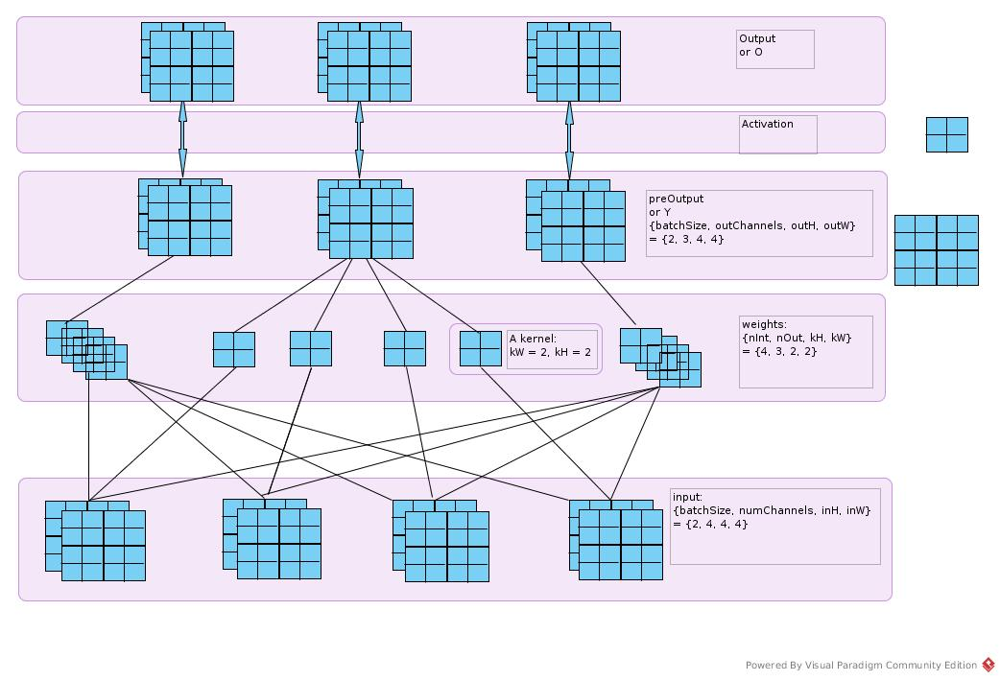

# What Happens in dp4j LenetMnist Example
## Class Diagram

## Sequence
### CNN Structure
### Codes Sequence
#### Initiation

#### Fit

## Computation
### Initiation
#### Parameters

Count number of all parameters:
``` Java
MultiLayerNetwork.init
    for (int i = 0; i < nLayers; i++) {
        NeuralNetConfiguration conf = layerWiseConfigurations.getConf(i);
        nParamsPerLayer[i] = conf.getLayer().initializer().numParams(conf);
        paramLength += nParamsPerLayer[i];
    }
```
Take Convolution Layer for example:
``` Java
ConvolutionParamInitializer.numParams
    public int numParams(Layer l) {
        org.deeplearning4j.nn.conf.layers.ConvolutionLayer layerConf =
                        (org.deeplearning4j.nn.conf.layers.ConvolutionLayer) l;

        int[] kernel = layerConf.getKernelSize();
        int nIn = layerConf.getNIn();
        int nOut = layerConf.getNOut();
        return nIn * nOut * kernel[0] * kernel[1] + (layerConf.hasBias() ? nOut : 0);
    }
```
Create a huge bulk of memory in 1-dimension
``` Java
MultiLayerNetwork.init
    if (parameters != null) {
        // ...
    } else {
        flattenedParams = Nd4j.create(1, paramLength);
        initializeParams = true;
    }
```
Assign part of this bulk into each layer in sequence
``` Java
MultiLayerNetwork.init
     int paramCountSoFar = 0;
     for (int i = 0; i < nLayers; i++) {
        INDArray paramsView;
        if (nParamsPerLayer[i] > 0) {
            //...
        } else {
            paramsView = null;
        }
        paramCountSoFar += nParamsPerLayer[i];

        NeuralNetConfiguration conf = layerWiseConfigurations.getConf(i);
        layers[i] = conf.getLayer().instantiate(conf, listeners, i, paramsView, initializeParams);
        layerMap.put(conf.getLayer().getLayerName(), layers[i]);
     }
```
#### Input/Label
For each mini batch, the input is organized into *INDArray* of batch * #imagebyte
Similar to labels.
``` Java
MnistDataFetcher.fetch
    public void fetch(int numExamples) {
        //...
        float[][] featureData = new float[numExamples][0];
        float[][] labelData = new float[numExamples][0];

        int actualExamples = 0;
        byte[] working = null;
        for (int i = 0; i < numExamples; i++, cursor++) {
            if (!hasMore())
                break;

            byte[] img = man.readImageUnsafe(order[cursor]);

            //...

            int label = man.readLabel(order[cursor]);

            //...

            float[] featureVec = new float[img.length];
            featureData[actualExamples] = featureVec;
            labelData[actualExamples] = new float[numOutcomes];
            labelData[actualExamples][label] = 1.0f;

            //...

            actualExamples++;
        }

        //...

        INDArray features = Nd4j.create(featureData);
        INDArray labels = Nd4j.create(labelData);
        curr = new DataSet(features, labels);
    }

```
Set the shape data.length * data\[0\].length
``` Java
    public BaseNDArray(float[][] data, char ordering) {
        this(Nd4j.createBuffer(ordering == 'c' ? ArrayUtil.flatten(data) : ArrayUtil.flattenF(data)),
                        new int[] {data.length, data[0].length},
                        Nd4j.getStrides(new int[] {data.length, data[0].length}, ordering), 0, ordering);
    }
```
### Forward Propagation
#### Input
Input of each layer is set at
``` Java
AbstractLayer.java
    @Override
    public INDArray activate(INDArray input, boolean training) {
        setInput(input);
        return activate(training);
    }
```
Input type was set in *MultiLayerConfiguration* builder
``` Java
LenetMins.java
    .setInputType(InputType.convolutionalFlat(inputImageSize, inputImageSize, channelNum))
```
A *PreProcessor* was created:
``` Java
MultiLayerConfiguration.Builder.build
           if (inputType != null) {
                InputType currentInputType = inputType;
                for (int i = 0; i < confs.size(); i++) {
                    Layer l = confs.get(i).getLayer();
                    if (inputPreProcessors.get(i) == null) {
                        //Don't override preprocessor setting, but set preprocessor if required...
                        InputPreProcessor inputPreProcessor = l.getPreProcessorForInputType(currentInputType);
                        if (inputPreProcessor != null) {
                            inputPreProcessors.put(i, inputPreProcessor);
                        }
                    }
                    //...
                }
                //...
           }

```
For CNN layer, a default *FeedForwardToCnnPreProcessor* is created
``` Java
    @JsonCreator
    public FeedForwardToCnnPreProcessor(@JsonProperty("inputHeight") int inputHeight,
                    @JsonProperty("inputWidth") int inputWidth, @JsonProperty("numChannels") int numChannels) {
        this.inputHeight = inputHeight;
        this.inputWidth = inputWidth;
        this.numChannels = numChannels;
    }
```
*Preprocessor* is executed before active() for each layer.
*MultiLayerNetwork* aggregate them. It is not embedded in ConvolutionLayer class
``` Java
    public INDArray activationFromPrevLayer(int curr, INDArray input, boolean training) {
        // ...
        input = getLayerWiseConfigurations().getInputPreProcess(curr).preProcess(input, getInputMiniBatchSize());
        // ...

        INDArray ret = layers[curr].activate(input, training);
        return ret;
    }
```
The 2-dim buffer is reshaped into 4-dim buffer
``` Java
FeedForwardToCnnPreProcessor.java
    @Override
    public INDArray preProcess(INDArray input, int miniBatchSize) {
        //...
        return input.reshape('c', input.size(0), numChannels, inputHeight, inputWidth);
    }
```
#### Convolution Layer
Suppose batchSize = 2. The layer should be like the following figure
Take the numbers in the figure for example.



##### ConvolutionLayer.preOutput
``` Java
        INDArray bias = getParamWithNoise(ConvolutionParamInitializer.BIAS_KEY, training);
        INDArray weights = getParamWithNoise(ConvolutionParamInitializer.WEIGHT_KEY, training);
````
weights is of dim {nIn, nOut, kernelHeight, kernelWidth}.
input is of dim {batchSize, numChannels, inputHeight, inputWidth}
"n" and "depth of channel" and "number of channels" are the same
``` Java
        INDArray col = Nd4j.createUninitialized(new int[] {miniBatch, outH, outW, inDepth, kH, kW}, 'c');
        INDArray col2 = col.permute(0, 3, 4, 5, 1, 2);
```
Create INDArray of size (miniBatch * outH * outW * inDepth * kH * kW)
Permute into shape (miniBatch, inDepth, kH, kW, outH, outW)
``` Java
        Convolution.im2col(input, kH, kW, strides[0], strides[1], pad[0], pad[1], dilation[0], dilation[1],
                        convolutionMode == ConvolutionMode.Same, col2);
        INDArray im2col2d = Shape.newShapeNoCopy(col, new int[] {miniBatch * outH * outW, inDepth * kH * kW}, false);
```
im2col expand the input into 2-dim matrix.
That is, to extract each block that would be conved with a set of kernel to a line of matrix
``` Java
        INDArray permutedW = weights.permute(3, 2, 1, 0);
        INDArray reshapedW = permutedW.reshape('f', kW * kH * inDepth, outDepth);
```
And to extract each set of kernel as a column of a matrix
``` Java
            z = im2col2d.mmul(reshapedW);
```
Just like the following figure


Multiply them and get the z, that is, output before activation
``` Java
        z = Shape.newShapeNoCopy(z, new int[] {outW, outH, miniBatch, outDepth}, true);
        z = z.permute(2, 3, 1, 0);
```
Reshape z in shape {miniBatch, outDepth, outH, outW}
It is permute(2, 3, 1, 0) in stead of (2, 3, 0, 1) is that the next block counted by row number in input
while in col number in output matrix.

##### ConvolutionLayer.activate(）
``` Java
        INDArray activation = afn.getActivation(z, training);
```
``` Java
ActivationReLU.getActivation()
    @Override
    public INDArray getActivation(INDArray in, boolean training) {
        Nd4j.getExecutioner().execAndReturn(new RectifedLinear(in));
        return in;
    }
```
Output is of the same dim as z, which is 4 rank matrix. And is sent to subsampling layer.
#### Subsample Layer
Not confirmed. Guess that the max pooling is executed by:
```
SubsamplingLayer.activate
--> Convolution.pooling2D
--> Nd4jCpu.double_maxpool2d
--> libnd4j maxpool2d.cpp
--> OpenBlas
```
And also guess that OpenBlas does not have too much trick.
It is a SIMD of naive implementation as Caffe does. [Caffe CNN Layer](https://software.intel.com/en-us/articles/caffe-optimized-for-intel-architecture-applying-modern-code-techniques)
#### Dense Layer
``` Java
BaseLayer.preOutput()
        INDArray ret = input.mmul(W);
BaseLayer.activate()
        INDArray ret = layerConf().getActivationFn().getActivation(z, training);
```
#### Output Layer
set input of output layer
``` Java
MultiLayerNetwork.computeGradientAndScore()
                INDArray actSecondLastLayer = activations.get(activations.size() - 1);
                getOutputLayer().setInput(actSecondLastLayer);
                backprop();
```
set labels of output layer
``` Java
MultiLayerNetwork.calcBackpropGradients()
            outputLayer.setLabels(labels);
            currPair = outputLayer.backpropGradient(null);
```
Get the output
``` Java
LossMCXENT.computeGradient()
        INDArray output = activationFn.getActivation(preOutput.dup(), true);
```
Then computed by ActivationSoftmax.getActivation()
``` Java
Annotation in ActivationSoftmax.java
/**
 * f_i(x) = exp(x_i - shift) / sum_j exp(x_j - shift)
 * where shift = max_i(x_i)
 */
```
Suppose it is a kind of normalization. To be clarified.
### Back Propagation
#### Output Layer
The loss function is created without weights parameters
``` Java
OutputLayer.Builder
        public Builder(LossFunction lossFunction) {
            super.lossFunction(lossFunction);
        }
```
The gradient was computed as:
``` Java
LossMCXENT.computeGradient()
                grad = output.subi(labels); //labels is one-hot vector
```
[softmax gradient English](https://ljvmiranda921.github.io/notebook/2017/08/13/softmax-and-the-negative-log-likelihood/)
[softmax gradient Chinese](http://freemind.pluskid.org/machine-learning/softmax-vs-softmax-loss-numerical-stability/)
The output layer is as the following figure:


```
Σ(k) means sum over index k
sigma(i, j) = (i == j)
loss = l = -log(zy), labels(y) = 1
zi = exp(xi - xt) / Σ(k)(exp(xk - xt)), xt = max(xk)

dzi/dxj = (sigma(i, j) * exp(xi - xt) / Σ) + (exp(xi - xt) * (-1) * (Σ ^ (-2)) * exp(xj - xt))
        = (exp(xi - xt) / Σ) * (sigma(i, j) - exp(xj - xt) / Σ)
        = zi * (sigma(i, j) - zj)

dl/dzi = sigma(y, i) * (-1) * (1 / zi)

dl/dxj = Σ(i)((dl/dzi) * (dzi/dzj))
       = Σ(i)(sigma(y, i) * (1 / zi) * zi * (zj - sigma(i, j)))
       = Σ(i)(sigma(y, i) * (zj - sigma(i, j)))
As sigma(y, i) == 0 when (y != i)
--> dl/dxj = zj - sigma(y, j)
And sigma(y, j) == labels
--> dL/dX = output - labels
```
#### Dense Layer


```
f = do / dz
epsilon = dl / do

dl/dwij = (dl/doi) * (doi/dzi) * (dzi / dwij)
        = epsilon(i) * f(i) * xj

dl/dxi = Σ(k)((dl/dok) * (dok/dzk) * (dzk/dxi))
       = Σ(k)(epsilon(k) * f(k) * w(k,i)
```
The back propagation happens in
``` Java
DenseLayer --> BaseLayer.backpropGradient()
    @Override
    public Pair<Gradient, INDArray> backpropGradient(INDArray epsilon) {
        //get z
        INDArray z = preOutput(true);
        //get f based on value of z
        //and get (f muli epsilon)
        INDArray delta = layerConf().getActivationFn().backprop(z, epsilon).getFirst(); //TODO handle activation function params

        Gradient ret = new DefaultGradient();

        INDArray weightGrad = gradientViews.get(DefaultParamInitializer.WEIGHT_KEY); //f order
        //weightGrad = input * delta = input * (f muli epsilon)
        Nd4j.gemm(input, delta, weightGrad, true, false, 1.0, 0.0);
        ret.gradientForVariable().put(DefaultParamInitializer.WEIGHT_KEY, weightGrad);
        //End of w gradient

        if(hasBias()){
            INDArray biasGrad = gradientViews.get(DefaultParamInitializer.BIAS_KEY);
            delta.sum(biasGrad, 0); //biasGrad is initialized/zeroed first
            ret.gradientForVariable().put(DefaultParamInitializer.BIAS_KEY, biasGrad);
        }

        //get w
        INDArray W = getParamWithNoise(DefaultParamInitializer.WEIGHT_KEY, true);
        //get W * (f muli epsilon)
        INDArray epsilonNext = W.mmul(delta.transpose()).transpose();
        //End of x gradient

        weightNoiseParams.clear();

        return new Pair<>(ret, epsilonNext);
    }
```
#### Subsampling Layer
SubsamplingLayer.backpropGradient()


``` Java
            col6d = Nd4j.create(new int[] {miniBatch, inDepth, outH, outW, kernel[0], kernel[1]}, 'c');
```


``` Java
            epsilon1d = epsilon.reshape('c', ArrayUtil.prod(epsilon.length()), 1); //zero copy reshape
```


``` Java
                Convolution.im2col(input, kernel[0], kernel[1], strides[0], strides[1], pad[0], pad[1], dilation[0], dilation[1],
                                convolutionMode == ConvolutionMode.Same, col6dPermuted);
```


``` Java
                INDArray isMax = Nd4j.getExecutioner().execAndReturn(new IsMax(col2d, 1));
```


``` Java
                isMax.muliColumnVector(epsilon1d);
```


``` Java
        Convolution.col2im(col6dPermuted, outEpsilon, strides[0], strides[1], pad[0], pad[1], inputHeight, inputWidth, dilation[0], dilation[1]);
```


Get the output


#### Convolution Layer
There are many respectable documents about convolution back propagation. So, just put the im2col/col2im view as implemented in dp4j
In forward phase, we have


The certain weight contributes to output by corresponding input.
```
preOutput(i, j) = Σ(k)(X(i, k) * W(k, j))
d(preOutput(i, j))/d(W(k, j)) = X(i, k)

d(loss)/d(w(k, j)) = Σ(i)((d(preOutput(i, j)/d(W(k, j))) * (d(l)/d(preOutput(i, j))))
                   = Σ(i)(X(i, k) * epsilon(i, j) * df(i, j))
                   = Σ(i)((X.transpose()(k, i)) * epsilon(i, j) * df(i, j))
                   = X.row(k) * (epsilon dot f).col(j)
```

``` Java
ConvolutionLayer.backpropGradient()
        // p.first is of preOutputShape
        // afn.backprop get df/dpreOutput and executed element wise product of epsilon
        delta = afn.backprop(p.getFirst(), epsilon).getFirst(); //TODO handle activation function params

        delta = delta.permute(1, 0, 2, 3); //To shape: [outDepth,miniBatch,outH,outW]
        INDArray delta2d = delta.reshape('c', new int[] {outDepth, miniBatch * outH * outW}); //Shape.newShapeNoCopy(delta,new int[]{outDepth,miniBatch*outH*outW},false);

        //im2col2d is as described in previous figure
        INDArray im2col2d = p.getSecond(); //Re-use im2col2d array from forward pass if available; recalculate if not

        //get im2col2d and delta2d both transposed
        Nd4j.gemm(im2col2d, delta2d, weightGradView2df, true, true, 1.0, 0.0);
```


```
Similarly
preOutput(i, j) = Σ(k)(X(i, k) * W(k, j))
d(preOutput(i, j))/d(X(i, k)) = W(k, j)

d(l)/d(X(i, k)) = Σ(j)(W(k, j) * epsilon(i, j) * df(i, j))
As preOutput2d is of shape (batch * outH * outW, outDepth)
And delta2d is of shape (outDepth, batch * outH * outW)
-->
d(l)/d(X(i, k)) = Σ(j)(W(k, j) * delta2d(j, i))
                = W.row(k) * delta2d.col(i)
```


### Update
``` Java
StochasticGradientDescent.optimize()
        //Update all parameters by configured updater
        stepFunction.step(params, gradient.gradient());
        //Set the updated parameters
        model.setParams(params);
```
### Score
The score sequence is like:


It computes L1 and L2 normalization at first. There is no such regularization in this example.
And then to compute the score in LossMCXENT.scoreArray
``` Java
        INDArray output = activationFn.getActivation(preOutput.dup(), true);
        INDArray scoreArr = Transforms.log(output, false).muli(labels);
```
Just to execute the softmax function and get the log of them. Then pick the one whose label == 1.it