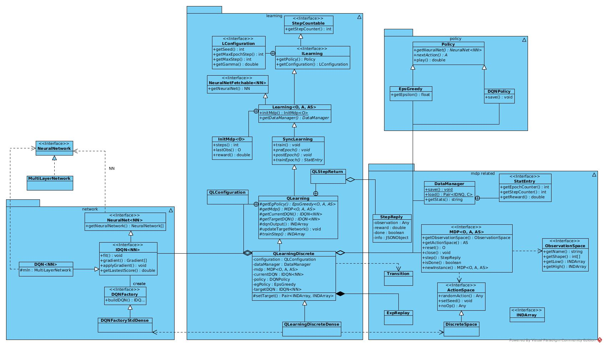
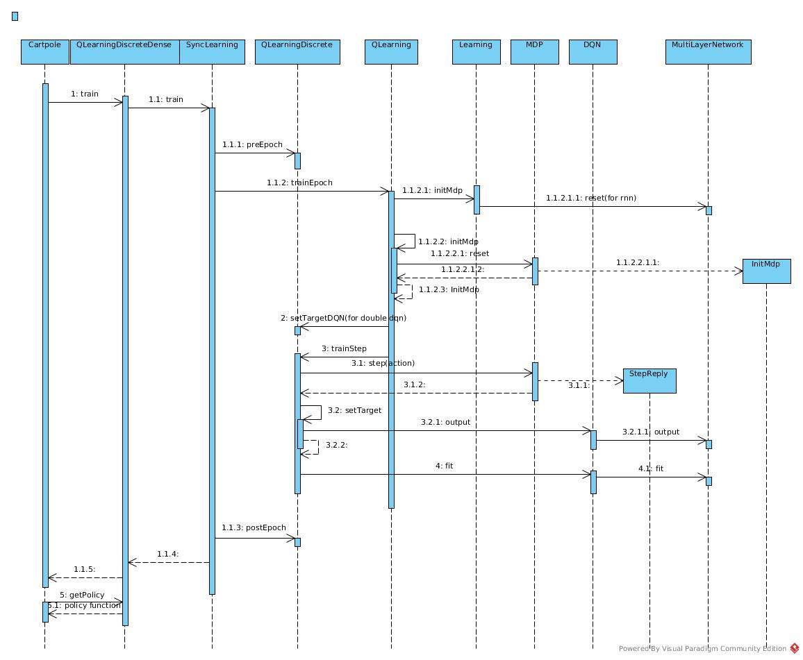

# Cartepole QLearning
## Architecture

## Sequence

## Algorithm
SARS
``` Java
    protected StatEntry trainEpoch() {
        //Execute initial steps to get the first meaningful state
        InitMdp<O> initMdp = initMdp();
        O obs = initMdp.getLastObs();

        //For stats
        double reward = initMdp.getReward();
        int step = initMdp.getSteps();

        Double startQ = Double.NaN;
        double meanQ = 0;
        int numQ = 0;
        List<Double> scores = new ArrayList<>();
        while (step < getConfiguration().getMaxEpochStep() && !getMdp().isDone()) {

            //For double DQN
            if (getStepCounter() % getConfiguration().getTargetDqnUpdateFreq() == 0) {
                updateTargetNetwork();
            }

            //Step = action + next state + (reward)
            QLStepReturn<O> stepR = trainStep(obs);

            if (!stepR.getMaxQ().isNaN()) {
                if (startQ.isNaN())
                    startQ = stepR.getMaxQ();
                numQ++;
                meanQ += stepR.getMaxQ();
            }

            if (stepR.getScore() != 0)
                scores.add(stepR.getScore());

            reward += stepR.getStepReply().getReward();
            obs = stepR.getStepReply().getObservation();
            incrementStep();
            step++;
        }

        //stats
        meanQ /= (numQ + 0.001); //avoid div zero


        StatEntry statEntry = new QLStatEntry(getStepCounter(), getEpochCounter(), reward, step, scores,
                        getEgPolicy().getEpsilon(), startQ, meanQ);

        return statEntry;

    }
```


A single step

``` Java
    protected QLStepReturn<O> trainStep(O obs) {

        Integer action;
        INDArray input = getInput(obs);
        // historyProcessor is for image record processing and cache(storage of circularqueue)
        boolean isHistoryProcessor = getHistoryProcessor() != null;


        if (isHistoryProcessor)
            getHistoryProcessor().record(input);

        // stack #skipFrame frames as one input
        int skipFrame = isHistoryProcessor ? getHistoryProcessor().getConf().getSkipFrame() : 1;
        int historyLength = isHistoryProcessor ? getHistoryProcessor().getConf().getHistoryLength() : 1;
        // warm up
        int updateStart = getConfiguration().getUpdateStart()
                        + ((getConfiguration().getBatchSize() + historyLength) * skipFrame);

        Double maxQ = Double.NaN; //ignore if Nan for stats

        //if step of training, just repeat lastAction
        if (getStepCounter() % skipFrame != 0) {
            action = lastAction;
        } else {
            if (history == null) {
                if (isHistoryProcessor) {
                    // Push input into queue to construct complete history
                    getHistoryProcessor().add(input);
                    // Get the frames to be stacked
                    history = getHistoryProcessor().getHistory();
                } else
                    history = new INDArray[] {input};
            }
            //concat the history into a single INDArray input
            INDArray hstack = Transition.concat(Transition.dup(history));
            if (isHistoryProcessor) {
                hstack.muli(1.0 / getHistoryProcessor().getScale());
            }

            //if input is not 2d, you have to append that the batch is 1 length high
            if (hstack.shape().length > 2)
                hstack = hstack.reshape(Learning.makeShape(1, ArrayUtil.toInts(hstack.shape())));

            // Get Q(s, a)
            INDArray qs = getCurrentDQN().output(hstack);
            // Get max a's index
            int maxAction = Learning.getMaxAction(qs);

            // For return
            maxQ = qs.getDouble(maxAction);
            // epsilon-greedy
            // Seemed run nn forward repetatively. Waste
            action = getEgPolicy().nextAction(hstack);
        }

        lastAction = action;

        // Execute action and prepare for return value
        StepReply<O> stepReply = getMdp().step(action);

        accuReward += stepReply.getReward() * configuration.getRewardFactor();

        //if it's not a skipped frame, you can do a step of training
        if (getStepCounter() % skipFrame == 0 || stepReply.isDone()) {
            // The lastest action reply had not been put into history
            // Why not put it into history immedately after action?
            INDArray ninput = getInput(stepReply.getObservation());
            if (isHistoryProcessor)
                getHistoryProcessor().add(ninput);

            INDArray[] nhistory = isHistoryProcessor ? getHistoryProcessor().getHistory() : new INDArray[] {ninput};

            // Add into replay memory
            Transition<Integer> trans = new Transition(history, action, accuReward, stepReply.isDone(), nhistory[0]);
            getExpReplay().store(trans);

            // Train the NN
            if (getStepCounter() > updateStart) {
                // Construct labels
                Pair<INDArray, INDArray> targets = setTarget(getExpReplay().getBatch());
                getCurrentDQN().fit(targets.getFirst(), targets.getSecond());
            }

            history = nhistory;
            accuReward = 0;
        }


        return new QLStepReturn<O>(maxQ, getCurrentDQN().getLatestScore(), stepReply);

    }

```


Prepare input and labels for NN


``` Java
    protected Pair<INDArray, INDArray> setTarget(ArrayList<Transition<Integer>> transitions) {
        if (transitions.size() == 0)
            throw new IllegalArgumentException("too few transitions");

        int size = transitions.size();

        // {getHistoryLength(), getCroppingHeight(), getCroppingWidth()}
        int[] shape = getHistoryProcessor() == null ? getMdp().getObservationSpace().getShape()
                        : getHistoryProcessor().getConf().getShape();
        // size * len * h * w
        int[] nshape = makeShape(size, shape);
        INDArray obs = Nd4j.create(nshape);
        INDArray nextObs = Nd4j.create(nshape);
        int[] actions = new int[size];
        boolean[] areTerminal = new boolean[size];

        for (int i = 0; i < size; i++) {
            Transition<Integer> trans = transitions.get(i);
            areTerminal[i] = trans.isTerminal();
            actions[i] = trans.getAction();

            INDArray[] obsArray = trans.getObservation();
            if (obs.rank() == 2) {
                obs.putRow(i, obsArray[0]);
            } else {
                for (int j = 0; j < obsArray.length; j++) {
                    // index of size = i, index of len = j
                    obs.put(new INDArrayIndex[] {NDArrayIndex.point(i), NDArrayIndex.point(j)}, obsArray[j]);
                }
            }

            INDArray[] nextObsArray = Transition.append(trans.getObservation(), trans.getNextObservation());
            if (nextObs.rank() == 2) {
                nextObs.putRow(i, nextObsArray[0]);
            } else {
                for (int j = 0; j < nextObsArray.length; j++) {
                    nextObs.put(new INDArrayIndex[] {NDArrayIndex.point(i), NDArrayIndex.point(j)}, nextObsArray[j]);
                }
            }
        }

        // Normalization, scale = 255
        if (getHistoryProcessor() != null) {
            obs.muli(1.0 / getHistoryProcessor().getScale());
            nextObs.muli(1.0 / getHistoryProcessor().getScale());
        }

        // Get Q(s, a), size * #actions
        INDArray dqnOutputAr = dqnOutput(obs);

        // Get Q(s', a')
        INDArray dqnOutputNext = dqnOutput(nextObs);
        INDArray targetDqnOutputNext = null;

        INDArray tempQ = null;
        INDArray getMaxAction = null;
        if (getConfiguration().isDoubleDQN()) {
            targetDqnOutputNext = targetDqnOutput(nextObs);
            getMaxAction = Nd4j.argMax(dqnOutputNext, 1);
        } else {
            // For each s', get maxQ_hat|a', size * 1
            tempQ = Nd4j.max(dqnOutputNext, 1);
        }


        for (int i = 0; i < size; i++) {
            double yTar = transitions.get(i).getReward();
            if (!areTerminal[i]) {
                double q = 0;
                if (getConfiguration().isDoubleDQN()) {
                    q += targetDqnOutputNext.getDouble(i, getMaxAction.getInt(i));
                } else
                    q += tempQ.getDouble(i);

                // y = gamma * maxQ_hat + r
                yTar += getConfiguration().getGamma() * q;

            }


            // Remove less possible output
            double previousV = dqnOutputAr.getDouble(i, actions[i]);
            double lowB = previousV - getConfiguration().getErrorClamp();
            double highB = previousV + getConfiguration().getErrorClamp();
            double clamped = Math.min(highB, Math.max(yTar, lowB));

            // Only update the expected output element corresponding to max Q_hat
            dqnOutputAr.putScalar(i, actions[i], clamped);
        }

        return new Pair(obs, dqnOutputAr);
    }

}
```

Neural Network:
*DQNFactoryStd**.java


``` Java
    public DQN buildDQN(int[] numInputs, int numOutputs) {
        //...
            // Loss function = (expected output get from setTarget - output) ^ 2
            // The NN compute the forward of input again. Waste as it had been computed in setTarget?
            confB.layer(conf.getNumLayer(), new OutputLayer.Builder(LossFunctions.LossFunction.MSE).activation(Activation.IDENTITY)
                            .nIn(conf.getNumHiddenNodes()).nOut(numOutputs).build());
        // ...

    }
```