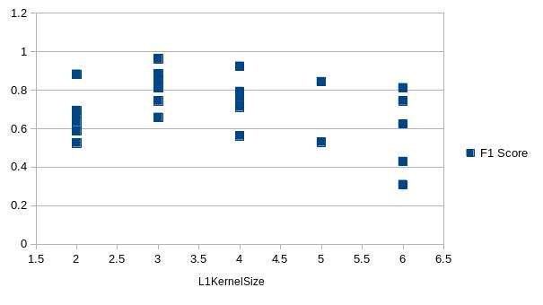

# Simple Classifier Tuning
As a simple task with small dataset, both scratch model and transfer model were tried.

## Task
This task is to classify the mahjong tiles into 3 classes: character, circle and bamboo.

## Dataset
The training dataset is datasets/dataset6. The test dataset is datasets/datasettest.

This is a very small set: about 200 images per category for training and 9 images per category for testing.

They are pictures found on the internet. Then they were chromonized and cropped into 20x30(w x h) images.

## Models
### Transfer
This model is tranferred from Lenet. The original model was created by LenetMnistExample.java as download of the existing Lenet model provided by zoo failed.

The transferred model was frozen except the output layer. As there are small number of parameters to be tuned, grid search was chosen for tuning.

Seemed epoch number do not matter and learningRate < 0.001 and learningRate > 0.2 should be tried.

### Scratch
The architecture is the same as Lenet, with only minor adjustion such as updater, loss function and other trivial parameters to be tuned.

The random search was implemented.

The learning rate and and kernel size showed more important impact and epoch number and l2 beta showed trivial importantce. And the kernel size indicated an obvious choice. So to fine-tune the learning rate and give l2 beta another try.

The learningRate = 0.01 is a verified good choice while l2Reg = 0.0008 is not as good as expected.

There is also a grid search result [report](https://github.com/fulltopic/Dp4jPractice/blob/master/datasets/reports/scratchreport1526318160396.xlsx)

