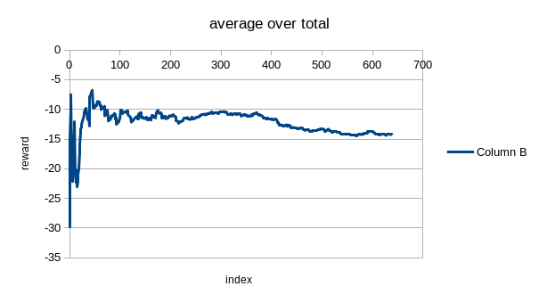
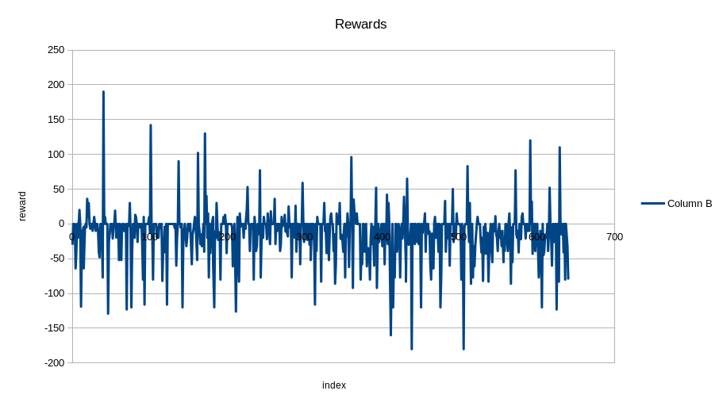

# A3C
Raw data is in [raw data](https://github.com/fulltopic/Dp4jPractice/tree/master/docs/a3c)
## Data Source
The NN connects to Tenhou server by [Tenhou client](https://github.com/fulltopic/tenhouclient).

The state is in the same format as described in [Supervised Learning](../mjsuperviesedlearning/Report.md)

The reward is based on the ten won/lost in the game and distributed by decay through all steps

## Architecture
|Layer  | Configuration                                    |
|-------|--------------------------------------------------|
|Input  |1 * 74, normalized into \[0, 1\]                    |
|Conv0  |kernel = 1 * 4, number = 8, Relu                  |
|Conv1  |kernel = 1 * 4, number = 8, Relu                  |
|Dense  |128 nodes, Relu                                   |
|Lstm   |Tanh, len = var, batch = 1                        |
|Output0|Value, output identity value as expected reward   |
|Output1|Softmax, output expected next action              |
* Conv0 scan sequential 3 or 4 tiles to detect potential pattern such as chow or pong
* Conv1 can cover larger(at least 9) scale for tiles in each class
* Dense to connect my own tiles and tiles on the table
* In mahjong game, Revolution layer seemed natural
* Initialized by parameters trained in supervised learning
## Reward Function
This game is in fact a partially observed RL problem,
and there are still a lots to be tried on network architecture and learning process.
While one thing important of RL observed in this course. That is reward function.

The output of the NN with supervised training parameters without RL training is like:

The table proposed to drop tile 30, that a single Feng. The advice seemed reasonable.

The policy softmax output:

|Seq|No.1|No.2|No.3|No.4|No.5|No.6|No.7|No.8|No.9|
|---|----|----|----|----|----|----|----|----|----|
|1  |0.00|0.00|0.01|0.00|0.00|0.00|0.00|0.00|0.00|
|2  |0.00|0.00|0.00|0.02|0.00|0.00|0.01|0.01|0.00|
|3  |0.00|0.00|0.00|0.00|0.00|0.00|0.00|0.00|0.00|
|4  |0.00|0.00|0.92|0.00|0.00|0.00|0.00|0.00|0.00|

The number of tiles could be dropped:

|Seq|No.1|No.2|No.3|No.4|No.5|No.6|No.7|No.8|No.9|
|---|----|----|----|----|----|----|----|----|----|
|1  |0   |0   |0   |0   |0   |0   |0   |0   |0   |
|2  |0   |0   |0   |1   |0   |0   |2   |1   |2   |
|3  |1   |0   |0   |0   |0   |0   |0   |0   |0   |
|4  |0   |0   |1   |0   |0   |0   |0   |0   |0   |
### Public Lobby
#### Default reward function
The default reward function is the Ten reward reported by Tenhou server,
sometimes cropped into \[-10, 10\].
As the AI is not good AI, my client seldom won,
therefore got a overwhelming number of lost records.
It makes the AI think that all steps are bad steps, and stop trying to figure out sensible action.
As the following table shows:

The policy softmax output:

|Seq|No.1|No.2|No.3|No.4|No.5|No.6|No.7|No.8|No.9|
|---|----|----|----|----|----|----|----|----|----|
|1  |0.00|0.16|0.00|0.05|0.07|0.00|0.03|0.10|0.00|
|2  |0.00|0.05|0.00|0.00|0.00|0.03|0.00|0.01|0.00|
|3  |0.22|0.00|0.00|0.00|0.00|0.05|0.00|0.06|0.00|
|4  |0.00|0.01|0.00|0.04|0.09|0.00|0.01|0.00|0.00|

The number of tiles could be dropped:

|Seq|No.1|No.2|No.3|No.4|No.5|No.6|No.7|No.8|No.9|
|---|----|----|----|----|----|----|----|----|----|
|1  |0   |0   |2   |0   |0   |1   |0   |0   |1   |
|2  |0   |0   |0   |1   |0   |0   |1   |2   |1   |
|3  |0   |0   |0   |0   |0   |1   |3   |0   |0   |
|4  |1   |0   |0   |0   |0   |0   |0   |0   |1   |

The output of policy gives large possibilities to tiles to be dropped that does not exist.

#### Invalid Action Penalty
When NN decides that the best choice is an action invalid, there are two drawbacks:
* We have to chose a random valid action as the possibility of best choice generated often > 0.5, which makes the second best or other choices meaningless
* The standard back-propagation of RL depends on best choice/largest possibility to get the right path

So an invalid action penalty was introduced.
When a predicted action was an action impossible, the advantage of the action was set to a fixed penalty value.
This is the advantage value, not the reward value, i.e. it is not propagated to previous steps.
Because at that time, the whole NN is not in proper status, I don't want the error to be propagated to make a mess.
While when the occurrence of invalid action decreased into certain level, this value should be set as reward.

The penalty value was set less than average reward to prevent the NN escaping into this area.

Then the NN produces more sensible output:

The policy softmax output:

|Seq|No.1|No.2|No.3|No.4|No.5|No.6|No.7|No.8|No.9|
|---|----|----|----|----|----|----|----|----|----|
|1  |0.12|0.00|0.00|0.00|0.00|0.00|0.00|0.00|0.37|
|2  |0.03|0.00|0.00|0.00|0.00|0.00|0.00|0.00|0.00|
|3  |0.00|0.00|0.00|0.00|0.00|0.00|0.00|0.00|0.00|
|4  |0.00|0.00|0.00|0.00|0.45|0.01|0.00|0.00|0.00|

The number of tiles could be dropped:

|Seq|No.1|No.2|No.3|No.4|No.5|No.6|No.7|No.8|No.9|
|---|----|----|----|----|----|----|----|----|----|
|1  |1   |0   |0   |0   |1   |1   |0   |0   |1   |
|10 |1   |0   |0   |1   |0   |1   |0   |0   |2   |
|19 |0   |0   |0   |0   |0   |0   |0   |1   |1   |
|28 |0   |0   |0   |0   |1   |2   |0   |0   |0   |

But it is still hard for it to win:

### Private Lobby
So that the training was moved into private lobby and all four players are controlled by this NN.
This environment guaranteed that there is always a winner.

While as there were always more lost than won among all these for players,
the NN could neither gain reward by valid actions nor by invalid actions,
after some training, it escaped into a fixed invalid action with no more exploration:

The policy softmax output:

|Seq|No.1|No.2|No.3|No.4|No.5|No.6|No.7|No.8|No.9|
|---|----|----|----|----|----|----|----|----|----|
|1  |1.00|0.00|0.00|0.00|0.00|0.00|0.00|0.00|0.00|
|2  |0.00|0.00|0.00|0.00|0.00|0.00|0.00|0.00|0.00|
|3  |0.00|0.00|0.00|0.00|0.00|0.00|0.00|0.00|0.00|
|4  |0.00|0.00|0.00|0.00|0.00|0.00|0.00|0.00|0.00|

The number of tiles could be dropped:

|Seq|No.1|No.2|No.3|No.4|No.5|No.6|No.7|No.8|No.9|
|---|----|----|----|----|----|----|----|----|----|
|1  |0   |1   |1   |1   |0   |0   |1   |1   |1   |
|10 |1   |0   |0   |1   |0   |0   |2   |0   |0   |
|19 |0   |0   |0   |1   |0   |0   |0   |2   |0   |
|28 |0   |0   |0   |1   |0   |0   |0   |1   |0   |

#### 4 Times Positive Reward
Positive reward was multiplied by 4 and zero reward was penaltied by -0.1 to encourage NN to win

The result was not worse than baseline:

| > 0 | = 0 | < 0 |
|-----|-----|-----|
|0.093|0.469|0.438|

According to some specific examples, the NN learned that Chow(34) and Pong(35) are critical to win,
while it failed to learn when they were valid actions.
In fact, availability of these actions are indicated by special value added in state,
they are 0.25 for Chow, 0.5 for Pong.

|Seq|No.1|No.2|No.3|No.4|No.5|No.6|No.7|No.8|No.9|
|---|----|----|----|----|----|----|----|----|----|
|1  |0.00|0.02|0.00|0.00|0.00|0.00|0.01|0.00|0.01|
|2  |0.02|0.02|0.01|0.00|0.01|0.04|0.02|0.01|0.15|
|3  |0.01|0.05|0.00|0.01|0.14|0.01|0.00|0.02|0.01|
|4  |0.00|0.07|0.00|0.02|0.00|0.01|0.00|0.00|0.29|

The number of tiles could be dropped:

|Seq|No.1|No.2|No.3|No.4|No.5|No.6|No.7|No.8|No.9|
|---|----|----|----|----|----|----|----|----|----|
|1  |0   |0   |0   |0   |0   |0   |0   |0   |0   |
|10 |1   |0   |0   |0   |0   |1   |1   |1   |0   |
|19 |0   |1   |0   |0   |1   |0   |0   |0   |0   |
|28 |0   |0   |1   |1   |0   |0   |0   |0   |0   |

#### No Negative Reward
Expert of the game said that beginner should learn how to win with little consideration of defence.
So, only game with positive rewards trained.
As there is no negative reward in game, assign a small invalid action penalty as -0.01.

It is not bad compared to other cases in this page:

| > 0 | = 0 | < 0 |
|-----|-----|-----|
|0.045|0.415|0.540|

While maybe the penalty was too small that required more training,
the output distribution seemed too random:

The policy softmax output:

|Seq|No.1|No.2|No.3|No.4|No.5|No.6|No.7|No.8|No.9|
|---|----|----|----|----|----|----|----|----|----|
|1  |0.02|0.12|0.01|0.06|0.01|0.01|0.03|0.01|0.01|
|2  |0.00|0.01|0.05|0.09|0.01|0.01|0.01|0.00|0.00|
|3  |0.01|0.01|0.00|0.01|0.01|0.00|0.01|0.00|0.27|
|4  |0.00|0.07|0.00|0.01|0.06|0.06|0.01|0.00|0.01|

The number of tiles could be dropped:

|Seq|No.1|No.2|No.3|No.4|No.5|No.6|No.7|No.8|No.9|
|---|----|----|----|----|----|----|----|----|----|
|1  |0   |0   |0   |2   |1   |0   |1   |2   |0   |
|10 |0   |0   |2   |1   |0   |0   |0   |0   |0   |
|19 |0   |1   |0   |0   |0   |0   |0   |0   |0   |
|28 |0   |0   |0   |0   |0   |0   |0   |0   |0   |

But further training showed that the training trapped in wrong path:

The policy softmax output:

|Seq|No.1|No.2|No.3|No.4|No.5|No.6|No.7|No.8|No.9|
|---|----|----|----|----|----|----|----|----|----|
|1  |0.00|0.00|0.00|0.00|0.00|0.00|0.00|0.00|0.00|
|2  |0.00|0.00|0.00|0.00|0.00|0.00|0.00|0.00|0.00|
|3  |0.00|0.00|0.00|0.00|0.00|0.00|0.00|0.00|0.00|
|4  |0.00|0.00|0.00|0.00|0.00|0.00|0.00|0.00|0.00|
|5  |0.00|0.00|0.00|0.00|1.00|0.00|0.00|0.00|0.00|

The number of tiles could be dropped:

|Seq|No.1|No.2|No.3|No.4|No.5|No.6|No.7|No.8|No.9|
|---|----|----|----|----|----|----|----|----|----|
|1  |0   |0   |0   |0   |1   |0   |0   |1   |0   |
|10 |1   |1   |0   |0   |0   |0   |1   |0   |0   |
|19 |0   |0   |0   |0   |0   |0   |0   |1   |0   |
|28 |1   |3   |0   |0   |1   |0   |0   |0   |2   |

The output fixed on an action that had never required prediction: 40

#### Random
The problem was that the random factor in Policy is too small to explore.
The epsilon was updated into 0.15 in this case.

And it seemed that the NN recovered.

| > 0 | = 0 | < 0 |
|-----|-----|-----|
|0.058|0.500|0.442|

The policy softmax output:

|Seq|No.1|No.2|No.3|No.4|No.5|No.6|No.7|No.8|No.9|
|---|----|----|----|----|----|----|----|----|----|
|1  |0.00|0.00|0.00|0.00|0.00|0.00|0.99|0.00|0.00|
|2  |0.00|0.00|0.00|0.00|0.00|0.00|0.00|0.00|0.00|
|3  |0.00|0.00|0.00|0.00|0.00|0.00|0.00|0.00|0.00|
|4  |0.00|0.00|0.00|0.00|0.00|0.00|0.00|0.00|0.00|

The number of tiles could be dropped:

|Seq|No.1|No.2|No.3|No.4|No.5|No.6|No.7|No.8|No.9|
|---|----|----|----|----|----|----|----|----|----|
|1  |0   |0   |0   |0   |0   |0   |1   |0   |0   |
|10 |1   |1   |1   |0   |1   |1   |0   |0   |0   |
|19 |0   |0   |0   |1   |0   |3   |1   |0   |0   |
|28 |0   |0   |0   |0   |0   |0   |0   |0   |1   |

## Conclusion
It is a partially observed game. This type of game has had just several cases resolved.
It seemed that it may not be problem that could be solved by a single NN, not to mention such a simple NN like this one.

I will continue this project to see whether more training could gain some improvement.
While I have to read more books and papers to understand what happened.