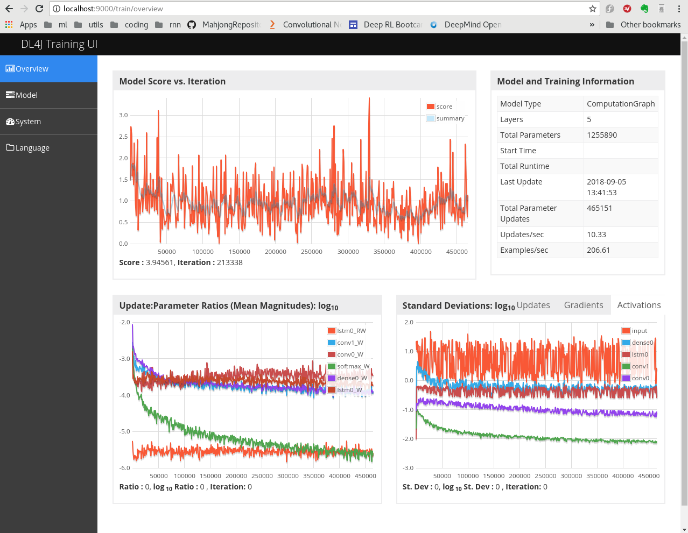
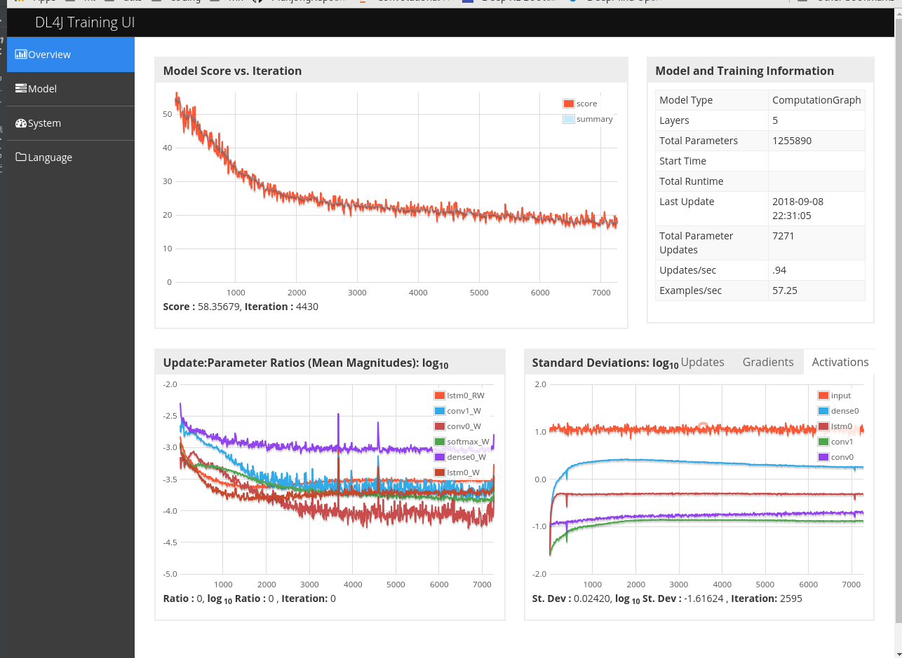

# Supervised Learning for RL NN
For further RL of Tenhou client, this model was trained by game played by Tenhou experts.
## Data
### Source
The data was downloaded from [天鳳位](http://tenhou.net/ranking.html).
The files in broken xml format have been transformed into xml files and located in [xml files](https://github.com/fulltopic/Dp4jPractice/tree/master/datasets/mjsupervised/xmlfiles)
### Input State
The input is a 1D int vector with length as 74:
* 0 ~ 33: My tiles owned currently
* 34 ~ 67: tiles discarded in the table, including tiles discarded by other players
* 68 ~ 71: If other player reached
* 72: If I am reached
* 73: If I am the oya

### Output Action
1D int vector with length as 42:
* 0 ~ 33: tile to be discarded
* 34: Chow
* 35: Pong
* 36 ~ 38: Kan. This action has been ignored
* 39: Reach
* 40: Ron
* 41: No operation

*1D vector of state may not be a good option as it is hard to detect connection between my tiles and discarded tiles*
## Architecture
The architecture of the NN is basically like:

| Layer | Activation |
|-------|------------|
| CNN   | RELU       |
| Dense | RELU       |
| LSTM  | TANH       |
|Output | Softmax    |

And several options tried.
## Training
The following figure shows the summary:

|Factor       | Value |
|-------------|-------|
|Learning rate|0.01   |
|Kernel size  |4      |
|Kernel number|8      |
|#Dense Node  |128    |

|Normalized|Masked|CNN|Dense|LSTM|Epoch|batchsize|Eval Acc|Eval F1|Test Acc|Test F1|
|----------|------|---|-----|----|-----|---------|--------|-------|--------|-------|
|0 ~ 1     |N     |2  |1    |Y   |8    |1        |0.4079  |0.5032 |0.3559  |0.0818 |
|0 ~ 256   |N     |2  |1    |Y   |8    |1        |0.4248  |0.5382 |0.6316  |0.4611 |
|0 ~ 7     |N     |2  |1    |Y   |8    |1        |0.6937  |0.5489 |0.6943  |0.5326 |
|0 ~ 7     |N     |0  |2    |Y   |8    |1        |0.03    |0.05   |NA      |NA     |
|0 ~ 7     |N     |2  |0    |Y   |8    |1        |0.4009  |0.4592 |NA      |NA     |
|0 ~ 256   |Y     |2  |1    |Y   |8    |64       |0.5145  |0.4722 |NA      |NA     |
|0 ~ 1     |Y     |2  |1    |Y   |8    |64       |0.5927  |0.5659 |NA      |NA     |
|0 ~ 1     |Y     |2  |1    |Y   |16   |64       |0.6531  |0.6016 |0.6485  |0.6002 |

* Seemed that Conv layer and Dense layer are both necessary for better performance.
* Without mask, the input value in \[0, 1\] can not standout in noise
* The case 6 could be trained with more epochs as the update ratio is still in good rage
* Batch size = 1 causes large variation.

## Error
Once the bi-directory lstm was tested and got a evaluation accuracy > 99%.
While the reason is that difference between current state and next state is exactly the action taken.
So the training is of nonsense, and test result is bad.