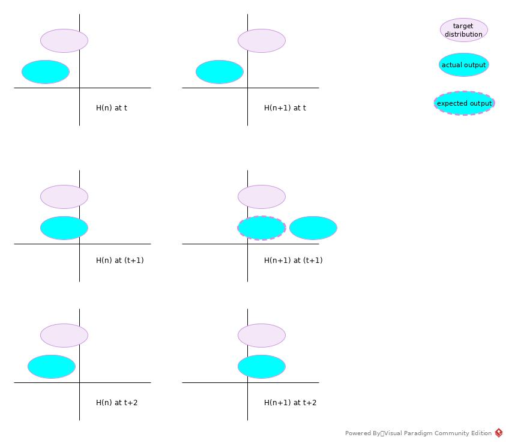
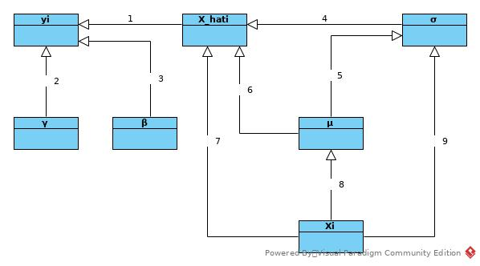

#BatchNormalization
##Why
### Normalization
[Batch Normalization](https://www.youtube.com/watch?v=BZh1ltr5Rkg)

Normalization is a widely used pre-processing trick in machine learning. 
The unbalanced feature scopes make learning rate hard to choose -- the same learning rate 
may explore some features while vanish other features at the same time.

After normalization, the same learning rate imposes same effect on all features, 
which makes the LR easier to choose. And then make use of regularization tools to select preferred features  
### Internal Covariate Shift
The topic is brought up by paper: [Batch Normalization: Accelerating Deep Network Training by Reducing Internal Covariate Shift
](https://arxiv.org/abs/1502.03167)

_We define Internal Covariate Shift as the change in th distribution of network activations
due to the change in network parameters during training._

An intuitive explanation is that the training of parameters of layer Hn+1 is updated based on distribution of output of Hn. 
But the sequence of back-propagation if from Hn+1 to Hn. 
So the ongoing update of different layers may conflict with each other or cancel update effect of each other.

 

Above figure showed a simple case. 
* In batch t training, Hn decided to move the output distribution to the right;
Hn+1 also decided to move the distribution to the right.
* The result is that, in batch (t + 1) training, Hn output fitted the target, while Hn+1 moved too much to miss the target.
* If the learning rate is small enough, Hn+1 may move the output back to match the target, 
while it also pushed output of Hn away from target. So the parameters of the whole network may be updated in a zigzagged pattern.
* If the learning rate is large enough, the update would be oscillating and fail to converge.

When batch normalization has been introduced, the output the each layer would be in the fixed center with limited scope, 
the network just update the shape to fit into the target. 

Some other papers argued that it may not the root cause of improved performance: [Understanding Batch Normalization](https://arxiv.org/abs/1806.02375)
### Other Observations
* De-correlated features 
* Introduced some noises as _mean(batch)_ is not _E(input)_
* [A Gentle Introduction to Batch Normalization for Deep Neural Networks](https://machinelearningmastery.com/batch-normalization-for-training-of-deep-neural-networks/)
* Smooth [How Does Batch Normalization Help Optimization?](https://arxiv.org/abs/1805.11604)
## Algorithm
Besides input standardization, batch-norm also introduced a linear transformation to recover 
representation ability of input for non-linear function in following layer. 
The parameters γ and β are independent of input values and learnable.  
### Forward
The _*Algorithm 1*_ from paper [Batch Normalization: Accelerating Deep Network Training by Reducing Internal Covariate Shift](https://arxiv.org/abs/1502.03167).

The following sequence figure is from [Batch Norm Paper Reading](https://www.youtube.com/watch?v=OioFONrSETc)

 
### Backward
Follow the sequence shown in above figure as (reverse) topology sort.
1. ∂l/∂x_hati = ∂l/∂yi * ∂yi/∂x_hati = ∂l/∂yi * γ
2. ∂l/∂γ = Σ(∂l/∂yi * ∂yi/∂γ) = Σ(∂l/∂yi * x_hati)
3. ∂l/∂β = Σ(∂l/∂yi * ∂yi/∂β) = Σ(∂l/∂yi)
4. ∂l/∂σ2 = Σ(∂l/∂x_hati * ∂x_hati/∂σ2) = Σ(∂l/∂x_hati * (-1/2) * (xi - μ) * (σ2 + ǫ)(-3/2))
5. ∂σ2/∂μ = (-2/m) * Σ(xi - μ)
6. ∂x_hati/∂μ = (-1) * (σ2 + ε)(-1/2)
7. ∂x_hati/∂xi = (σ2 + ǫ)(-1/2)
8. ∂μ/∂xi = 1/m
9. ∂σ2/∂xi = (2/m) * (xi - μ)

Then
* ∂l/∂μ = ∂l/∂σ2 * ∂σ2/∂μ + Σ(∂l/∂x_hati * ∂x_hati/∂μ)
* ∂l/∂xi = ∂l/∂x_hati * ∂x_hati/∂xi + ∂l/∂μ * ∂μ/∂xi + ∂l/∂σ2 * ∂σ2/∂xi 
### In Inference
In inference, the μ and σ2 are not estimation of batch input, but the E of all previous input instead. 
* μ = E[μ] = mean(Σ(μbatch))
* σ2 = Var[x] = (m/(m - 1)) * mean(Σσ2batch)

The batch-norm output is 
y = γ * x_hat + β = γ * ((x - μ)/(σ2 + ε)(-1/2)) + β
## Benefits
* Larger learning rate
* Less sensible to parameter initiation
* Less epoch required

[Notes of paper](https://gist.github.com/shagunsodhani/4441216a298df0fe6ab0)
## Other References
[Covariate Shift](https://www.youtube.com/results?search_query=covariate+shift)

[Batch Norm(Chinese)](https://www.youtube.com/watch?v=BZh1ltr5Rkg)

[Batch Normalization(Andrew Ang)](https://www.youtube.com/watch?v=nUUqwaxLnWs)