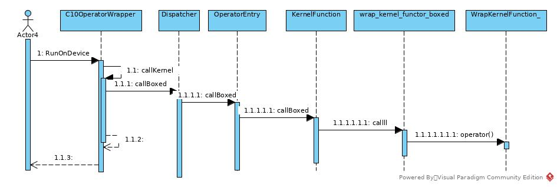

# Kernel Registration
## Three Types of Processors
*Pytorch* is able to wrap all three types of processor (operators) into a uniform format: *KernelFunction*.
The types could be wrapped are function, functor and lambda.
[under hood](https://web.mst.edu/~nmjxv3/articles/lambdas.html)
### Sequences
According to following operator invocation sequence image, 
the uniform format of processors is *KernelFunction*.

TODO: boxedfunctor.operator()


The processor registration sequence is like:

### Classes in Pytorch
The relationship of processor wrappers:

## The Interface to Register Difference Kernels by Meta
### Entries
The entry of processor wrapping is implemented in *op_registration.h*.
Most processors are registered statically in system initiation. 
And the registration entries for different processor types recognizes types by meta programming in compile time.

#### entry0
```c++
  private:
    Options&& kernel(c10::optional<TensorTypeId>&& dispatch_key, KernelFunction&& func, 
    		std::unique_ptr<FunctionSchema>&& inferred_function_schema) && {
      KernelRegistrationConfig config;
      config.dispatch_key = dispatch_key;
      config.func = std::move(func);
      config.inferred_function_schema = std::move(inferred_function_schema);
      kernels.push_back(std::move(config));
      return std::move(*this);
    }
```
* This is the private function that each other *kernel* function would end up with.
* This function put the processor into registry storage
#### entry1
```c++
// internal-only for registering stack based kernels
Options&& kernel(TensorTypeId dispatch_key, KernelFunction::BoxedKernelFunction* kernel_func) && {
```
* This is internal-only function, but don't know why it is defined as public
* All three types of kernels are wrapped into BoxedKernelFunction to complete the kernel registration 
#### entry2
```c++
template<class KernelFunctor, class... ConstructorParameters>
    guts::enable_if_t<guts::is_functor<KernelFunctor>::value, Options&&> kernel(TensorTypeId dispatch_key,
    		ConstructorParameters&&... constructorParameters) && {
      static_assert(std::is_base_of<OperatorKernel, KernelFunctor>::value,
    		  "Tried to register a kernel functor using the kernel<Functor>() API, but it doesn't inherit from c10::OperatorKernel. Please have the functor inherit from it.");
      static_assert(std::is_constructible<KernelFunctor, ConstructorParameters...>::value,
    		  "Wrong argument list for constructor of kernel functor. The arguments to kernel<Functor>(arguments...) must match one of the constructors of Functor.");
    ...
}
```
* This entry is for functor.
* The SFINAE mechanism works in __ReturnType__ by *guts::enable_if_t*.
Then there are *static_assert* to enforce the *KernelFunctor* is derived from *OperatorKernel*
and the functor is constructable from *Parameter* 
so that we can create *KernelFactory* object from these *Parameter(types)*
* As the *KernelFunctor* is already a child of *OperatorKernel*,
the class figure above shows that there is no wrapper for this type of kernel.
* The *ConstrucotrPatameters* is not mandatory 

#### entry3
```c++
template<class FuncType, FuncType* kernel_func>
    guts::enable_if_t<guts::is_function_type<FuncType>::value, Options&&> kernel(TensorTypeId dispatch_key) && {
      static_assert(!std::is_same<FuncType, KernelFunction::BoxedKernelFunction>::value,
    		  "Tried to register a stackbased (i.e. internal) kernel function using the public kernel<...>() API. Please either use the internal kernel(...) API or also implement the kernel function as defined by the public API.");
      static_assert(kernel_func != nullptr, "Kernel function cannot be nullptr");
    ...
}
```
* This entry is for efficient function wrapping
* As declared in annotation, as the type parameters (*FuncType* and *kernel_func*) for internal *kernel* function are ready, this function may be able to be compiled as *inline*
* The *static_assert* forbids *FuncType* as *BoxedKernelFunction*, as it is more efficient to wrap it with the first *kernel* function
* If *BoxedKernelFunction* was allowed, the input parameter *Stack* of this kernel must include the *OperatorKernel* itself.
I don't know if it is OK in runtime, while it is confusing for users to make up the *Stack* object.

#### entry4
```c++
template<class FuncType>
    // enable_if: only enable it if FuncType is actually a function
    guts::enable_if_t<guts::is_function_type<FuncType>::value, Options&&> kernel(TensorTypeId dispatch_key, FuncType* kernel_func) && {
      static_assert(!std::is_same<FuncType, KernelFunction::BoxedKernelFunction>::value, "Tried to register a stackbased (i.e. internal) kernel function using the public kernel<...>() API. Please either use the internal kernel(...) API or also implement the kernel function as defined by the public API.");
      TORCH_INTERNAL_ASSERT(kernel_func != nullptr, "Kernel function cannot be nullptr");
    ...
}
```
* This is less efficient function for *function* type wrapping as the template only specializes codes for types(*FuncType*), but not for function object/reference.

#### entry5
```c++
template<class Lambda>
    guts::enable_if_t<
        guts::is_functor<guts::decay_t<Lambda>>::value
        && !std::is_same<typename guts::infer_function_traits_t<guts::decay_t<Lambda>>::func_type,
		KernelFunction::BoxedKernelFunction>::value,
        Options&&> kernel(TensorTypeId dispatch_key, Lambda&& functor) && {
      static_assert(!std::is_base_of<OperatorKernel, guts::decay_t<Lambda>>::value, "The kernel(x) API for registering a kernel is only meant to be used with lambdas. Your kernel is a functor. Please use the kernel<Functor>() API instead.");

      // We don't support stateful lambdas (i.e. lambdas with a capture), because their
      // behavior would be nonobvious. A functor kernel with cache gets a new instance of
      // its cache each time the kernel is looked up from the dispatch table.
      // A lambda with a capture would be global and share its capture between all kernel lookups.
      // So, instead of making users having to think about it (including the thread-safety
      // issues this causes), let's just forbid stateful lambdas alltogether.
      static_assert(guts::is_stateless_lambda<guts::decay_t<Lambda>>::value, "The kernel(x) API for registering a kernel only works for stateless lambdas (i.e. lambdas without captures). If you need a cache, please use the functor based API kernel<Functor>() instead.");
    ...
}
```   
* This entry is for lambda wrapping.
* *guts::is_functor<guts::decay_t<Lambda>>::value* to check if the lambda is valid
* No stateful lambda allowed

### Wrapping Process
#### BoxedKernelFunction
```c++
static KernelFunction makeFromBoxedFunction(BoxedKernelFunction* func) {
    std::cout << "KernelFunction::makeFromBoxedFunction" << std::endl;

    return KernelFunction(
      nullptr,  // no functorFactory_, this can only be called in a boxed way.
      nullptr,  // no functor_ object either
      func,
      nullptr  // no unboxed function pointer
    );
}
```
The *KernelFunction* wrapped provides only *boxed_kernel_func* only 
as both functor and stack pointers have been provided by *func*.
#### functor
```c++
template<class KernelFunctor, class... ConstructorParameters>
    // enable_if: only enable it if KernelFunctor is actually a functor
    guts::enable_if_t<guts::is_functor<KernelFunctor>::value, Options&&> kernel(TensorTypeId dispatch_key,
    		ConstructorParameters&&... constructorParameters) && {
//...
      return std::move(*this).kernel(
        std::move(dispatch_key),
        KernelFunction::makeFromUnboxedFunctorFactory<KernelFunctor>(
        		detail::KernelFactory<KernelFunctor, guts::decay_t<ConstructorParameters>...>(
        				std::forward<ConstructorParameters>(constructorParameters)...)),
        detail::FunctionSchemaInferer<KernelFunctor>()()
      );
}
```
The entry provided a factory instead of an object
as the template was specialized in compile time and the kernel was registered statically.
while a functor requires an object.
 
```c++
template<class KernelFunctor, class... Args>
class KernelFactory final {
    static_assert(std::is_constructible<KernelFunctor, Args...>::value, "Wrong argument types for constructor of kernel functor.");

  public:
    explicit constexpr KernelFactory(Args... args)
    : constructor_parameters_(std::move(args)...) {
//    	std::cout << "KernelFactory::constructor" << std::endl;
    }

    std::unique_ptr<OperatorKernel> operator()() const {
    	std::cout << "KernelFactory::operator()" << std::endl;
      return guts::apply(
        [] (const Args&... params) -> std::unique_ptr<OperatorKernel> {return guts::make_unique_base<OperatorKernel, KernelFunctor>(params...); },
        constructor_parameters_);
    }

  private:
    std::tuple<Args...> constructor_parameters_;
  };
``` 
The *KernelFactory* creates functor of type *KernelFunctor* that inherits *OperatorKernel*

```c++
template<class KernelFunctor, bool AllowLegacyTypes = false>
static KernelFunction makeFromUnboxedFunctorFactory(std::function<std::unique_ptr<OperatorKernel>()> kernelFunctorFactory) {
    static_assert(guts::is_functor<KernelFunctor>::value, "Tried to call KernelFunction::makeFromUnboxedFunctor<KernelFunctor> but the argument is not a functor.");
    static_assert(std::is_base_of<OperatorKernel, KernelFunctor>::value, "Tried to call KernelFunction::makeFromUnboxedFunctor<KernelFunctor>, but the functor doesn't inherit from c10::OperatorKernel. Please have the functor inherit from it.");
	  std::cout << "KernelFunction::makeFromUnboxedFunctorFactory" << std::endl;

    return KernelFunction(
      std::move(kernelFunctorFactory),
      nullptr, // delay creation of functor_ (it will be created by calling functorFactory_ later)
      &detail::wrap_kernel_functor_boxed<KernelFunctor, AllowLegacyTypes>::call,
      reinterpret_cast<void*>(&detail::wrap_kernel_functor_unboxed<KernelFunctor>::call)
    );
}
```
The *KernelFunction* to be wrapped is created by above function. 
The *KernelFunction* has *functorFactory_* and *boxed_kernel_func_* set, 
as the functor object will be created in run-time with dynamic constructor arguments,
while the *callBoxed* or *callUnboxed* function requires a
##### Why the Functor is wrapped by another call() function?
* When the *KernelFunction* has been stored in registry, it lost its real type. To users, it is just some *KernelFunction* and *OperatorKernel* pointers.
* When the *call()* function invoked, there are just input and return arguments specialized. 
As it is natural for user (e.g. NN Model) to set these parameters, 
while it is unreasonable for user to provide <funcType> template parameters, 
which will make the extensibility and flexibility of the framework unfeasible.
* If we make the facade as a simple *OperatorKernel.operator()(args)* 
and make every child class of *OperatorKernel* to implements these *operator()* function,
the number of the combination(NOT) of input types and the conflicts of return type for same input types 
make the strategy almost impossible.
* So we wrapped the *OperatorKernel* again and provided a static function 
to make the operations in a uniform format without consideration of inheritance tree
* Besides operator input arguments, the *call* function also receive a functor argument to 
take advantage of functor/lambda properties. (Not sure if it is best solution)
* For boxed/unboxed functor, the specialized *wrap_kernel_functor_(un)boxed* struct holds the functor signature as by parameter *KernelFunctor*,
and the *OperatorKernel* input argument is *static_cast*-ed into *KernelFunctor* in static *call* function.
* The *call* function also manipulates stack for boxed kernel.
##### Sequence
* KernelFunctor Type + ConstructorParameter Types
* A _KernelFactory_ for above types
* A *wrap_kernel_functor_boxed* specialized type for *KernelFunctor* type,
the wrapper class provides static *call* function
* A *wrap_kernel_functor_unboxed* specialized type for *KernelFunctor* Type,
the wrapper provides static *call* function
#### Function
```c++
template<class FuncType, FuncType* kernel_func>
    guts::enable_if_t<guts::is_function_type<FuncType>::value, Options&&> kernel(TensorTypeId dispatch_key) && {
       return std::move(*this).kernel(
        std::move(dispatch_key),
        KernelFunction::makeFromUnboxedFunction<FuncType, kernel_func>(),
        detail::FunctionSchemaInferer<typename detail::WrapKernelFunction<FuncType, kernel_func>::type>()()
      );
}
```
As mentioned above, the *kernel* function specialized by both *FuncType* and *kernel_func*.

```c++
  template<class FuncType, FuncType* func, bool AllowLegacyTypes = false>
  static KernelFunction makeFromUnboxedFunction() {
    return makeFromUnboxedFunctor<AllowLegacyTypes, typename detail::WrapKernelFunction<FuncType, func>::type>(
      guts::make_unique_base<OperatorKernel, typename detail::WrapKernelFunction<FuncType, func>::type>()
    );
  }
```
The function is wrapped into a *WrapKernelFunction_* functor 
```c++
  template<class FuncType, FuncType* kernel_func, class ReturnType, class... Parameters>
  class WrapKernelFunction_<FuncType, kernel_func, ReturnType, guts::typelist::typelist<Parameters...>> final
  	  : public c10::OperatorKernel {
  public:
    auto operator()(Parameters... args) -> decltype((*kernel_func)(std::forward<Parameters>(args)...)) {
    	std::cout << "WrapKernelFunction_::operator()" << std::endl;
      return (*kernel_func)(std::forward<Parameters>(args)...);
    }
  };
```
Then generate *KernelFunction* for this functor instead of function:
```c++
  template<bool AllowLegacyTypes = false, class KernelFunctor>
  static KernelFunction makeFromUnboxedFunctor(std::unique_ptr<OperatorKernel> kernelFunctor) {
    return KernelFunction(
      nullptr, // no functorFactory_ because we already have the functor_
      std::move(kernelFunctor),
      &detail::wrap_kernel_functor_boxed<KernelFunctor, AllowLegacyTypes>::call,
      reinterpret_cast<void*>(&detail::wrap_kernel_functor_unboxed<KernelFunctor>::call)
    );
  }
```
As mentioned above, the functor is wrapped by a static *call* function
#### Lambda
```c++
template<class Lambda>
    // enable_if: only enable it if Lambda is a functor (note: lambdas are functors)
    guts::enable_if_t<
        guts::is_functor<guts::decay_t<Lambda>>::value
        && !std::is_same<typename guts::infer_function_traits_t<guts::decay_t<Lambda>>::func_type,
		KernelFunction::BoxedKernelFunction>::value,
        Options&&> kernel(TensorTypeId dispatch_key, Lambda&& functor) && {
 
       return std::move(*this).kernel(
        std::move(dispatch_key),
        KernelFunction::makeFromUnboxedLambda(std::forward<Lambda>(functor)),
        detail::FunctionSchemaInferer<detail::WrapRuntimeKernelFunctor<guts::decay_t<Lambda>>>()()
      );
}
```
*KernelFunction* is generated by 
```c++
  template<bool AllowLegacyTypes = false, class Lambda>
  static KernelFunction makeFromUnboxedLambda(Lambda&& lambda) {
    return makeFromUnboxedFunctor<AllowLegacyTypes, detail::WrapRuntimeKernelFunctor<guts::decay_t<Lambda>>>(
      guts::make_unique_base<OperatorKernel, detail::WrapRuntimeKernelFunctor<guts::decay_t<Lambda>>>(std::forward<Lambda>(lambda))
    );
  }
```
The *WrapRuntimeKernelFunctor* provides a type to specialize *makeFromUnboxedFunctor*
```c++
  template<class FuncType>
  using WrapRuntimeKernelFunctor = WrapRuntimeKernelFunctor_<
      FuncType,
      typename guts::infer_function_traits_t<FuncType>::return_type,
      typename guts::infer_function_traits_t<FuncType>::parameter_types
  >;
```
The *WrapRuntimeKernelFunctor* also recognizes *return_type* and *parameter_type* of the lambda
and generate a corresponding functor.
```c++
  template<class FuncType, class ReturnType, class... Parameters>
  class WrapRuntimeKernelFunctor_<FuncType, ReturnType, guts::typelist::typelist<Parameters...>> final : public c10::OperatorKernel {
  public:
    template<class FuncType_>
    explicit WrapRuntimeKernelFunctor_(FuncType_&& kernel_func)
    : kernel_func_(std::forward<FuncType_>(kernel_func)) {
    	std::cout << "WrapRuntimeKernelFunctor" << std::endl;
    }

    auto operator()(Parameters... args) -> decltype(std::declval<FuncType>()(std::forward<Parameters>(args)...)) {
    	std::cout << "WrapRuntimeKernelFunctor::operator()" << std::endl;
      return kernel_func_(std::forward<Parameters>(args)...);
    }

  private:
    FuncType kernel_func_;
  };
```
Then the *KernelFunction* is created by *makeFromUnboxedFunctor*
#### Conclusion
In general, all unboxed types are wrapped into functor and then 
an assistant class generated to provide static *call* function 
to complete the registration and to preserve the type information of types. 
### The Stack
## The Options Chain Pattern Implementation
## *valid_input_xxx*