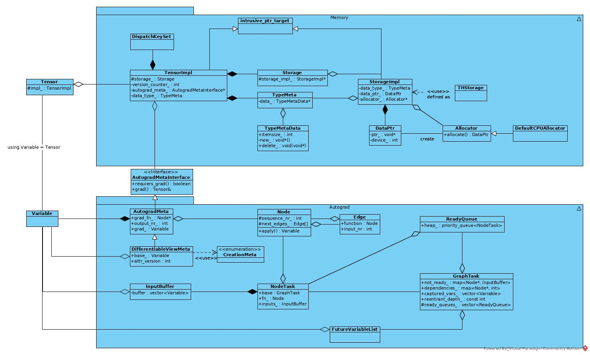
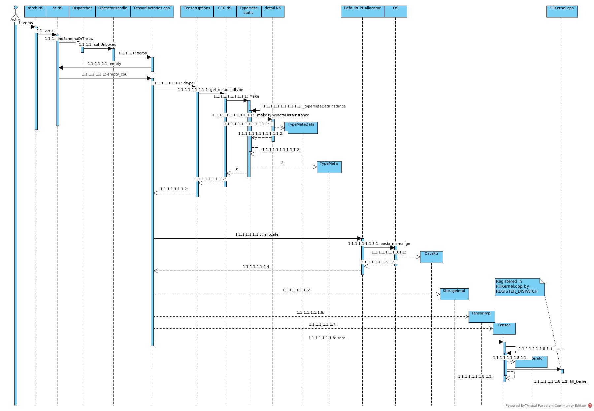
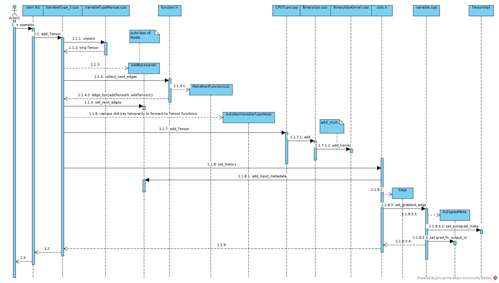
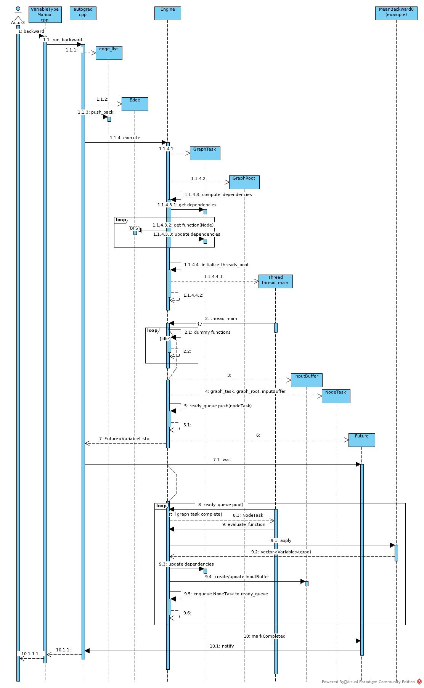
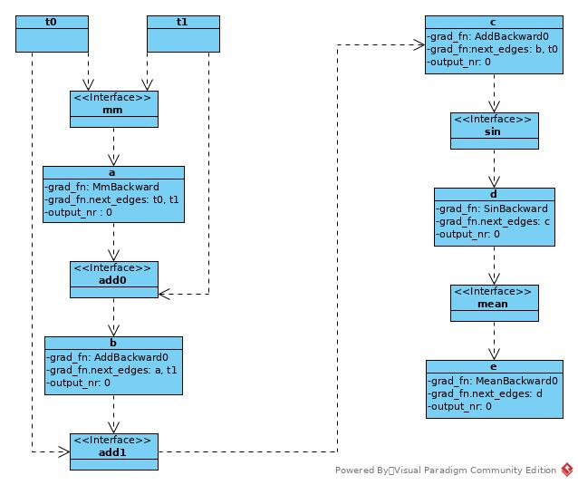
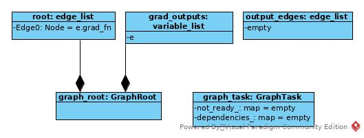
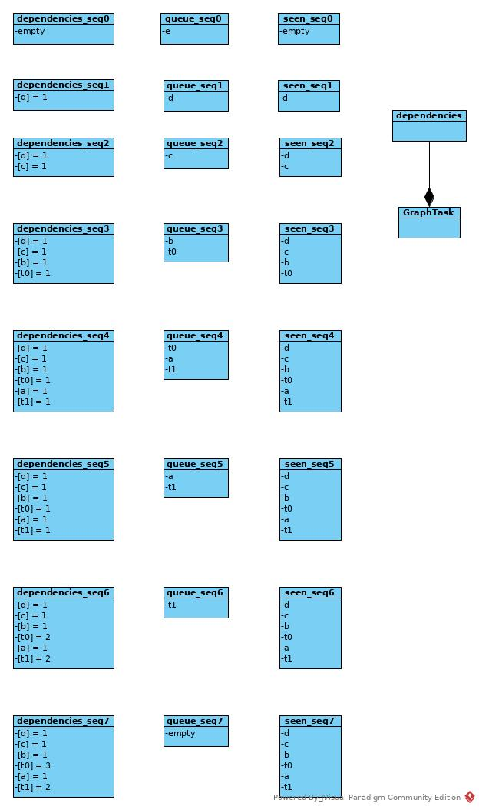
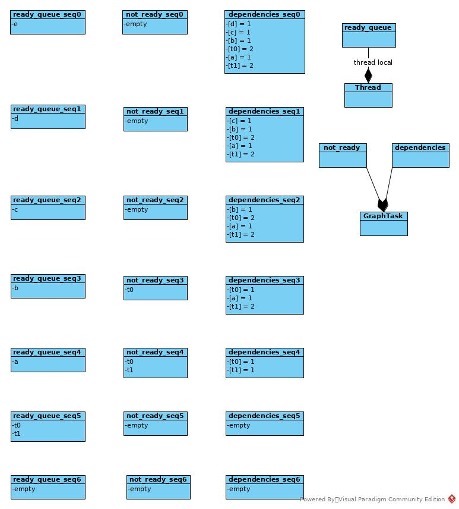
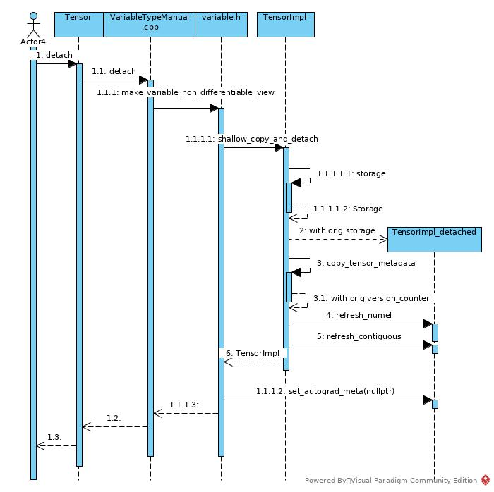

# Tensor Implementation (CPU)
## Structure


* _Tensor_ is a wrapper class, it does not provide actual implementation.
* The functions of _Tensor_ implemented in _TensorImpl_. 
* The functions of _TensorImpl_ could be grouped into 3 categories:
    1. For memory storage, implemented in _Storage_ class.
    2. For autograd engine, key class is _AutogradMeta_.
    3. Shortcut of _torch_ functions (e.g. _torch::add_ and _Tensor.add_)     
## Memory

* Dispatcher dispatched the _zeros_ to native cpu handle: _zeros_ defined in _TensorFactories.cpp_
* To create an empty tensor.
* To decide type meta: 
    1. type element size
    2. _Newer_ and Deleter_
    3. The _TypeMeta_ is still a wrapper class, it wraps a _TypeMetaData_ pointer. 
    4. The default dtype is a static object, the _TypeMetaData_ member is a raw pointer, and the get/create functions return object instead of smart pointer or reference. 
    There is no cost of deep clone of _TypeMetaData_, while it is still cost of object copy.
    5. Return _TypeMeta_ of _float_ + _CPU_.
* Get CPU allocator as allocator.
* Allocate _dataptr_ by posix library. There is alternative to allocate large SHM file and allocate _dataptr_ from SHM.
* Create _StorageImpl_ by above _TypeMeta_, _dataptr_ and _allocator_ (for delete).
* Create _Tensor_ by above _StorageImpl_
* Set the dispatcher key of the _Tensor_ as CPU
* Call _Tensor.zero_ to fill the Tensor with 0s
* Dispatcher dispatched the function to _fill_kernel_ defined in _FillKernel.cpp_
* The kernel implements fill by vector instructions.  

In general, to create a all zeros tensor:
* Decide type meta to dispatch to proper allocator.
* Decide dispatcher key to dispatch to proper fill kernel

Ref:

[philosophy](http://blog.ezyang.com/2019/05/pytorch-internals/)

[memory internal](https://www.miracleyoo.com/2019/12/11/Pytorch-Core-Code-Research/)

[OS related](https://zhuanlan.zhihu.com/p/34629243)
## Autograd
### Forward


* Before _add_ forward execution, prepare the _Variable_ for backward in advance.
* Find backward kernel _AddBackward0_
* Create _Node_ with backward kernel
* Set addends as next edges of current _Node_
* Call CPU kernel for add operation
* Set the add result as input of current _Node_
* Add the _Node_ into the _add_result_tensor.autogradMeta_
### Backward


* Get root _Edge_. An _Edge_ includes a _Node_ pointer and a sequence number. 
A _Node_ includes a backward function and next edges. 
* Execute backward DAG with root _Edge_ and root grad outputs.
* Create _GraphTask_ and _GraphRoot_. 
    1. _GraphRoot_ is a special _Node_, which defines no actual backward function.
    2. _GraphTask_ keeps all _Node_ to be executed, storing in _not_ready_ map or _dependencies_ map.
*  _Engine_ traverses the graph by _Node_ --> _Edge_ --> _Node_ --> ... --> Leaf. 
_Engine_ traverses the graph in BFS or topology order and keeps _NodeTask_ in maps mentioned above.
* If execution thread pool has not been initialized, create the thread pool
* When there is no outstanding task in local _ready_queue_, just run dummy task.
* Create _NodeTask_ with _GraphTask_ mentioned above and push into local _ready_queue_ and return _Future_
* Working thread detects the ready _GraphTask_ and turns from idle state into working state
* Working thread execute kernel of current _NodeTask_
* Get all dependent _NodeTask_ of current _NodeTask_ by its _edge_list_.
* Check _dependencies_ of current _GraphTask_, if dependent _Node_ has dependent-number == 0, 
remove it from _dependencies_ and push corresponding _NodeTask_ into thread local _ready_queue_.
* Check _not_ready_ map of current _GraphTask_, if dependent _Node_ is ready, 
erase it from _not_ready_ map and push the task into thread local _ready_queue_.
* If a _NodeTask_ that was in dependencies_ had reached (dependent-number == 0), push it into _not_ready_
* If no outstanding task in _GraphTask_ remained, mark the _GraphTask_ as Complete
* Notify caller of _backward_ that is waiting on _Future_

#### Key Files
* _aten/src/ATen/core/Variadic.h_
* _aten/src/ATen/core/dispatch/Dispatcher.h_
* _aten/src/ATen/core/Tensor.cpp_
* _aten/src/ATen/native/BinaryOps.cpp_
* _aten/src/ATen/native/TensorFactories.h_
* _aten/src/Aten/native/TensorFactories.cpp_
* _aten/src/ATen/native/cpu/BinaryOpsKernel.cpp_
* _aten/src/ATen/templates/TensorBody.h_

* _c10/core/TensorOptions.h_
* _c10/core/ScalarType.h_
* _c10/core/Scalar.h_
* _c10/core/DispatchKeySet.h_
* _c10/core/Allocator.h_
* _c10/core/TensorImpl.cpp_

* _torch/include/c10/core/TensorImpl.h_
* _torch/include/c10/core/Storage.h_
* _torch/include/c10/core/StorageImpl.h_

* _torch/csrc/autograd/variable.h_
* _torch/csrc/autograd/variable.cpp_
* _torch/csrc/autograd/VariableTypeManual.cpp_
* _torch/csrc/autograd/input_buffer.h_
* _torch/csrc/autograd/edge.h_
* _torch/csrc/autograd/engine.h_
* _torch/csrc/autograd/engine.cpp_
* _torch/csrc/autograd/function.h_
* _torch/csrc/autograd/autograd.cpp_
* _torch/csrc/autograd/functions/utils.h_
* _torch/csrc/autograd/functions/basic_ops.h_
* _torch/csrc/autograd/generated/Functions.cpp_
* _torch/csrc/autograd/generated/Functions.h_
* _torch/csrc/autograd/generated/variable_factories.h_
* _torch/csrc/autograd/generated/VariableTypeEverything.cpp_

### Use Case
Take following block as example:
``` c++
	Tensor t0 = torch::rand({2, 2}, TensorOptions().requires_grad(true));
	Tensor t1 = torch::rand({2, 2}, TensorOptions().requires_grad(true));

	Tensor a = torch::mm(t0, t1);
	Tensor b = a + t1;
	std::cout << "x add" << std::endl;
	Tensor c = b + t0;
	Tensor d = torch::sin(c);
	Tensor e = d.mean();

	e.backward();
```
#### Forward Phase


In forward phase, the operation result _Variable_ remembers the backward function 
and set forward operation input _Variables_ as next edges in backward phase.
#### Backward Phase
##### Initiation
Prepare _GraphTask_ and _GraphNode_ for task execution.

``` c++
auto Engine::execute(const edge_list& roots,
                     const variable_list& inputs,
                     bool keep_graph,
                     bool create_graph,
                     const edge_list& outputs) -> variable_list {
// ...

  auto graph_task = std::make_shared<GraphTask>(
      keep_graph,
      create_graph,
      worker_device == NO_DEVICE ? 0 : total_depth + 1);

  auto graph_root = std::make_shared<GraphRoot>(roots, inputs);
 
// ...
}
```

After initiation:


##### Compute Dependencies
```c++
auto Engine::compute_dependencies(Node* root, GraphTask& task) -> void {
  std::unordered_set<Node*> seen;
  std::vector<Node*> queue { root };

  auto& dependencies = task.dependencies_;
  while (!queue.empty()) {
    auto fn = queue.back(); queue.pop_back();
    for (const auto& edge : fn->next_edges()) {
      if (auto next_ptr = edge.function.get()) {
        dependencies[next_ptr] += 1;
        const bool was_inserted = seen.insert(next_ptr).second;
        if (was_inserted) queue.push_back(next_ptr);
      }
    }
  }
}
```
The process of BFS:


##### Execution
```c++
void Engine::evaluate_function(
    std::shared_ptr<GraphTask>& graph_task,
    Node* func,
    InputBuffer& inputs) { 
  const auto opt_parent_stream = (*func).stream(c10::DeviceType::CUDA);
  c10::OptionalStreamGuard parent_stream_guard{opt_parent_stream};

  auto outputs = call_function(graph_task, func, inputs);
  auto& fn = *func;

  int num_outputs = outputs.size();
  if (num_outputs == 0) { 
    return;
  }

  std::lock_guard<std::mutex> lock(graph_task->mutex_);
  for (int i = 0; i < num_outputs; ++i) {
    auto& output = outputs[i];
    const auto& next = fn.next_edge(i);

    bool is_ready = false;
    auto& dependencies = graph_task->dependencies_;
    auto it = dependencies.find(next.function.get());

    if (--it->second == 0) {
      dependencies.erase(it);
      is_ready = true;
    }

    auto& not_ready = graph_task->not_ready_;
    auto not_ready_it = not_ready.find(next.function.get());
    if (not_ready_it == not_ready.end()) {
      InputBuffer input_buffer(next.function->num_inputs());

      // Accumulates into buffer
      const auto opt_next_stream = next.function->stream(c10::DeviceType::CUDA);
      input_buffer.add(next.input_nr,
                       std::move(output),
                       opt_parent_stream,
                       opt_next_stream);

      if (is_ready) {
        auto& queue = ready_queue(input_buffer.device());
        queue.push(
            NodeTask(graph_task, next.function, std::move(input_buffer)));
      } else {
        not_ready.emplace(next.function.get(), std::move(input_buffer));
      }
    } else {
      auto &input_buffer = not_ready_it->second;

      // Accumulates into buffer
      const auto opt_next_stream = next.function->stream(c10::DeviceType::CUDA);
      input_buffer.add(next.input_nr,
                       std::move(output),
                       opt_parent_stream,
                       opt_next_stream);
      if (is_ready) {
        auto& queue = ready_queue(input_buffer.device());
        queue.push(
            NodeTask(graph_task, next.function, std::move(input_buffer)));
        not_ready.erase(not_ready_it);
      }
    }
  }
}
```

The process of topology DAG traverse


### Detach


_Tensor.detach()_ implements a shallow clone of original _Tensor_. 
The detached _Tensor_ is invalid to grad immediately after _detach()_ as its _AutogradMeta_ has been set as _nullptr_.
## Some Codes
### intrusive_ptr
### UniqueVoidPtr.h
### Tensor.h Template
### Variadic.h apply: MakeNextFunctionList.apply
### Some Knowledge
#### Anonymous Namespace
* The definition is treated as a definition of a namespace with unique name and a using-directive in the current scope that nominates this unnamed namespace.
* This is the same as the C way of having a static global variable or static function but it can be used for class definitions as well. 
* It also avoids making global static variable.
* Usage in _aten/src/ATen/core/op_registration/README.md_

[cppreference](https://en.cppreference.com/w/cpp/language/namespace#Unnamed_namespaces)

[stackoverflow](https://stackoverflow.com/questions/357404/why-are-unnamed-namespaces-used-and-what-are-their-benefits)

[local linkage](https://stackoverflow.com/questions/4181059/linkage-of-symbols-within-anonymous-namespace-within-a-regular-namespace)

#### template keyword
```c++
template<class Key, class Value, class Iterator>
class DictEntryRef final {
public:
  explicit DictEntryRef(Iterator iterator)
  : iterator_(std::move(iterator)) {}

  Key key() const {
    return iterator_->first.template to<Key>();
  }
//...
```
#### const
```c++
  const DictEntryRef<Key, Value, Iterator>& operator*() const {
      return entryRef_;
  }
```
*entryRef_* is not a const object. Declaring the return type as *const* enables declaring the function as *const*
 